# DE&T 2

Notes: Quiz 5 will be a question on Section1, 4 questions, protection of the family (Quiz 5), 3 other essay topics, intestacy, wills, and trusts most likely. Section2 multiple choice, short answer. ETA 4-5 mins on each. “Prove to the professor you are not guessing”, but we do not have to name drop cases in short answer, citing the statute is OK.— 7 mc qs, 14 tf, yes no, sa qs, there will be a divorce+disclaimer and slayer+disclaimer question

[DET Ass 1 – Answers (UPC only)](DET%20Ass%201%20%E2%80%93%20Answers%20(UPC%20only)%2073f5ed0eba7843ef909a0d5b12c5fbec.md)

[Will Master](Will%20Master%200886734d2dbd4f0dba1a8a2ac08a7ece.md)

[Will Assignment Claude](Will%20Assignment%20Claude%2028f4fdbee45080adab32d04cb1c6f2e1.md)

# Course Overview

> Although the process of administration deals with the property of the dead, it is
operated by, and affects, the living.
> 
- Probate systems developed to collect the assets of decedents, satisfy creditors, pay taxes, resolve conflicts among beneficiaries, and distribute what was left to the appropriate persons or institutions.
    - But only some property interests are “subject to probate”
        - Property the decedent held alone or as tenant in common will pass according to the terms of a will, or if there is no will, according to an “intestate statute”
        - Joint tenancy property, life insurance proceeds, property in lifetime trusts, pensions, and IRA’s are all outside of probate.
1. The Will
    1. Look at the text, who it makes executor, who the property is left to
2. Opening the Estate
    1. If named, the executor oversees identifying the assets, paying debt, distributing excess etc… 
    2. If not named, the “personal representative” does this. Determined my statute, usually a relative/spouse.
        1. A court in the decedent’s domicile represents them. Usually the probate court, surrogate’s court, orphan’s court.
        2. Also, if the decedent owned property in another jurisdiction, an ancillary admin might be necessary. Ancillary is designed to protect local creditors and is particularly likely if the asset is real property.
3. Administration
    1. Formal admin is supervised to the court, informal only requires reporting to the court. The Uniform Probate Code allows a range of approaches. They offer the choice of universal succession as well, which skips administration entirely and gives title to the heirs or residuary devisees, subject to the claims of creditors and any other devisees.
        1. Assuming supervision…
            1. Executor collects the assets, brings actions necessary to enforce claims the decedent may have had against others, the assets are listed on an inventory filed with the court.
            2. For digital assets: tough.
                1. Executor can open a bank account in his name as “executor of decedent x” and request the bank to transfer funds in the decedents old account to the new one, giving the bank a copy of the letters Testamentary. Executor can use these funds to pay for attorneys fees, pay debts, etc.
                2. REMEMBER: Jointly owned assets belong to the widow if there is a survivorship provision.
4. Holding Period
    1. Determining whether the estate needs to file and pay any taxes liek death tax returns
    2. Determining whether the estate needs to file fiduciary income tax, income tax return for the decedent
    3. Determining whether any claims coming from any creditors are valid
    4. If he needs money to live on during administration, Jeremy can request that he be paid a family allowance from the assets of the estate. The amount will depend on local law, and, in some cases, on his need.
5. Delivery
    1. As the executor delivers assets, he will obtain a receipt which he files with the court, along with an accounting of the transactions and a petition to be discharged from his duties at the end…
    2. Copies of the accounting will be given to the two children, who may object if they believe that he improperly managed the estate. If they make no objections, or if the court determines that he properly managed the estate, it will discharge him and administration comes to an end.

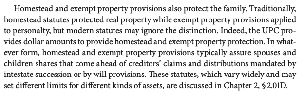

Question: A married man with children wants to appoint his long-time paramour to serve as his executor. Should a court refuse to appoint her because of her relationship with the testator?

Answer: The court would typically not refuse to appoint a paramour solely because of her relationship with the testator. This principle is supported by In re Estate of Nagle, 317 N.E.2d 242 (Ohio Ct. App. 1974), where the court held that a testator's selection of an executor should be honored unless there are specific statutory disqualifications or clear evidence that the appointment would harm the estate. In Nagle, the court emphasized that personal relationships alone are not sufficient grounds for disqualification. **The paramount consideration is whether the named executor can faithfully and competently administer the estate in accordance with the testator's wishes and the law's requirements.**

**Is Probate Necessary?**

- When someone has died, we need to collect the assets, take care of the creditors, resolve any disputes among claimants, and get clear title into the hands of the right survivors.
    - If we need the probate system to accomplish any of these goals, we should use it.
    - If not, we shouldn’t. It may be avoided in small estates under summary admin procedures. UPC SS 3-1201-1204 (for estates of $25k or less)

### Lifetime Transfers

“Will substitutes” “Probate Avoidance Devices”

- Lifetime transfers effectively transfer wealth at someone’s death, but are not subject to the probate system.

**Trusts**

> “The purposes for which trusts can be created are as unlimited as the imagination of lawyers” - Professor Scott
> 
- The most useful estate planning device as they are extremely flexible.
- Essential Elements:
    1. Property (sometimes called res)
        1. Property serves as the principal (corpus) of the trust, invested to generate income for the beneficiaries.
    2. held by someone (the trustee)
        1. Of course it must be held by someone, the settlor, grantor, trustor, testator etc…
        2. Settlor can create a trust through a lifetime transfer or by will. During the settlor’s life is called a lifetime (intervivos) trust. These avoid the probate process. 
        3. Created by a will is called a testamentary trust. Typically subject to the continuing jurisdiction and supervision of the probate court.
    3. to benefit someone else (the beneficiary)

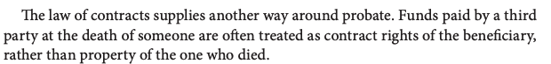

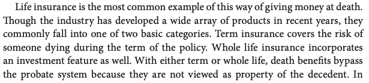

**Guardianships and Conservatorships**

- When someone cannot act on their own behalf to handle their affairs, they must appoint a person to act for them.
    - Ex. if a parent is killed in an accident, the orphan will need someone to care for them and their property.
    - Guardian or Conservator of the property.
    - A third kind could be a guardian ad litem, appointed to protect the child's interest during litigation.
- The powers of a guardian over an incompetent adult may have authority than one over a competent minor.
- GAL have limited powers because their sole function is to protect the ward’s interests in a specific litigation matter.
- Choosing a guardian for a minor child is very serious, one of the primary reasons people execute wills. They want to avoid “acrimonious litigation”
    - According to UPC, guardians named in the will can assume office upon probate of the will without court approval, even in jurisdictions where courts much confirm appointments.
    - But usually, the guardian has only limited powers, and may act only with court approval.
    - Additionally, required accountings and bonds increase attorneys fees and court costs, diminishing the assets available for the minor.
        - Recognizing these drawbacks, the UPC grants the guardian broad powers of management, exercisable without court approval, much as though the guardian were trustee of a privately establihed trust.
        
        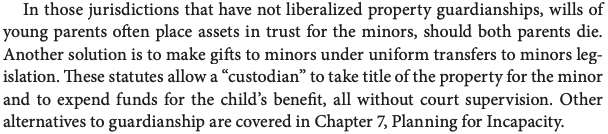
        

**The Uniform Codes and the Restatements**

- The UPC (Uniform Probate Code) and UTC (Uniform Trust Code) offer statutory language and commentary to state legislatures considering reform.
    - UPC has been 18 jurisdictions and UTC has been adopted in more than 30 states.
    - Uniform acts in the area are monitored by the Joint Editorial Board for Uniform Trust and Estate Acts, a group of academic lawyers and practitioners.

# Intestacy/Taking by Rep

So, an estate is left…

> Professor Harvey—Heirs are not the primary beneficiary of the probate process. They may only dip after debts, taxes, and expenses are paid…The heirs merely get whats left.
> 

1. Consider protective provisions and creditors.
    1. Surviving spouse and children get homestead allowance of $22,500 UPC 2-402
    2. Surviving spouse and children get a monetary exempt property allowance of $15,000 UPC 2-403
    3. UPC also grants a “reasonable allowance” to the surviving spouse, minor children, obligated to support, UPC 2-404
        1. These protections are subject to revision based on consumer prices UPC1-109

---

1. Who are the survivors who could potentially collect?
    1. To survive means they must outlive for 120 hours UPC 2-104
        1. Are people missing? Evidence of death; presumption after five years UPC 1-107(5)
2. Stepchildren and non‑heirs: Stepchildren do not inherit by intestacy absent adoption or a specific statute. Confirm adoption status.
3. **First, is there a surviving spouse?**
    1. The spouse gets the entire estate if either…
        1. Decedent leaves no descendants nor parents 102(1)(i) or Spouse gets everything if decedent has no kids or parents left 
        2. Decedent leaves only descendants who are descendants of the surviving spouse as well 102(1)(ii) spouse gets everything if decedent leaves only children who are also children of the spouse 
    2. The spouse gets $300,000 plus 3/4 of the remaining balance of the estate if there are no descendants left, but the decedent leaves parents. 102-2
    3. The spouse gets $225,000 plus 1/2 of the remaining balance of the estate if all of the decedent’s surviving descendants are also descendants of the surviving spouse AND the surviving spouse has one or more surviving descendants who are not descendants of the decedent. 2-102(3)
    4. The spouse gets $150,000 plus 1/2 of the remaining balance of the estate if one or more of the decedent’s surviving descendants are not descendants of the surviving spouse. 2-102(4)
4. **If there is a remaining balance beyond the spouse, where does it go?**
    1. First, to the decedent’s descendants by representation 103(a)(1)
    2. If no surviving descendants, to the decedent’s parents equally if both survive, or to the only surviving parent if one survives 103(a)(2) (make sure you know who the parents are)
        1. Make sure the parent is not barred from inheriting via 2-114
            
            103(a)(1) parent’s parental rights were terminated and the parent child relationship was not judicially reestablished
            
            103(a)(2) the child died before reaching 18 and there is c&c evidence that immediately before the child’s death the parental rights of the parent could have been terminated due to abandonment, abuse, neglect, etc…
            
    3. If no descendants or parents, to the descendants of the decedent’s parents (siblings) by representation 103(a)(3)
    4. If no descendants, or parents, or descendants of decedents parents (siblings), it goes to the grandparents…
        1. Half to both paternal grandparents, or to the one surviving grandparent. If both dead, to the descendants of the paternal grandparents (aunt and uncle) by representation. 103(a)(4)(a)
            1. 103(a)(5) If there are no survivors on either the maternal side, but there are on the paternal side, the half that would have gone to the maternal side may go with the paternal side, and vice versa.
        2. Half to both maternal grandparents, or to the one surviving grandparent. If both dead, to the descendants of the maternal grandparents (aunt and uncle) by representation. 103(a)(4)(b)
    
    (b) If there is no taker under subsection (a), but the decedent has:
    
    (b)(1) one deceased spouse who has one or more descendants who survive the decedent, to that spouse’s descendants by representation
    
    (b)(2) decedent has more than one deceased spouse who has one or more descendants who survive, an equal share to each set of descendants **by representation**
    
5. **Adoptive Parents? 119**
    1. Parent–child relationship rules for adoptees are governed by UPC 2-115, 2-118, and 2-119 (fresh start approach, plucking a child from a family placing them elsewhere, they may now inherit from the adoptive family only, minus the following…)
        1. **Step‑parent adoption**: If an individual is adopted by the spouse of a genetic parent, a parent–child relationship exists between the adoptee and (i) the genetic parent whose spouse adopted the individual and (ii) the adopting step‑parent; a limited relationship may persist with the other genetic parent for the purpose of the adoptee or the adoptee’s descendants inheriting from or through that parent. UPC 2-119(b)(1)-(2)
            
            Child is adopted by spouse of genetic parent. “New” parent, and the genetic parent of the “new” pair, there is parent-child relationship for inheritance. The other, seperated genetic parent, may inherit DOWN to the child, but may not inherit FROM the child.
            
        2. **Adoption by a relative** of a genetic parent (or that relative’s spouse/surviving spouse): a parent–child relationship exists with both genetic parents, but only for the purpose of the adoptee (or the adoptee’s descendants) inheriting from or through either genetic parent. UPC 2-119(c)
            
            Child is adopted by a relative. Child maintains parent child relationship with both parents so child can inherit from them, but only down, not up.
            
        3. **Adoption after death** of both genetic parents: a parent–child relationship exists with both genetic parents, but only for inheritance through those parents by the adoptee or the adoptee’s descendants. UPC 2-119(d)
            
            Childs parents die, then is adopted by other people. If the blood grandparents are passing down, the child still has a parent-child relationship to inherit.
            
6. **Equitable Adoption?**
    1. Equitable Adoption aka Virtual Adoption
        1. Courts sometimes treat a child as adopted, even in the absence of formal adoption proceedings. 
            1. Ex. Heirs of Hodge where child was treated as adopted when raises by others since age three and given their last name.
        2. May be recognized if a person had the authority to contract to adopt, offers an independent way to prove parent child relationship.
7. Half-Blood vs. Full Blood relative, does it matter?
    1. UPC 2-107 Relatives of half-blood inherit the same share they would inherit if they were of the whole blood.
8. Individuals related through two lines
    - A person related to the decedent through two lines (e.g., double first cousin) takes only one share. UPC 2-113
9. If there is no taker in the above, the intestate estate passes to the [state] UPC 2-105

**By representation**…what is the practice used for representation?

- We are allocating shares by representation. There are four different methods.

1. **Per Capita**
    - Simply count the heads of eligible receivers, divide the state into the number of receivers, and distribute.
2. **Strict Per Stirpes**
    - **Divide the estate into as many shares as there are:**
        - surviving children AND
        - deceased children who have surviving descendants.
            - As we go down, again, divide among the living and the dead with descendants.
                - Check the fractions, add ‘em up, it better result in 1.00!
3. **Modified Per Stirpes**
    - Division of the estate begins at the closest generation with living descendants. We skip older, empty generations.
    - **Once we found the generation with survivors, do Strict Per Stirpes…**
        - Immediately divide the estate into as many shares as there are surviving children AND deceased children who have surviving descendants.
            - As we go down, that portion of the estate is divided, again, among the living and the dead with descendants of the descendants.
                - Check the fractions, add ‘em up, it better result in 1.00!
4. **UPC 2-106 / Per Capita at Each Generation**
    - Begin with Modified Per Stirpes, begin at the closest generation with living descendants. We skip older, empty generations.
        - We then take all the shares which would have passed in Modified Per Stirpes, which are surviving descendants AND deceased with surviving descendants…
            - Add them up!
                - Allocate one share to each survivor in that nearest generation
                - Combine the remaining shares and distribute them in the same manner among the next generation
                    - This achieves **generational equality on each side**, mirroring 2-106(b) but applied to the ancestor level referenced in 2-103(a)(3)–(5).
                    - Single‑side rule: If there are takers on only one side (paternal or maternal), that side takes the whole under 2-103(a)(5).

# **Intestacy Notes**

- For those who die without a will, an intestate statute provides an “estate plan” designed by the state legislature.

**Overview**

- Even if there is a will, it might not cover EVERYTHING.
    - Ex. Carter “leaves all real property to Parker”…but Parker would then have no right to Carter’s personal property. Thus, Carter would die “partially intestate”, passing according to the states intestate statute.
- Intestate Statutes
    - Extends well beyond decedents without wills or those with gaps in their estate plans.
    - These statutes help identify “interested persons” who may be able to challenge a will. They also aid document interpretation.
    - Intestate schemes provide document drafters with a variety of models to present to their clients who want wills or trusts set up.

**Terminology**

- Heirs: those people identified by statute to take the estate to the extent that the decedent dies intestate
- Ancestors: parents grandparents, extending back into history
    - “My children” refers only to a single generation
- “Descendants” and “Issue”: refer to a multi-generational group including children, grandchildren, and the continuing line
- Collaterals: those peopl eout of the lines of ascent and descent: aunts, uncles, brothers, sisters, cousins

**Survivorship**

Intestate statutes give shares to the dependents survivors. One question is what it means to be alive.

- Section 1 od the Uniform Determination of Death Act: someone is dead if there is irreversible cessation of all circulatory and respiratory functions or irreversible cessation of all functions of the entire brain, including the stem.

More common question: who died first?

(UPC 2-104)

(a) **Requirement of Survival by 120 hours**; Individual in Gestation. For the purposes of intestate succession, homestead allowance, and exempt property, and except as otherwise provided in subsection (b), the following rules apply:

(1) An individual born before a decedent’s death who fails to survive the decedent by 120 hours is deemed to have predeceased the decedent. If it is not established by clear and convincing evidence that an individual born before the decedent’s death survived the decedent by 120 hours it is deemed that the individual failed to survive for the required period.

(2) An individual in gestation at a decedent’s death is deemed to be living at the decedents death if the individual lives 120 hours after birth. If it is not established by the clear and convincing evidence that an individual in gestation at the decedent’s deatj lived 120 hours after birth, it is deemed that the individual failed to survive for the required period.

(Subsection 2 addresses the rights of a child in gestation at the time of the decedent's death. For the child to be considered living at the decedent's death and eligible to inherit, the child must be born alive and survive for at least 120 hours after birth. If it cannot be proven that the child lived for 120 hours after birth, the child is deemed to have predeceased the decedent and cannot inherit.)

- Problem: a person simply disappearing
    - UPC 1-107(4) death can be established by clear and convincing circumstantial evidence.
        - Someone who has not been heard from for a continuous period of five years “and whose absence is not satisfactorily explained after diligent search or inquiry” is generally presumed dead after five years UPC 1-107(5)

Equivalent for Pennsylvania…

**Choice of Law**

- Under normal choice-of-law principles, courts apply the whole law of a state whose law is deemed to control a transaction.
    - BUT when decedents have had ties to more than one state, choice of law questions may arise.
        - Courts usually apply the law of the situs of the property to questions surrounding realty
        - Courts usually apply the law of the decedent’s domicile to questions concerning personalty.
- Therefore, even though the law of the situs normally controls realty disposition, the conflict of laws rules of the situs state may require that the laws of another state, such as the state of the domicile, control. A court in one state may therefore find that is must refer to the law of another state, only to be required by that law to consider the law of yet a third state.

**Protective Provisions**

- Another set of rules that while not limited to intestacy, influences survivors shares.
- Family members have a right to estate assets “off the top”, before creditors claims and before distribution according to the intestate statute (or the will if there is one)
    - Most protective statutes are set monetary amounts, some coming from state constitutions and some through statutes.
        - The UPC 2-402 provides the surviving spouse or children a monetary homestead allowance of $22,500.
        - The UPC 2-403 provides the surviving spouse or children a monetary exempt property allowance of $15,000.
    1. Homestead property
        
        -the actual homestead, real estate
        
    2. Exempt Property
        
        -personal property
        
        -Some states protections exceed $90,000, like New York. Some are very low, like Florida with protections at $1,000.
        
        -NOTE: some jurisdictions lump homestead and exempt together.
        
    3. Support
- These protections levels under the UPC are subject to revision, based on changes in consumer prices UPC 1-109
    - Also, the UPC grants a “reasonable allowance” to the surviving spouse, minor children the decedent was obligated to support, and children the decedent was in fact supporting UPC 2-404

**Basic Aspects of Intestate Schemes**

- Blood relatives are favored:
- Family Lines Matter
- Stop when you find survivors: Living survivors cut off those further down the inheritance line
- Degree of Relationship Matters:
    - Who inherits, what shares people take.
    - Be careful, sometimes degree of relationship will trump other principles, sometimes other principles will prevail.
- Representation can affect shares
    - In some situations, intestate statutes will use a predeceased person as a placeholder to determine how shares are divided. Consider a decedent who left three surviving descendants: (1) a child and (2) two grandchildren who are daughters of a predeceased child. The intestate statue would use the predeceased child as a representative of the grandchildren and divide the estate with one-half to the surviving child and one-quarter each to the grandchildren

### Qualifying to Take

- When statutes use terms such as “spouse” “children” “issue” “descendants”, questions arise as to who falls within the designated class.
- 2017 Uniform Parentage Act: Section 609, the adjudication of de facto parentage, recognizing an individual as a parent who is not the genetic or adopting parent, or a presumed parent or a deemed parent as the result of an assisted reproductive technology. In effect, based on a de facto parentage, a child may have three parents.

The 2008 UPC Intestacy Provisions

UPC Section 2-102 **Share of a Spouse**

The intestate share of a decedent’s surviving spouse is:

(1) the entire intestate if:

(i) no descendant or parent of the decedent survives the decedent; or

(The surviving spouse gets the entire estate if the decedent has no living parents or descendants)

(ii) all of the decedent’s surviving descendants are also descendants of the surviving spouse and there is no other descendant of the surviving spouse who survives the decedent;

(If the decedent and the surviving spouse have children together, AND the surviving spouse has no children from other relationships, then the spouse gets everything. This protects family wealth by keeping it with the spouse when all children are shared, but prevents the spouse from potentially diverting assets away from the decedent's children if the spouse has children with someone else)

(2) the first $300,000, plus 3/4 of any balance of the intestate estate, if no descendant of the decedent survives the decedent, but a parent of the decedent survives the decedent;

(If the decedent dies with living parents but no descendants, the spouse gets the first $300,000 plus 3/4 of the remaining estate)

(3) the first $225,000 plus 1/2 of any balance of the intestate estate, if all of the decedent’s surviving descendants are also descendants of the surviving spouse and the surviving spouse has one or more surviving descendants who are not descendants of the decedent;

(If the decedent and the surviving spouse have children together, AND the surviving spouse has one or more children from other relationships)

(4) the first $150,000, plus one-half of any balance of the intestate estate, if one or more of the decedent’s surviving descendants are not descendants of the surviving spouse.

(If the decedent has children from a previous relationship who are not also the children of the surviving spouse, the spouse gets the first $150,000 plus half of the remaining estate. This provides some protection for the decedent's children from a prior relationship while still giving substantial support to the surviving spouse)

UPC Section 2-103 **Share of Heirs Other than Surviving Spouse**

(a) any part of the estate not passing to the decedent’s surviving spouse, or the entire estate if there is no surviving spouse, passes in the following order to the individuals who survive the decedent:

(1) to the decedent’s descendants by representation;

(Descendants take by representation. Use 2-106(b) per capita at each generation unless your jurisdiction specifies a different scheme.)

(2) if there is no surviving descendant, to the decedent’s parents equally if both survive, or to the surviving parent if only one survives;

(the share of the estate not going to spouse, or all if there is no surviving spouse, to the decedent’s parents equally, or to the single surviving parent)

(3) if there is no surviving descendant or parent, to the descendants of the decedent’s parents or either of them by representation;

(4) if there is no surviving descendant, parent, or descendant of a parent, but the decedent is survived on both the paternal and maternal sides by one or more grandparents or descendants of grandparents:

(the share of the estate not going to spouse, or all if there is no surviving spouse, there is no surviving descendant, no surviving parents, no surviving descendants of their parents, but there are surviving grandparents…)

(A) half to the decedent’s paternal grandparents equally if both survive, to the surviving paternal grandparent if only one survives, or to the descendants of the decedent’s paternal grandparents or either of them if both are deceased, the descendants taking by representation; and

(Goes to the paternal grandparents, equally. If only one paternal grandparent, it goes to them, or to the descendants of the decedent’s paternal grandparents or either of them if both are deceased, the descendants taking by representation)

(B) half to the decedent’s maternal grandparents equally if both survive, to the surviving maternal grandparent if only one survives, or to the descendants of the decedent’s maternal grandparents or either of them if both are deceased, the descendants taking by representation

(Goes to the maternal grandparents, equally. If only one maternal grandparent, it goes to them, or to the descendants of the decedent’s paternal grandparents or either of them if both are deceased, the descendants taking by representation?)

(5) if there is no surviving descendant, parent, or descendant of a parent, but the decedent is survived by one or more grandparents or descendants of grandparents on the paternal but not the maternal side, or on the maternal but not the paternal side, to the decedent’s relatives on the side with one or more surviving members in the manner described in paragraph (4)

(b) If there is no taker under subsection (a), but the decedent has:

(1) one deceased spouse who has one or more descendants who survive the decedent, the estate or part thereof passes to that spouse’s descendants by representation; or

(2) more than one deceased spouse who has one or more descendants who survive the decedent, an equal share of the estate of part thereof passes to each set of descendants by representation.

Section 2-105 **No Taker.**

If there is no taker under the provisions of this Article, the intestate estate passes to the [state].

Section 2-106 **Representation**

(a) Definitions.

(1) “Deceased descendant,” “deceased parent,” or “deceased grandparent” means a descendant, parent, or grandparent who either predeceased the decedent or is deemed to have predeceased the decedent under Section 2-104

(they either died before the decedent, or they are deemed predeceased)

(2) “Surviving descendant” means a descendant who neither predeceased the decedent nor is deemed to have predeceased the decedent under Section 2-104.

(they did not die before the decedent, nor are they deemed predeceased)

(b) Decedent’s Descendants

If under 2-103(1) a decedents intestate estate passes by representation to the decedents descendants, the estate is divided into equal shares as there are (i) surviving descendants in the generation nearest to the decedent which contains one or more surviving descendents AND (ii) deceased descendants in the same generation who left surviving descendants.

Each surviving descendants the nearest generation is allocated one share.

The remaining shares are combined and then divided in the same manner among the surviving descendants of the deceased descendants as if the surviving descendants who were allocated a share and their surviving descendants had predeceased the decedent. ( 

(c) 

(c) Descendants of Parents or Grandparents: If under 2-103(1) a decedents intestate estate passes by representation to the decedents deceased parents or either of them or to the descendants of the decedent’s paternal or maternal grandparents or either of them, the estate is divided into as many equal shares as there are…

(i) surviving descendants AND

(ii) deceased descendants in the same generation who left surviving descendants

Each surviving descendant in the nearest generation is allowed one share. The remaining shares are combined and then divided in the same manner among the surviving descendants of the deceased descendants as if the surviving descendants who were allocated a share and their surviving descendants had predeceased the decedent.

(generational equality, all people of the various generations end up getting the same)

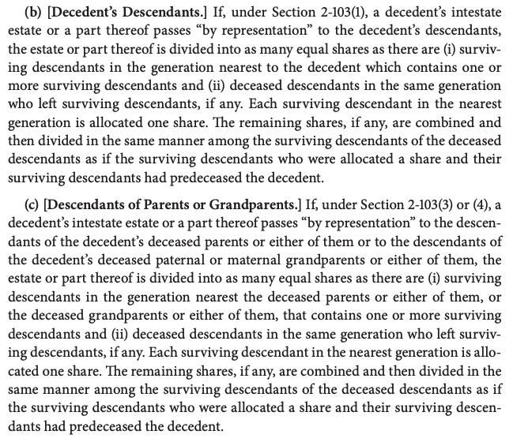

UPC Section 2-114. Parent Barred from Inheriting in Certain Circumstances

(a) A parent is barred from inheriting from or through a child of the parent if:

(1) the parent’s parental rights were terminated and the parent-child relationship was not judicially reestablished; or

(2) the child died before reaching 18 years of age and there is clear and convincing evidence that immediately before the child’s death the parental rights of the parent could have been terminated under law of this state other than this code on the basis of nonsupport, abandonment, abuse, neglect, or other actions or inactions of the parent toward the child.

Adopted Persons

UPC 

- 2-102 Spouse?
- 2-103 definition of family: Persons related by blood marriage or adoption.

### **Adoptive Parents under the UPC**

UPC 2-115, 118, 119a,b1,b2,c,d,e

- 119 Except as otherwise provided, a parent-child relationship does not exist between an adoptee and the adoptee’s genetic parents. (Fresh Start approach, plucking the child from the birth family, placing them into the adoptive family. They may now inherit from the adoptive family only)
    - (b) **Stepchild Adopted by Stepparent**: A parent-child relationship exists between an adoptee who is adopted by the spouse of either genetic parent and:
        - (1) the genetic parent whose spouse adopted the individual; and (if Mom and Dad divorce, and Mom married a new guy, and they adopt me, I can inherit from Mom, Dad, and new guy, BUT Dad cannot inherit from me anymore)
        - (2) the other genetic parent, but only for the purpose of the right of the adoptee or a descendant of the adoptee to inherit from or through the other genetic parent (if Mom and Dad divorce, and Mom married a new guy, and they adopt me, I can inherit from Mom, Dad, and new guy)
    - (c) **Individual Adopted by Relative of Genetic Parent**: A parent-child relationship exists between both genetic parents and an individual who is adopted by a relative of the genetic parent or by the spouse or surviving spouse of a relative of a genetic parent, but only for the purpose of the right of the adoptee or a descendant of the adoptee to inherit from or through either genetic parent.
        
        This exception means that if a person is adopted by a relative of one of their genetic parents (such as an aunt, uncle, or cousin), or by the spouse/surviving spouse of such a relative, they still maintain inheritance rights from or through both genetic parents. This preserves inheritance connections with biological family when the adoption stays within the extended family.
        
    - (d) I**ndividual Adopted after Death of Both Genetic Parent**s: A parent-child relationship exists between both genetic parents, but only for the purpose of the right of the adoptee or a descendant of the adoptee to inherit through either genetic parent.
    - (e) **Child of Assisted Reproduction of Gestational Child Who Is Subsequently Adopted**: If after a parent-child relationship is established between a child of assisted reproduction and a parent or parents under Section 2-210 or between a gestational child and a parent or parents under 2-121 the child is adopted by another or others, the child's parent or parents under 2-120 or 1-121 are treated as the child's genetic parent or parents for the purpose of this section
- Fresh Start Approach - plucking the child from the birth family, placing them into the adoptive family. They may now inherit from the adoptive family.
    - What if only 1 step parent?
        - They cannot inherit from the severed birth parent, but can from the new parent.
        - The idea is that you may only have one mother one father.
    - Exceptions to Fresh Start Approach
        - (d) A parent-child relationship exists between both genetic parents and an individual who is adopted after the death
        - They are not doing a fresh start for they are permitting inheritance but it is a one way street, down to the adopted child, not up.
        - So the adopted child has three parents for receiving inheritance

Problem 67:1 - Bob was born to Doug and Wanda, who later divorced. Wanda then married Alphonse, who adopted Bob with Doug’s consent.

1. When Doug dies, does Bob inherit from him under UPC? 
    
    Answer: Under UPC Have we met the condition of the step-parent exception? Yes, because they are married. Therefore, a parent-child relationship exists between Doug and Bob? Yes. Therefore, Bob may inherit from Doug.
    
2. Can Doug inherit from Bob?
    
    Answer: No
    
3. Same as (a) and (b) if Doug and Wanda had adopted Bob?
    
    Answer: (a) Yes Bob can inherit from Doug. (b) No Doug cannot inherit from Bob because this upward inheritance must be genetic.
    
4. What if Wanda and Doug cohabit? 
    
    Answer: No, they must be married.
    
5. Instead of marrying Alphonse, Wanda formed a domestic partnership or civil union with Marjorie, who adopted Bob?
    
    Answer: Step-parent exception does **not** get you there—they have to be married.
    

Problem 67:2 - Bob was born to Doug and Wanda. Then, Doug died and Wanda married Alphonse, who adopted Bob. When Doug’s father dies, would Bob inherit from him?

Answer: Yes, 119(b)(2), adoptee and the other genetic parent. Downward inheritance only.

1. After Sam’s mother died, the widow of his mother’s brother adopted him. Later, Sam’s maternal grandfather died intestate. Would Sam inherit anything from his grandfather?
    
    Answer: Fresh start, Sam is plucked from mom and dad, to adoptive parents. The adoptive parents are uncle and widow. But the uncle is dead at the time of adoption. 119 exception C 
    
    A parent-child relationship exists between both genetic parents and an individual who is adopted by a relative of the genetic parent or by the spouse or surviving spouse of a relative of a genetic parent
    
    Sam inherits from his maternal grandfather through the exception found in UPC 2-119(c). This section states: "A parent-child relationship exists between both genetic parents and an individual who is adopted by a relative of the genetic parent or by the spouse or surviving spouse of a relative of a genetic parent, but only for the purpose of the right of the adoptee or a descendant of the adoptee to inherit from or through either genetic parent."
    
    Here's the analysis:
    
    - Sam's mother is his genetic parent
    - Sam's mother's brother (his uncle) is a relative of Sam's genetic parent
    - Sam was adopted by "the widow of his mother's brother" - meaning the surviving spouse of a relative of his genetic parent
    - This precisely fits the exception in 2-119(c)
    
    Therefore, for inheritance purposes only, Sam still maintains a parent-child relationship with both his genetic parents. This means Sam can inherit from his maternal grandfather (who is related to him through his genetic mother).
    

Problem: Peggys daughter Roxanne has battled drug addiction. Peggy is raising Roxannes son Jason for most of his life. Peggy died recently while caring for Jason because Roxanne is back in prison. Should Jason be able to inherit from his grandmother?

Answer: 2-103 The decedent’s descendants, by representation, by priority??? What does 103 say? 

We don’t want to give it to Roxanne, we want to give it to Jason. How?

Renunciation-Disclaimer, you wan refuse to accept an inheritance. If so, you are treated as if you had pre-deceased the inheritance. If she does this, than Jason may inherit.

According to intestate succession rules, if Roxanne (the daughter/mother) is unable to inherit due to renunciation, Jason (the grandson) would be next in line to inherit from Peggy (the grandmother) through the principle of representation. Under UPC 2-103, if the decedent's descendants take by representation, Jason would step into his mother's place in the inheritance line.

This follows the general principle that if a child of the decedent cannot inherit (whether due to predecease, disclaimer, or in some jurisdictions, unworthiness), that child's share passes to their descendants.

Note: probate courts are courts of equity - we could argue equitable adoption. We are not gonna find equitable remedies in a statute, legal remedies are. We could argue that Roxanne equitably adopted.

### **Half-Bloods**

UPC 2-107 - Relatives of half-blood inherit the same share they would inherit if they were of the whole blood.” 

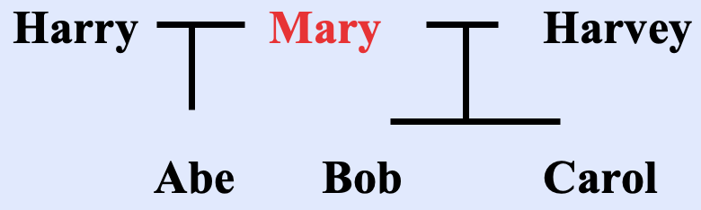

Ex. If Carol dies, with no parents, and no descendants…her estate goes to the descendants of her parents…should Bob and Abe get equal shares even though Carol is full blood related to Bob and only half-blood related to Abe?

Answer: UPC 2-107 half bloods are whole bloods, they get the same.

Pennsylvania - 2104 - Paragraph 3 - same as above.

**(3) Whole and half blood.**--Persons taking under this chapter shall take without distinction between those of the whole and those of the half blood.

---

### **Ancestors and Collateral Relatives**

- As a starting place intestate statutes follow family lines when identifying which blood relations will inherit: first seek descendants, then move up one generation looking for parents, then down again seeking siblings and their offspring. After that, states disagree about when it is appropriate to modify the process or stopping entirely.
    - The UPC continues for another generation: move up to the grandparents (half to maternal and half to paternal)
    - If only one side of the family has survivors, they take everything. UPC 2-203(4)
        - This is the end of blood relations

**2.03 Allocating Shares**

UPC 2-102

First, if the surviving spouse is the parent of the decedents children, but also has other children, the survivor takes 225,000, plus one half of the balance.

But, if the decedent left children who are not children of the surviving spouse, the survivor only takes $150,000 plus one-half of the balance.

Pg. 85 Problems.

Shelley and Art had two children: Hope and Roy. When Art died, Shelley married John and they had a daughter, Beth. 

(a) Shelley died leaving an estate of $400,000 in liquid assets. Who takes what shares of Shelley’s estate under the law of your state? Under the UPC?

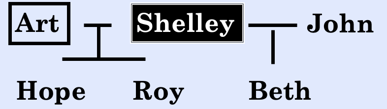

Answer: Under the UPC 2-102(4), the surviving spouse, John, gets *$150,000 plus one-half of the balance*, 125,000, therefore $275,000.

This is because the decedent, Shelley, left children who are AND are not the children of the surviving spouse, John. So we fulfill both a and b of 102. 

UPC 2-103 the remaining $125,000 is equally divided to the three descendants = $41,666 each.

Later down the line, when John dies, his only descendant is Beth, therefore she will receive his $675,000, in total $716,666.

(b) Instead, John predeceased Shelley leaving an estate of $300,000 in liquid assets plus Greenacre (worth $100,000), a farm he inherited from his paternal uncle. Who takes what shares of John’s estate under the law of your state? Under the UPC?

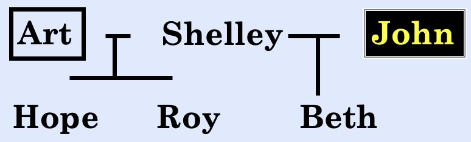

Answer: Under the UPC 2-102 the surviving spouse gets $225,000 plus 1/2, therefore $312,500 goes to spouse. 

This is because John has a descendant. 

The rest goes to the daughter, Beth, $87,500. 

Later, when Shelley dies, her three children equally inherit her estate. This is $237,500 each, total of $325,000 for Beth, though, as she inherited the extra from John.

**Descendants, Collaterals and Ancestors**

By Representation Below…

1. **Per Capita:** counts people, counting heads
    - Common when all the takers are in the same generation.
    - Someone in the class who is eligible to receive, but has died, can still receive if they have descendants who have survived.

- Here, All alive decedents of ‘I’ would get an equal share…
    - K, O, U, V, W, X, Y, Z all get 1/8 share.

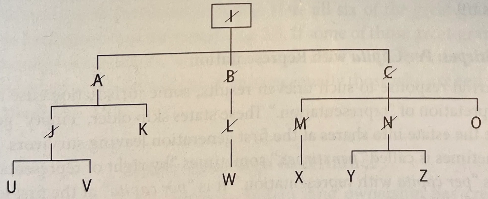

1. **Strict/Pure Per Stirpes**: Divide the estate into as many shares as there are surviving children or deceased children who have descendants surviving the decedent. (Modeling the result as though the child did not pre-decease, and that is why it is most attractive to parents)
- Here, I dies
    - Then, A B and C get 1/3, easy.
        - But A is dead, but has two kids, J and K.
            - We count 1 share for everyone who survives, so A’s share is shared between J and K (1/6 each).
                - But J is dead, so it is passed to U and V equally.
        - But B is deceased, goes to L, but L is dead, is passed to W, W inherits 1/3.
        - But C is deceased, is split to M N and O
            - M is dead, goes to X
            - N is dead, is split between Y and Z.
1. **Representation: Per Stirpes / Per Capita with Representation / Modified Per Stirpes (Pennsylvania is this too)**: Skip older, empty generations and begin to divide the estate into shares at the first generation with survivors.
    1. If all the kids are dead, skip the generation, begin counting shares when people are alive.
    2. Here, A B and C are all dead, SKIP!
        
        
        
    
2. UPC 2-106(b) **Per Capita at Each Generation**

This is 2-106

(b) Decedents Descendants If, under section 2-103(1) a decedent’s intestate estate or a part thereof passes “by representation” to the decedent’s descendants, the estate or part thereof is divided into as many equal shares as there are…

(i) surviving descendants in the generation nearest to the decedent which contains one or more surviving descendants and 

(ii) deceased descendants in the same generation who left surviving descendants, if any. Each surviving descendant in the nearest generation is allocated one share. The remaining shares, if any, are combined and then divided in the same manner among the surviving descendants of the deceased descendants as if the surviving descendants who were allocated a share and their surviving descendants had predeceased the decedent.

Divides the estate into shares by counting both (i) living descendants in the closest generation that has survivors and (ii) deceased persons in that same generation who left surviving descendants.

- Here, ignore the children’s generation bc non survived.
- Grandchildren generation, add the number of survivors plus the number of those who died leaving descendants who survive. Here, divide 6 ways and give K and O 1/6 each.
- Move down a generation and divide the remainder of the estate. All six great grandchildren died leaving descendants, so we divide what is left (4/6) to them equally.

# Wills

Exam Open: 

Rationale: If we fail at the will, we will fall into intestacy. If we succeed in executing the will, we get to avoid intestacy. The parties in interest, therefore, have a preference one way or another, attacking or defending a will.

1. **The Mental Element** includes two principal requirements:
    1. **Testamentary Intent**: (the intent to create a will) the intent that the document or transaction control the disposition of property at the maker’s death, but create no rights or powers until that time. Consider Kuralt, sometimes intent requires analysis, but Edmundson v Estate of Fountain lacked dispositive language.
        1. On the exam, find the dispositive language and use it in your answer.
        2. Under traditional rules, extrinsic evidence is not admissible to resolve patent ambiguities (ambiguities apparent from the face of a document) but can be used to resolve latent ambiguities (ambiguities discoverable by considering extrinsic evidence), such as where extrinsic evidence shows property/beneficiary within the Will was erroneously identified (Gibbs). 
    2. **Testamentary Capacity**: Requirements: Must be 18, but also:
        1. Not suffering from mental deficiency, general lack of ability to put things together, **beliefs lacking reasonable foundation**.
        2. **no insane delusion** (Mental illness alone is not enough to prove lack of capacity, Romero.) 
        3. passing the **Cunningham Test**.
            1. know the nature and extent of his/her property (knowing it apart from other peoples property)
            2. know “the natural objects of the testator’s bounty” namely those persons most of us would expect to take the property (knowing those in your orbit, your loved ones, knowing the ones who you intend to receive from your will)
            3. understand the basics of the plan for disposing of the property (general understanding)
            4. understand how the above elements interrelate
                1. their knowledge need not be perfect, rather they must be sufficient under the circumstances
2. Challenges to The Mental Element Once the will is validly executed, we ask whether there are any extenuating circumstances:
    1. **Undue Influence**: Wrongdoer substitutes their will for the testator’s will through coercion or domination. Saucier, Olsen
        1. To raise inference, pleader must prove
            1. Donor was susceptible
            2. Wrongdoer had opportunity 
            3. Wrongdoer had disposition
            4. Result appearing to the the effect of undue influence
        2. Even if the testator understood and signed will, undue influence is a separate inquiry.
        3. Presumption may shift to there being undue influence if “the wrongdoer was in a confidential relationship with the donor and there were suspicious circumstances surrounding the preparation, formulation, or execution of the donative transfer” Res Prop 8.3f.
            1. Dominant-subservient relationship
    2. **Fraud**: Two kinds
        1. Fraud in Factum: Fooling testator into signing a will but including a sneaky undisclosed provision.
        2. Fraud in Inducement: Fooling the testator into believing facts which are not true.
    3. Tortious Interference with Expectancy (unlikely for the exam)
3. **The Physical Element** includes:
    1. **In writing**
    2. **signed** at the end, by the testator, or signed by someone in the testator’s conscious presence
    3. Either:
        1. **Signed** **by two people**, competent witnesses, who witnessed the testator sign already, OR
        2. **Signed by notary public**, where testator acknowledges the will as his own, in lieu of the two witnesses.
            1. No interested witness doctrine under UPC.
                1. What if you have no witnesses, and no notary signature, meaning an unattested will? **Holographic Will**
                    1. Signature, date, and Material portions are handwritten by testator **502(b)**
                    2. Intent, including extrinsic evidence, that the document constitute testators will **502(c)**
4. **If a Physical Element fails:**
    1. **Substantial Compliance**: 
    2. **Harmless Error**: This is such an insignificant defect that it doesn’t change anything, treat it as if it is in compliance. **503.**
5. **What Exactly is in the Will? What pages?**
    1. Integration—which pages are part of it, which documents are part of it? (multiple documents in Kuralt), we sign will at end bc it marks end of integrated intent, anything after not their intent?
    2. Incorporation by Reference: A separate writing
        1. Writing must be in existence at the date of the will
        2. Described as being in existence (**upc** doesn’t have this)
        3. …with sufficient description
        4. Must meet the description
        5. Intent to incorporate—objective
    3. Republication by Codicil, must have a valid codicil,
        1. must be signed
        2. described items in 
        3. referred to as one in existence at time of death
    4. Independent Significance—Acts of testamentary significance do not have to comply with the rules of Wills, acts of independent significance must.
        1. Testamentary—my wife Giselle Marquez gets my stocks
        2. Independent—the person I married gets my car
6. **Has the Will been Revoked?**
    1. **507(a)(1)** Revocation by writing—executing a subsequent will that revokes part or whole expressly or by inconsistency
    2. **507(a)(2)** Revocationary act—burning, tearing, canceling, obliterating, destroying
    3. Recocation by Operation of Law—statutory, largely ignore.
7. If Revoked, has it been Revived?
    1. **509(a)** subsequent instrument, considering only the four corners of the will, if the testator intended to revive previous will, it is revived. Default is no revival.
    2. **509(b)** physical act, considering four corners and extraneous evidence, if testator intended to revive previous will, it is revived. Default is revival.
8. **Dependent Relative Revocation**
    1. An undo button. destruction of the old will was conditional on the new will being valid.
        1. If the new will is invalid for some reason, the court can bring it back.
        2. I revoked this document based on the condition that I believed something else was true, and based on either mistake of law or fact, it is not.

Exam Close

### Attorney’s Role / The Planning Process

- Attorneys must listen to what is said and what is not said, sometimes what you say you want is not the same as what you want
    
    > If I had asked people what they wanted, they would have said faster horses - Henry Ford
    > 
- Begins with gathering facts, beneficiaries and assets, considering tools such as wills, trusts, gifts, contracts, consequences.
- Beneficiaries:
    - We need the beneficiaries names, and enough of a description to distinguish them from others.
    - Particularly delicate is the problem of learning whether any issues are non-marital, unrelated by blood.
    - Some are minors, they may need a guardian or a trust.
    - Contingent Beneficiaries: There is a real possibility of one or more beneficiaries predeceasing the client.
- Fiduciaries:
    - We must learn who (a) will be the executor of the clients estate (b) who will be the trustee of any trust (c) who will be the guardian of any minor children
- Property:
    - We need an accurate description of the property, title, value, tax liability, impact of gifts, insurance, survivorship, etc.

### What is a Will / The Creation of Wills

**UPC 1-201** General Definitions

**(56)** “Will” includes codicil and any testamentary instrument that merely appoints an executor, revokes or revises another will, nominates a guardian, or expressly excludes or limits the right of an individual or class to succeed to property of the decedent by intestate succession.

A codicil means an amendment to a will. **For a codicil to be effective, it must meet the same requirements as a will.** 

A codicil NEVER replaces the entirety of another will, it either adds to it, supplementing the will, or substituting a small portion of the will.

A will is a positive action, not a negative action. A negative action would be saying ‘anybody can have my estate except Bob’. Under common law you can’t have a negative will. 

**2-602**

“A will may provide for the passage of all property the testator owns at death and all property acquired by the decedent’s estate after the testator’s death.”

- A will does not create any present rights, therefore, the right to revoke the will or change the will via codicil must still exist

**PA 2501** - Who May Make a Will

Any person 18 or older who is of age and of sound mind may make a will

**PA 2502** - Form and Execution Of a Will

**Every will shall be in writing and shall be signed by the testator at the end thereof,** subject to the following rules and exceptions:

**(1)** Words following signature. The presence of any writing after the signature to a will, whether written before or after its execution, shall not invalidate that which precedes the signature.

**(2)** Signature by mark.--If the testator is unable to sign his name for any reason, a will to which he makes his mark and to which his name is subscribed before or after he makes his mark shall be as valid as though he had signed his name thereto: Provided, That he makes his mark in the presence of two witnesses who sign their names to the will in his presence.

**(3)** Signature by another. If the testator is unable to sign his name or to make his mark for any reason, a will to which his name is subscribed in his presence and by his express direction shall be as valid as though he had signed his name thereto: Provided, That he declares the instrument to behis will in the presence of two witnesses who sign their names to it in his presence.

### The Mental Element

- The mental side of will making includes two principal requirements: testamentary intent and testamentary capacity.
1. **Testamentary Intent:** the intent that the document or transaction control events (normally the disposition of property) at the maker’s death, but creates no rights or powers until that time.
    - Usually clear
        - Ex. “Give my watch to Annie”
    - Sometimes intent requires some analysis, Kuralt.
- If not clear, can we consider extrinsic evidence?
    - Under traditional rules, extrinsic evidence is not admissible to resolve patent ambiguities (ambiguities apparent from the face of a document) but can be used to resolve latent ambiguities (ambiguities discoverable by considering extrinsic evidence), such as where extrinsic evidence shows property/beneficiary within the Will was erroneously identified (Gibbs).

Estate of Kuralt, Montana 2003

> The classic case of probate litigation: You have the client introducing a document disrupting the planned will.
> 

Planners need to be proactive. 

Facts: Charles Kuralt, after a stay in the hospital, sent a letter to Shannon, stating that “I’ll have the lawyer visit the hospital to be sure you inherit the rest of the place if it comes to that…” He underlined the word inherit. He already had a will, though. He sold part of the deed to the Montana house to Shannon before he died, and planned to give the rest at a later date (with cash money he gave her.) She attempts to probate the will in Montana for the property in Montana, which makes the court send out notifications to the beneficiaries, including the wife.

Nobody is challenging the validity of original NY will, but the real estate is going to wife, and Shannon is arguing that this note is a codicil, amending the will, arguing that this note is in fact a codicil.

Holding/Reasoning: This letter was enough to demonstrate testamentary intent to create a will.

“Although Kuralt intended to transfer the remaining land to Shannon, he was reluctant to consult a lawyer to formalize his intent because he wanted to keep their relationship secret.

Finally, the use of the term ‘inherit’ underlined by Kuralt reflected his intention to make a posthumous disposition of the property…

No testator would use the word ‘inherit’, this is not a verb for giving. Unfortunately Shannon won, maybe the wife didn’t care.

But consider also the case of Oral Fountain.

- “Oral Fountain left a handwritten document titled “last will” listing her childrens names and certain property under each name. The ‘will’ was signed and witnessed, but failed bc it lacked any dispositive language” (Edmundson v. Estate of Fountain).

Also—If an individual possesses testamentary capacity, freedom of testation allows him, within very broad limits, to make his will as unjust and capricious as his desires may dictate. The reasons for this treatment seem to be twofold: (1) It accords with the basic policy of testamentary capacity to protect the family of the testator, and (2) a disposition which is idiosyncratic should be treated as having the same probative value as any other abnormal behavior.

1. **Testamentary Capacity**
    1. Sometimes this is referring to a court requiring that a testator be a certain age, 18
    2. More commonly, the term refers to the testator’s mental state. 
        1. Ensure the testator is not suffering from mental deficiency, the general lack of ability to put things together, **beliefs lacking reasonable foundation**
            1. “psychiatric diagnosis is not sufficient. There must also be direct evidence that psychiatric symptoms are specifically interfering with decision-making.(1) psychiatric history and (2) specific inquiry into the patients understanding of and reasoning about the decision at hand.
        2. Ensure the testator is not operating under an **“insane delusion”** over something in particular
            1. Mental deficiency concerns the general capacity to make a will, a testator who has a guardian because he cannot handle his own affairs may still make a will, the question is whether they understand enough things relating to the will-making process.
            2. **Romero is a case of insane delusion**
            3. If the testator suffers from mental deficiency at the time the will was executed the whole will is void, but if a testator fades in and out but executes the will during a lucid interval, the will is valid.
                1. Insane Delusion: specific beliefs unsupported by any rational explanation. If particular provisions of the will are the result of the delusion, they are void. Frequently, the whole will fails when an individual is found to have an insane delusion.
        3. **Factors courts consider: The Cunningham Test**
            1. know the nature and extent of his/her property (knowing it apart from other peoples property)
            2. know “the natural objects of the testator’s bounty” namely those persons most of us would expect to take the property (knowing those in your orbit, your loved ones, knowing the ones who you intend to receive from your will)
            3. understand the basics of the plan for disposing of the property (general understanding)
            4. understand how the above elements interrelate
                1. their knowledge need not be perfect, rather they must be sufficient under the circumstances

In re Estate of Romero, Colorado 2005

Insane Delusion case

> Do what you intend to do
> 

It is very difficult for an attorney to unduly influence their client…thats the point of having an attorney!

Facts: Robert Romero’s will left $500 for each of his children and the remainder of his estate to his mother and sister (defendant). The children claimed that Romero did not have the testamentary capacity to execute his will as Romero had been treated for schizophrenia and was a protected person under a Veterans Administration (VA) guardianship. Romero’s attorney testified that he met with Romero several times about the will and that Romero chose to effectively disinherit his children in favor of his mother and sister because of his mother and sister’s love and care and the lack thereof from his children.

The children argued, in part, undue influence, insane delusion, and that Romero was unaware of the size of his estate. When Romero signed the will, his estate was valued at approximately $90,000. At his death, the estate was valued at approximately $450,000. 

Holding/Reasoning: **Evidence of mental illness alone is not sufficient to prove lack of testamentary capacity**. Generally, a person has testamentary capacity if he understands the nature of the will creation and what the will intends to accomplish, and knows the extent of the estate. Alternatively, a person lacks testamentary capacity if he or she suffers from an insane delusion, which is a belief held in spite of all evidence pointing to the contrary.

While testamentary capacity requires that the person knows the extent of his estate, the person need not know the estate’s exact value. Knowledge of the categories of assets that compose the estate is sufficient. 

Romero’s attorney’s testimony made clear that Romero did not draft his will based on the amount of his assets. Rather, he intended to explicitly disinherit his children by his nominal gift of $500 to each of them. The evidence indicates that the amount of these gifts would have been the same regardless of the extent of Romero’s estate. 

**To prove he lacked testamentary capacity, the kids, the party contesting the will, must prove it.**

In Re Estate of Strittmater, NJ 1947

Insane delusion case

Facts: Miss Strittmater, never married, lived with her parents and seemingly lived a happy devoted life. But wrote in a letter after their death “my father was a corrupt, vicious, unintelligent savage…that moronic she devil that was my mother…” also, evidence, primarily from notes written in the margins of books, showed that Strittmater vehemently hated men as a class and had become staunchly feminist. Additional evidence showed that she destroyed a clock, killed a kitten, and used profane language. But on the other hand her lawyer said over a period of years of working with her, she was entirely reasonable and normal. 

Holding/Reasoning: The will was invalidated, as it was a result of testator’s insanity.

Here, various evidence showed a change in Strittmater’s conduct later in life, which supports her physician’s conclusion that she was suffering from a split-personality type of paranoia. The notes written by Strittmater in the margins of books show her extreme beliefs and strong hatred of men. Her mental condition found other outlets when she destroyed a clock and killed a kitten. Her split personality is evidenced by the fact that her dealings with her attorney and bank were quite normal. Since Strittmater joined the party in 1925 but did not become active in the party and develop strong feminist opinions until 11 years later, the distribution of her estate to the party was the product of her paranoia and insane delusions about men.

### **Undue Influence**

- Contests of wills based on lack of capacity often include the additional claim that the will was the product of undue influence. While distinct theories, the two often arise from the same sorts of fact patterns.
    - Ex. If the person who stands to benefit from the will assisted in its preparation, an undue influence claim is likely.
        - The ct may focus on the claim that the influencer coerced the testator to create a will that is not the will of the testator but of the influencer
- Restatement of Property”
    - “Circumstantial evidence is sufficient to raise an inference of undue influence if the contestant proves that
        1. the donor was susceptible to undue influence
        2. the alleged wrongdoer had an opportunity to exert undue influence
        3. the alleged wrongdoer had a disposition to exert undue influence and
        4. there was a result appearing to be the effect of the undue influence.
        
    - Which raises the question, what kind of influence is ‘undue’?
        1. First, prove the existence of a confidential relationship
            1. (fiduciary, which means attorney client, reliant, or dominant-subservient, which. means a healthcare provider, you cant do anything without the nurse, the nurse holds sway over you) (not meaning secret necessarily) (it is not necessarily enough, also requires suspicious circumstances) (some states swap benefit of doubt where if you can show confidential relationship and suspicious circumstances, the D must now show that the other factors are not met)
            2. The rest of these are factors considering in mixing up the soup of undue influence claim…
        2. the influencing beneficiary’s participation in some part of the will’s preparation
        3. the extent of secrecy and haste
        4. the extent the new plan changes earlier plans
        5. the extent the beneficiary’s benefit is unwarranted or unfair in light of other possible claimants
        6. testator’s susceptibility
        7. the existence of independent advice

Restatement Third of Property (Wills and Other Domative Transfers)

8.3

f. Presumption of Undue Influence: A presumption of ui arises if the alleged wrongdoer was in a confidential relationship with the donor and there wer suspicious circumstances surrounding the preparation, formulation, or execution of the donative transfer.

g. Confidential Relationship—fiduciary, reliant, or dominant-subservient. Traditionally, the single term “confidential relationship” has been used to describe a relationship that gives rise to a presumption of undue influence if coupled with suspicious circumstances. When examined more closely, the term “confidential relationship” embraces three sometimes distinct relationships—fiduciary, reliant, or dominant-subservient.

A fiduciary relationship is one in which the confidential relationship arises from a settled category of fiduciary obligation. Some fiduciary relationships are between the donor and a hired professional. For example, an attorney is in a fiduciary relationship with his or her client. . . . Other fiduciary relationships are not necessarily between the donor and a hired professional. For example, an agent under a power of attorney is in a fiduciary relationship with his or her principal, but the donor’s agent under a power of attorney frequently is a close family member or trusted friend who receives no fee for acting as agent. . . .

Whether a reliant relationship exists is a question of fact. The contestant must establish that there was a relationship based on special trust and confidence, for example, that the donor was accustomed to be guided by the judgment or advice of the alleged wrongdoer or was justified in placing confidence in the belief that the alleged wrongdoer would act in the interest of the donor. . . .

Whether a dominant-subservient relationship exists is a question of fact. The contestant must establish that the donor was subservient to the alleged wrongdoer’s dominant influence. Such a relationship might exist between a hired caregiver and an ill or feeble donor or between an adult child and an ill or feeble parent.

In a particular case, these three relationships might overlap. 

h. Suspicious Circumstances: The existence of a confidential relationship is not sufficient to raise a presumption of undue influence. There must also be suspicious circumstances surrounding the preparation, execution, or formulation of the donative transfer.

In re Estate of Saucier

Background:

Facts: The father of the decedent, grandfather of the intestate beneficiary as his guardian. The first will, a holographic document, left everything to the son, the second will was typewritten and left everything to the healthcare giver, Susan. The father argues we should not respect the second will because of undue influence. 

Issue:

Holding/Reasoning: 

Notes/Questions:

-The burden of proving undue influence is normally upon the contestant. As Saucier illustrates, the burden may shift when the party charged with asserting influence was in a confidential relationship with the decedent, but courts disagree on the nature of any shift.

The standard then, is to prove with clear and convincing evidence that the other factors did not exist.

-Evidence that the testator received independent advice is often said to overcome the presumption of undue influence.

-Like an insane delusion, undue influence may affect either a bequest or the entire will. If undue influence attacks the plan the entire will fails, if it attacks a single bequest, the court will invalidate that one gift.

-Undue influence can apply even when the benefit goes to someone other than the influencer.

-The burden of proving undue influence normally is upon the contestant. As Saucier illustrates, the burden may shift when the party charged with asserting the influence was in a confidential relationship with the decedent, but courts disagree on the nature of any shift. Saucier illustrates the burden of proof typically shifts to the proponent when a contestant demonstrates the existence of a confidential relationship and suspicious circumstances, some courts, though, argue that rather than a shift of burden of proof, the confidential relationship + suspicious circumstances give rise only to “a probable inference” and the ultimate burden of proof remains on the contestants at all times.

-This will was executed at a bank, in a public place, shine the light of day on it, this fact was critical in deciding that it was not executed in undue influence.

we could have had a doctor be a witness for the execution, that would be great.

Pg 125.1

Question: David has asked your advice whether he can defeat Matilda’s gift. Harry, 70, lived alone with two kids in far away cities. Matilda visited once or twice a month, and he really enjoyed these visits. Harry spoke with his kids, his neighbor, and decided to leave 9,000 to Matilda, and the other 41,000 split between his kids.

Answer: I would advise David that he faces significant challenges in attempting to defeat Matilda's gift of $9,000.

1. **Testamentary Capacity:** There's no indication that Harry lacked testamentary capacity. The notes mention that Harry consulted with his children and neighbor before making his decision, suggesting he was of sound mind and understood the nature of his actions.
2. **Undue Influence:** To establish undue influence, David would need to prove:
    - The existence of a confidential relationship - maybe? is an old man at risk of being influenced by his niece?
    1. the influencing beneficiary’s participation in some part of the will’s preparation - no substantial role
    2. the extent of secrecy and haste - no facts to this
    3. the extent the new plan changes earlier plans
    4. the extent the beneficiary’s benefit is unwarranted or unfair in light of other possible claimants
    5. testator’s susceptibility - not really
    6. the existence of independent advice

**Conclusion:** Given that Harry received independent advice, the relatively modest size of Matilda's gift, and the absence of suspicious circumstances, David would likely not succeed in contesting the gift on grounds of undue influence or lack of capacity. 

**Pg. 125.2**

Question: You have been in practice for several years, and your grandmother wants you to prepare her will, where she wishes to provide a substantial bequest for the charity upon whose Board you sit. What do you do?

Answer: I should NOT write that will. A violation of my ethics, and playing right into the undue influence cases. It doesn’t mean you can’t write a will for your grandmother, but you could quit the charity, or tell her to get another. 

Can I write a will for my Dad if he is going to leave everything to me?

It is problematic…

**Pg 125.3**

Question: Robin, a multimillionaire, had little interest in financial matters, so she left all financial affairs to her roommate Chris, a financial planner. When Robin’s will left everything to Chris, Robin’s family challenged the will on undue influence grounds. What more would you want to know before decided on whether the undue influence claim might stick?

Answer: Robin’s intent. Any other evidence regarding Robin’s intentions on where to leave her money, maybe her relationship with her parents, good bad? Did she seek advice from anyone else?

Olsen v. Corporation of New Melleray

Background: Iowa Supreme Court 1953

Facts: James Feeney lived with his sister on his farm for the last years of his life. His will left the greater part of his estate to ‘Society For the Propagation of the Faith’, a corporation who is partly run by Hazel Mary.

Issue:

Holding/Reasoning:

> Influence, to be undue, must be such as to substitute the will of the person or persons exercising the influence for that of the testator, thereby making the writing express, not the purpose and intent of the testator, but that of the person or persons exercising the undue influence
> 

Question: Would it have made any difference if the alleged undue influence had come solely from Monsignor Wolfe and the O’Connors had not been involved with the church at all?

Answer: Yes,  he court considered several important factors:

- The cumulative effect of influence from multiple parties connected to the beneficiary (the church)
- The relationships between all parties involved in the alleged influence
- The timing and circumstances of the will's creation
    
    If only Monsignor Wolfe had been involved, without the O'Connors' church connection, there would be less evidence of a coordinated effort to influence the testator. The court specifically examined the interconnected relationships among all parties when evaluating whether there was substitution of the testator's will with that of others. With fewer people involved, it might have been more difficult to establish this substitution of will, potentially changing the outcome of the case.
    
    **The problem here was that the charity was active in the creation of the will. The individual, at best, was recluse and weird, and it looks like he was susceptible to undue influence.**
    

### **Fraud**

- Occasionally someone will contest a will on the basis of one of two types of fraud:
1. Fraud in Factum — fooling the testator into signing a document purporting to be a will, or a document known to be a will, but including an undisclosed provision
    1. Ex. Forging a will via getting Dad to sign a document, telling him it is a school permission slip and it is actually a will leaving everything to me.
    2. Ex. Forging a will via getting Dad to sign a will, telling him he is leaving everything to Parker, but actually is leaving everything to me.
2. Fraud in Inducement — Getting the testator to execute a document by misrepresenting the facts.
    
    Ex. Max and his daughters Lynn and Beth. Lynn convinces Max that Beth is dead and therefore should leave everything to Lynn. Max intends to execute a will, but that intent is the result of, is perverted by, Lynn’s fraud.
    

126 Question: Martha had two children, James and Ethel. James lived with his dad, Ethal lived with Martha. The dad died, and Ethel told Martha that he left his entire estate to James, and therefore Martha should leave her entire estate to Ethel. She does.

Should Martha’s will be denied probate because of the misrepresentation?

Answer: Maybe, the evidence that she is divorced and does not live with James is likely not enough to establish she Martha loves and intends to take care of one sibling over the other. The will is executed with Martha’s intent, but the intent is the result of, and is perverted by, Ethel’s fraud.

**Tortious Interference with Expectancy**

- This is a tort… S 19 160-161

(1) A defendant is subject to liability for interference with an inheritance or gift if:

(a) the plaintiff had a reasonable expectation of receiving an inheritance or gift:

(b) the defendant committed an intentional and independent legal wrong;

(c) the defendant’s purpose was to interfere with the plaintiff’s expectancy;

(d) the defendant’s conduct caused the expectancy to fail; and

(e) the plaintiff suffered economic loss as a result.

### **Executing Wills**

- Traditional analysis identifies four principal justifications for Statutes of Wills rules…
    1. Evidentiary: we want to be confident that we have reliable information about what the testator wanted.
    2. Ritual: Requiring a level of Ceremony, It is a cautionary function, it warns the testator and focuses their mind, giving them more confidence in the seriousness
    3. Protective Purpose: this protects others from overreaching
    4. Channeling: uniformity gives testators, lawyers, and courts a common language for approaching problems. 

- Statutes are picky, super details, i’s are dotted and t’s are crossed.
- The more modern reproach, with reforms coming, is to reduce details and add flexibility.
    - “Reformation”
    - Substantial compliance
    - A dispensing power

**UPC2-502 Execution**

(a) Except as provided in sub(b) and in 2-503, 2-506, and 2-513, a will must be:

(1) in writing

(generally, wills statutes require the original writing, not a copy, but if it is lost or destroyed, a copy will substitute)

(some states allow oral wills, “nuncupative wills” but require that: 

1. The will must be made while the testator is in his or her last illness (some states are restrictive and require that the will be made while in extremis)
2. the will may pass only personalty under a specific dollar limits
3. the witnesses must reduce the will to writing shortly after its making usually within 10 days
4. the testator must specifically ask the witnesses the statement as a will
5. the will must be offered for probate within a limited period after the testators death.
    
    *An oral will MAY NOT revoke a prior written will.
    

(2) signed by the testator or in the testators name by some other individual in the testator’s conscious presence and by the testator’s direction; and 

(All wills must be signed by the testator. Witness’ signatures may also be necessary. Generally, any mark applied to the doc with the intent that it operate as the decedent’s signature will fulfill the “signature” requirement (Kimmel’s Estate)) Most statutes allow assistants to sign on behalf of the testator, but that act must come at the testator’s direction or sometimes express direction (Estate of Luce))

(3) either:

(A) signed by at least two individuals, each of whom signed within a reasonable time after the individual witnessed either the signing of the will as described in para (2) or the testator’s acknowledgment of that signature or acknowledgment of the will; or

(unless the state allows holographic wills, wills must be signed by two witnesses)

(B) acknowledged by the testator before a notary public or other individual authorized by law to take acknowledgments.

UPC 2-505(b)

“The signing of a will by an interested party does not invalidate the will or any provision of it.”

(Many states say part of being competent is being ‘disinterested’, in the sense they do not take gifts under the will. Strictly speaking, the rule would invalidate most wills signed by interested witnesses. 

Some states have “purge” statutes, allowing an interested witness to invalidating the gift

Wanda gets 50, Robert gets 30, Robert purges his gift, the 30 goes to intestacy, therefore it gets split, wanda gets 65, robert gets 15.

‘Lesser of the two’ states, the lesser of the gift or the amount the witness would have received had there been no new will, will be invalidated.

Wanda get 50, Robert gets 30. we simply apply the rule of Robert will receive what he is getting under the will OR what he is gettin gunder intestacy, whichever is smaller…

Under UPC, interested is ok

Under a statute where a witness must be disinterested, the will might fail…

In re Demaris’ Estate

Substantial Compliance argument. Probate courts are courts of equity. If you are failing to meet a requirement—you will try to argue the equities. One of those is that this is such an insignificant defect that it doesn’t change anything…

Also another equity considerations, Residual clause means they want to avoid intestacy, meaning they have a reason to avoid intestacy…if they don’t maybe they do not care??

Background: Oregon Supreme Court, 1941

Facts: One of the witnesses, Dr. Gillis, signed the will in an adjacent room “outside of the testator’s vision”, moments after the other witness signed. His signature was challenged.

The state statute required - in the presence of the testator…they used the “line of sight test.”

Issue: Strict vs. Liberal interpretation of “conscious presence”

Strict = Testator could have seen them AND IN FACT did see them sign

Liberal = Conscious presence…what we use here.

Holding/Reasoning:

We are convinced that any of the senses that a testator possesses, which enable him to know whether another is near at hand and what he is doing, may be employed by him in determining whether the attesters are in his presence as they sign his will…

“In conclusion, we express the belief that if Dr. Gillis and his wife failed to comply with the strict letter of the statute when they attested the will, they nevertheless substantially complied with its requirements. To hold otherwise would be to observe the letter of the statute as interpreted strictly, and fail to give heed to the statute’s obvious purpose.”

Substantial Compliance test…

Estate of Parsons

Background: CA Appeals court, 1980, Justice Grodin

Facts: Two of the witnesses were named in the will. Plaintiffs brought suit saying they are not disinterested witnesses.

Issue: Whether a subscribing witness to a will who is named in the will as a beneficiary can be ‘disinterested’ if they file a disclaimer of her interest.

Holding/Reasoning:

Evelyn tried to renounce her inheritance, and therefore she should be an uninterested notice.

Do we need a notary?

No

Therefore, do we now have two uninterested witnesses, yes!

Does this work? No.

The fact that she was interested at the time the will was executed is what matters. Going from interested then to uninterested now doesn’t make a difference as the whole point was to protect against undue influence.

**UPC 2-502** Choice of Law as to Execution

- A written will is valid if its execution complies with the law at the time of execution of the place where the will is executed, or of the law of the place where at the time of execution or at the time of death the testator is domiciled, has a place of abode, or is a national.

**Self Attestation & Self-Proving Affidavits**

UPC 2-502(a)(3) page 148?

**UPC 2-504** Self-Proved Will

(a) A will may be simultaneously executed, attested, and made self proved, by acknowledgment thereof by the testator and affidavits of the witnesses, each made before an officer authorized to administer oaths under the laws of the state in which execution occurs and evidenced by the officer’s certificate, under official seal, in substantially the following form:

A self-proved will allows the will to be admitted to probate without requiring the witnesses to testify, which streamlines the probate process.

- It allows the will to be simultaneously executed, attested, and made self-proving in a single ceremony.
- This is done through acknowledgments by the testator and affidavits from the witnesses.
- These acknowledgments and affidavits must be made before an officer authorized to administer oaths (typically a notary public).
- The officer must provide a certificate under official seal.
- The form that follows in the statute provides the specific language to be used in this self-proving affidavit.

This differs from section (b), which allows a will to be made self-proving at any time after its execution, rather than simultaneously with execution.

(b) An attested will may be made self-proved at any time after its execution by the acknowledgment therefor by the testator and the affidavits of the witnesses, each made before an officer authorized to administer oaths under the laws of the state in which the acknowledgment occurs and evidenced by the officer’s certificate, under the official seal, attached or annexed to the will in substantially the following form:

While section (a) allows for simultaneous execution and self-proving, section (b) creates flexibility by allowing testators to add a self-proving affidavit to their will at any time after the will has been executed.

- Unlike section (a), which requires everything to be done in a single ceremony, section (b) allows the self-proving process to occur separately from the will's execution.
- The will must still have been properly attested at its original execution.
- The self-proving procedure requires acknowledgment by the testator and affidavits from the witnesses.
- These must be made before an officer authorized to administer oaths (typically a notary public).
- The officer must provide a certificate under official seal.
- This certificate must be attached or annexed to the will.
- The statute provides specific language to be used in this self-proving affidavit.

This provision is particularly useful when testators realize after creating their will that making it self-proving would be beneficial, or when the original execution didn't include the self-proving affidavit for any reason.

(c) A signature affixed to a self-proving affidavit attached to a will is considered a signature affixed to the will, if necessary to prove the will’s due execution.

If a witness signature appears only on the self-proving affidavit and not on the will itself, section (c) ensures that this doesn't invalidate the will.

Essentially, if a witness only signed the self-proving affidavit (which is attached to the will) but failed to sign the will itself, section (c) says we can consider that signature on the affidavit as if it were on the will itself, "if necessary to prove the will's due execution."

**Electronic Wills**

- One of the biggest issues with electronic wills is whether witnesses need to by physically present at the time the testator electronically signs the will.
    - The Uniform Act allows a state to choose either to require the witness be physically present or also allow an electronic (remote) witnessing.

Problems with Electronic Wills

Req 1— Writing

- The signature is not my signature, it is Docusign. We accept that, because we have established that as a norm, but it’s not my signature.
    - Are we now giving up the requirement of a wet signature? Basically.
        - In a contract, you can always question the signor later, but with a will, the questioning is likely to occur after the person is dead.

Req 2—Signed—At the end

- Any mark that is intended to be a signature
- Great place to start if you want to invalidate his will—this signature doesn't look like his
    - What if you are in a state that doesn’t require witnesses?
        - Holographic will doesn’t have to be witnessed? How would you prove it is his handwriting?
    - Can they have assistance signing it? Hand injury? In a position at that particular moment that is preventing them to sign such as muscle weakness?
- What is the end?

Req 3 —Presence

Sight or conscious

Each others?

Req 4 - Competent Witnesses

Age

mental competance

DisinstereteD?

**Other Rules in Some Statutes**

Publication: A few statutes require that the testator “publish” the will by telling the witnesses that the document is his will

Order of Events: Because witnesses formally are attesting to the testator’s signature, the testator’s signature should be there when the witnesses add theirs.

Attestation: The witnesses signing that they witnessed the testator sign and they signed as a witness.

**Holographic Wills**

- Recognizing that in some situation formality is not possible, and that some testators simply believe it is not necessary, about half of the states allow informal, hand-written wills in particular circumstances.
- Called “holographs” these wills qualify for recognition under an alternative set of rules. Most importantly, holographs need not be witnessed, in return for the eliminating for witnesses, however, states require additional elements, primarily aimed at assuring the genuineness of the document.
- This is an unattested will, we replace the ack of witnesses with the fact that the will is in your handwriting…
    - Attested means it has witnesses…holographic/unattested means no witnesses, we can make up for it by the will being in your handwriting…

First, do we have two witnesses? Great, its attested, handwriting doesn’t matter!

If not, then…it is unattested…

Does it have hologtraphic will statute?

If not, argue substantial compliance, argue harmless error…

**UPC 2-502(b)**

Holographic wills are viewed as valid even if “immaterial parts such as date or introductory wording are printed, typed, or stamped” or if printed will forms are used the the “material portions of the document are handwritten.” 

The signature and “material portions” must be in the testator’s handwriting.

**UPC 2-502(c)**

Intent that the document constitute the testator’s will can be established by extrinsic evidence, including, for holographic wills, portions of the document that are not in the testator’s handwriting (Irving v Divito)

- Several states require the document to be “entirely” or “wholly” in the testator’s handwriting: Because of their minimal requirements, holographic wills may appear in unlikely places. Handwritten letters, on furniture, briefcases, walls, car bumpers.
    - Can handwritten words followed by a signature on an attested will constitute a holographic codicil. YES (Re Will of Allen)

If you have a will, then a handrwritten codicil, does that count?

Handwritten words followed by a signature on an attested will can constitute a holographic codicil (Will of Allen)

What would we do? Date it. Sign it.

**Problems with Holographic Wills**

> Simply stated, holographic wills are more trouble than they are worth…
> 

Before starting writing, FIND THE DEFECT!

- Wholly/Entirely/Materially in the Handwriting of the Testator: Many docs offered for probate as holographic wills are not unblemished. They may include minor non-handwritten components, like headers of stationary or printed dates.
- Testamentary Intent: Is the handwritten name a signature or is it a part of the text of the will?
- Interpretation: Sometimes it is drafted so poorly, the court simply cannot determine the testator’s intended plan of disposition.
    - Does a devise of the testator’s house “& its entire contents” include coins, and jewelry found in the home?

Four Reasons for Legislatures to allow holographic wills…

1. They provide an inexpensive alternative to intestacy
2. They allow an inexpensive way to amend complicated estate plans
3. They serve people caught with little time to love
4. In the overwhelming majority of cases, they distribute a decedent’s property without fuss or objections.

Historically: No remedy if you made an error in execution

Reforms:

Substantial Compliance

Harmless Error/Dispensing Power

Excused Non-Compliance

**UPC 2-503 Harmless Error**

Although a document or writing added upon a document was not executed in compliance with Section 2-502, the document or writing is treated as if it had been executed in compliance with that section IF the proponent of the doc or writing establishes by clear and convincing evidence that the decedent intended the document or writing to constitute

(i) the decedent’s will

(ii) a partial or complete revocation of the will

(iii) an addition to or an alteration of the will (a codicil), or

(iv) a partial or complete revival of his or her formerly revoked will or of a formerly revoked portion of the will

Permits a court to dispense with the formalities if it is satisfied “that the decedent intended the document…to constitute” his or her will.

Whether or not a decedent intended a formally executed document to be his or her will has always been secondary to whether or not the document complied with the statutory formalities…

The most recent salvo in a long campaign against formalism in wills adjudication.

“The law of wills is notorious for its harsh and relentless formalism” (John Langbein)

In re Estate of Wiltfong

Background: Colorado Appeals court, 2006

Facts: In the presence of friends, decedent gave proponent a birthday card containing a typed letter decedent had signed. The letter expressed decedent’s wish that if anything should ever happen to him, everything he owned should go to proponent. The letter also stated that proponent, their pets and an aunt were his only family “everyone else is dead to me.” Decedent told proponent and the friends that the letter represented his wishes. The trial court ruled it was not a will because it did not meet the requirements of CO law. 

Issue: Whether a defect is harmless in light of the statutory purposes, not in light of the satisfaction of each statutory formality, viewed in isolation.

Holding/Reasoning:

CO law said that

1. signature and material portions must be in writing (FAILED)
2. must bear the testators signature
3. must also bear the signature of two persons who witness the testator sign or the testators acknowledgment of the signature

Holographic wills are viewed as valid even if “immaterial” parts such as date or introductory wording are printed, typed, or stamped”, or if printed will forms are used and the “material portions of the document are handwritten”. UPC 2-502(b). 

This will fails…but!

We argue Harmless Error. 

Under a proper formulation of the harmless error analysis, once a court determines a decedent signed or acknolwedged a document as a will, as the trial court did here, the issue becomes whether the proponent can establish by clear and convincing evidence the decedent intended the document to be a will.

This proof may take the form of extrinsic evidence, such a dececent’s statements to others about the letter, the language of the letter, and surrounding circumstances.

Reformation—a Narrow argument that there is a clear error in the will that we ought to reform.

Law firm makes a will for a testator, they make a copy of X’s will and copy a provision and paste it into Y’s will. 

In Y’s will, it accidentally refers to a person in X’s will. A clear mistake that the law firm could easily speak to…

Reformation—there is a clear error here that would be reformed.

We have an understanding of what happened.

Pg 163

Question 1: What do you say about clear and convincing standard, is it sufficient protection against the floodgates risk?

Answer:

Question 2: In a state that does not authorize electronic wills, should an electronic will be admitted to probate under a state’s harmless error statute?

Answer:

Problem 1: At the end of a handwritten letter, writer finally says “I just want you to know, you’ll get everything when I’m gone.” Should a court recognize that language as a will under 2-503?

Answer:

Problem 2: Wong, sitting in a room with her 2 friends, wrote in a letter “I give all my property at my death to my good friend Robert. I want both of you to sign this.” Before they sign it, the fire alarm goes off. Wong died in the fire. Is the paper a valid will?

Answer: No.

# **Protective Planning**

- Our concern is how to protect estate plans from attack
- Some situations are obvious:
    - Lack of capacity
    - Over-dependance on one person
- Some situations are tricky:
    - Testator make make a substantial gift outside the family
    - Second marriages, spouses may agree on a plan but they go sideways once one spouse dies

- Only those who would benefit from a finding of invalidity have standing to contest a will
    - Persons left nothing under a will but would be left something under intestacy
    - Persons who took a larger share under a previous will but a reduced share under the current will
        - Courts disagree on whether creditors of an heir (or creditors of a beneficiary) have standing
            - Secured creditors are more likely to have standing then general creditors
        - Fiduciaries usually have standing to contest later wills on behalf of the people who would be hurt

Problem 165.1

Yes. She does.

**Structural Elements**

- An estate plan might include features designed to discourage bringing a will contest
    - No-Contest Clauses: Denies gifts to any beneficiary who challenges the will. These sometimes go under the label “in terrorem” because they are designed to terrorize beneficiaries tempted to bring a contest
        - Note that if the will contest is successfulm the no contest clause will have no effect, it falls with the will.
        - Many jurisdictions refuse to apply no-contest clauses if there was “probably cause” to bring the contest.
            - Under this approach, even if you lose the contest, if you had probable cause for bringing it, there will be no penalty.
    - Mediation or Arbitration Clauses: Authorize documents to mandate alternative dispute resolution (ADR),
        - Even if local jurisdictions do not enforce these (under strict contract principles, the beneficiary is not a party to the contract, so it is not enforceable), the mere prescense of a cluase to do so may be enough.
            - Also, the testator can die ADR to No Contest.
                - Ex. A contestant who has first engaged in good-faith mediation will still receive some percentage of the gift they otherwise would have lost under the No Contest…
    - Explanations: If youare leaving out a family member, or want to reduce their shares, one option is to explain in the will the reasons for doing so.
        - What otherwise looks like unjustified favoritism might become more understandable.
        - This can be risky, though, disparaging someone and leaving them out may INCREASE chances they contest the will
        - Also, failure to get the facts right may bring a claim of lack of capacity
        - Also, failure to get the facts right may bring a claim of testamentary libel / Slander of wills.
    - Premorten Probate: Allows a will to be admitted to probate before the testators’ death, to give interested parties notice of an intent to probate the will
        - If anyone objects, a hearing is held to determine whether the will should be admitted.
        - Absent statutory authority, premorten probate is not allowed.
    - Lifetime Trusts and Other Gifts
    - Family Law Options

### **Conduct**

- By acting defensively, lawyers can build a record to discourage contests.
    - Preserve evidence viewing the elements of mental capacity and undue influence
    - If the testator is disinheriting someone for private reasons, the lawyer could ask the testator to write out an explanation or prepare an audio or video recording to keep on file
    - Using the testator’s own handwriting supports both the authenticity of the document and its weight as actually reflecting the testator’s intention.
    - A recording of the testator explaining the will could be powerful evidence of competency and actual intention,
    - Disclose the plan of the will to those who might be dissapointed.

# **Components of a Will**

**A. Integration**

- Usually it is easy to determine which papers make up a will, they are numbered and stapled together!
    - Integration problems arise when pages are loose or scattered or piled together. The question then, is, which papers were present and intended to be part of the will at the time of execution?
        - Planners use a variety of techniques to avoid such controversy…
            - Signatures/Initials at the end of each page
            - Stating in the attestation clause how many pages are in the will

**B. Incorporation by Reference (objective)**

- Incorporation by Reference is a way to give testamentary effect to a document not present at the execution.
    - Writing must be in existence at the date of execution of the will
    - Described As In Existence: (necessary bc we are referencing a seperate document that is not attached here, so it is not enough that it is in existence, we must state that it is in existence)
        - **Republication by Codicil.** When a testator creates a codicil it has the effect of republishing the will as of the date of the codicil. This means any document in existence at the time of the codicil can be incorporated by reference, even if it was created after the original will but before the codicil. The codicil effectively updates the execution date of the will to the date of the codicil.
            - If the codicil is valid, the will can be republicated, fixing the errors of the original document, the will.
                - If the will has no signature, date, or witnesses, if the codicil gets all three, the will is republicated.
                    - We can execute a holographic codicil, no witnesses needed, therefore fixing a typed will that lacks:
                        - Date
                        - Signature
                        - Witnesses
                    - With a handwritten will, a holographic codicil, with
                        - Date
                        - Signature
                        - No witnesses bc it is holographic!
    - Sufficient Description: Be described with sufficient detail to identify it, or you can argue “it’s close enough” aka substantial compliance, argue harmless error
        - Or you can literally execute the letter! Get it signed and witnessed.
    - Meets/Fits Description: If letter is described in some way, but it is not found that way, then it does not meet the definition. Not precise, “sufficient description”
    - Intent to Incorporate: An objective intent, met by the provision, must be shown by the will intending to incorporate the writing into the will.
    
    The **UPC-2510** eliminates the second element, which has troubled courts
    

Simon v Grayson

Background: 1940 CA SC

Facts: Testator $6000 to the executors saying that he will leave a letter with instructions on how to distribute the funds, which will be found in his personal effects, dated March 25, 1932. A letter was found, but it was dated July 3, 1933. 

Issue:

Holding/Reasoning:

Although an informal document is not in existence when the will referring to it is executed, a later republication of the will by codicil will satisfy the “existing document” rule and will incorporate it by reference provided the testamentary instruments sufficiently identify it.

---

Dexter Johnson had a will typed. At the end, he handwrote “To my brother, I leave $10 only.” He signed it twice. No witnesses.

In a jurisdiction recognizing holographic, should the will be probated?

Answer: 

If you represent the people in the typewritten section of the will, and they want it to be valid:

This is all one document, the handwritten stuff was put on before the signature.

It was done at two different times. 

The typewritten stuff was signed. Not a valid will bc no witnesses. It is a hologtaphic will? No bc none of it was his handwriting. All invalid.

When he adds the handwritten stuff, he signs it, that is a holographic will bc the second writing was entirely composed of his handwriting. It is signed and dated. 

The holographic will incorporates by reference the original will

Republication by codicil!! This requires a certain condition to the prior writing, but incorporation by reference does not…????

**C. Independent Significance**

To what extent can a will reference information outside of the will?

- Courts regularly give testamentary effect to information outside of a will. Most frequently, they identify people and property.
- Courts routinely consider evidence under the doctrine of independent significance, the key to the doctrine is the notion of significance independent of the will
- Acts of testamentary significance don’t have to comply with the rules of wills
    - My wife Giselle Marquez gets my stocks
    - The contents of the safe box in my car is left to a specific list of people named within the will.
- Acts of independent significance must comply with the rules of wills
    - The person I married gets my car
        - The car when the will and the car when you died might be different! If you bought a truck throughout the tenure of the will, you probably did not buy the new car in order to give it when you die, but probably because you wanted it.
    - The furniture in my den goes to my son
        - 
        - The furniture in the den might be significantly different!

If an act is wholly of testamentary significance, then it can be challenged. Then someone may bring a claim to get those out of the safety deposit box.

A will that says I am Leaving letters in a safety deposit box referencing who gets what.

Putting the letters in the safety box only has testamentary significance…they are only there to affect the will…

Reference to non-testamentary significance does not violate the policies to the Statute of Wills. 

### Interpreting Wills: Extrinsic Evidence

**Rule Statement:**

Under traditional rules, extrinsic evidence is not admissible to resolve patent ambiguities (ambiguities apparent from the face of a document) but can be used to resolve latent ambiguities (ambiguities discoverable by considering extrinsic evidence), such as where extrinsic evidence shows property/beneficiary within the Will was erroneously identified (Gibbs). 

**Rule Statement:**

- Traditionally courts have been reluctant to look beyond the language of a document when they try to determine its meaning.
    - They may give effect to the “plain meaning” of a particular set of words or stretch further, but plain meaning may mean different things to different judges.
- Understanding the circumstances, however, requires a court to consider extrinsic evidence—the principal traditional reason to allow extrinsic evidence is to resolve ambiguity.
- The Third Restatement of Property says that
    - 10.2 “In seeking to determine a donor’s intention, all relevant evidence, whether direct or circumstantial, may be considered. Thus, the text of the donative document and relevant extrinsic evidence may both be considered.”

**Patent and Latent Ambiguities**

- Patent Ambiguity - one apparent from the face of a document
- Latent Ambiguity - one only discoverable by considering extrinsic evidence
    - Gibbs says there are two kinds of latent ambiguities
        1. Where there are two or more persons or things exactly measuring up to the description in the will
        2. Where no person or thing exactly measures up to the description, but two or more things answer the description imperfectly.
            1. “Extrinsic evidence must be resorted to under these circumstances to identify which of the parties, unspecified with particularity in the will, was intended by the testator.”

- Under traditional rules, extrinsic evidence is not admissible to resolve patent ambiguities, but can be used to resolve latent ambiguities. Many courts noq reject this distinction and allow all extrinsic evidence in either situation…

Ex. I give my money and coin collection

Answer: Physical money? Medium of currency? Collectible coins? Ambiguous

Ex. I give my farm

Answer: Including the equipment? Crops? Animals?

Ex. “To the heart Association”

Answer: Which heart association? Which chapter? 

In re Estate of Gibbs

Background: Wisconsin 1961

Facts: The wills of both George and Lena Gibbs made a 1 percent bequest to “Robert J. Krause.” However, the name of the Gibbses’ old friend was Robert W. Krause, and he lived at a different address. When the Gibbses both died in 1960, the trial court awarded the bequests to Robert W. Krause, the Gibbses’ long-term friend. Robert J. Krause appealed to the Wisconsin Supreme Court.

Issue: May extrinsic evidence be admitted to show that a description of property or a beneficiary in a will may be mistaken>?

Holding/Reasoning: Yes

Extrinsic evidence will be admitted to determine whether property or a beneficiary has been erroneously identified.

If the extrinsic evidence shows that there are erroneous details in the description of the property or a beneficiary, those details should be disregarded to avoid frustrating the testator’s intent.

“Although courts subscribe to an inflexible rule against reformation of a will (the traditional rule says if construction of the will is possible, extrinsic evidence is inadmissible), it seems that they have often strained a point in matters of identification of property or beneficiaries in order to reach a desired result by way of construction..” (Citing Will of Stack)

We therefore consider that the county court properly disregarded the middle initial and street address, and determined that respondent was the Robert Krause whom testators had in mind.

They must prove to the judge that there is a latent ambiguity here…

Under rules as to construction of a will, unless there is ambiguity in the text of the will, read in the light of surrounding circumstances, extrinsic evidence is inadmissible for the purpose of determining intent.

“An ambiguity is not that which may be made doubtful by extrinsic proof tending to show an intention different from that manifested in the will, but it must grow out of the difficulty of identifying the person whose name and description correspond with the terms of the will.” 

“Although the question posed is usually whether extrinsic evidence is admissible, the trial court usually hears it, and the strength of the evidence may determine the outcome.”

---

**Interpretation or Reformation**

- Courts faced with mistakes in drafting often purport to “interpret” or “construe” a document in order to correct a mistake. They do this because the traditional rules preclude reforming wills.

Restatement Third of Property

12.1 Reforming Donative Documents to Correct Mistakes

A donative document, though unambiguous, may be reformed to conform the text to the donors intention if the fol

12.2

A donative document may be modified in a manner that does not violate the donor’s probable intention, to achieve the donor’s tax objective

We can alter the will for tax objections? This is the traditional tax reformation OK. Even the judges are ok to screw the tax authorities.

Flannery v McNamara

Background: Massachusetts 2000, Judge Ireland

Facts: William’s will left all of his property to his wife, Katherine. However, Katherine predeceased William, and the will did not name any contingent beneficiaries and did not contain a residual clause. Helen Flannery and Margaret Moran (plaintiffs), Katherine’s sisters, filed a petition for will reformation to effectuate White’s intent that they receive his property. The Flannerys stated that, unlike the heirs, they had a close relationship with White and that White had in fact told the Flannerys that his house and belongings would be theirs someday.

Issue: Can the court reform the will?

Holding/Reasoning: No

Courts do not reform unambiguous wills. While courts construe ambiguous terms in a will, where the will is unambiguous, reformation is not permitted.

Where a will is unambiguous, extrinsic evidence is not admissible to construe a will. Reformation of unambiguous wills would open the judicial system to an onslaught of reformation claims from persons who think, however baselessly, that the decedent intended to leave property to them.

Reformation is not intended to fill gaps, it is intended to fix mistakes. 

Reformation would have been a great argument in the Gibbs case…

# **Revocation of Wills**

- As times change, estate plans may also need to change
- The law has established specific methods for revoking or amending wills. Moreover, if the testator does not act, the law may revoke a will in situations in which the legislature thinks the typical testator would have wanted that result…

Statutes allow testators to modify or revoke their wills by either of twob asic methods: 

1. A writing that meets statutory requirements
2. Specific acts that do physical damage to the will

**In Writing**

- The surest way to revoke a will is by validly executing a later document expressly revoking the will. Usually this later document is a new will that simply replaces the old one.
- To avoid confusion, the most-well drafted wills begin with the statement “I revoke all of my prior wills.”
    - The revoking document must satisfy the will-execution rules.
        - In a jurisdiction that allows holographs, a short handwritten note might revoke a long, formal, printed will.
- Problems arise if a later will is inconsistent with a prior will, but lacks a clause expressly revoking all or part of the prior one.

**Physical Act**

- Testators can revoke wills by physically altering the document with the intent to revoke it
- Standards for what constitutes a sufficient act of revocation often hinge upon the local statute.

**Revocation** (the provisions of revocation takes things out… NOT substituting or putting new ones in…)

By subsequent instrument

Express revocation

Partial v full

Codicil v subsequent will

implied revocation

subsequent instrument

silent on revocation

partial v full

By Physical Act

**UPC 2-507** Revocation by Writing or by Act

(a) A will or any part thereof is revoked: By subsequent instrument

(1) **by executing a subsequent will** that revokes the previous will or part expressly or by inconsistency; or Express revocation

A will or provision of a will is revoked if the testator executes a new will expressing that the will or portion of the will is revoked either explicitly or by stating something directly contradictory to the original will or provision aka inconsistency.

(2) by performing a revocationary act on the will, if the testator performed the act with the intent and for the purpose of revoking the will or part or if another individual performed the act in the testator’s conscious presence and by the testator’s direction. For the purposes of this section, “revocationary act on the will” includes burning, tearing, canceling, obliterating, or destroying the will or any part of it. A burning, tearing, or canceling is a “revocationary act on the will,” whether or not the burn, teat, or cancellation touched any of the words on the will.

If you cross out 99% of article II, but you mistakenly dont include the 1% in the big X on the page, all of article II is gone…

No voodoodolls, even if the doesnt have to touch the words, its gotta be ON THE WILL…cant be on a symbol on the will, no physical act revocation on a copy etc…

(b) If a subsequent will does not expressly revoke a previous will, the execution of the subsequent will wholly revokes the previous will by inconsistency if the testator intended the subsequent will to replace rather than supplement the previous will.

(c) The testator is presumed to have intended a subsequent will to replace rather than supplement a previous will if the subsequent will makes a complete disposition of the testator’s estate. If this presumption arises and is not rebutted by clear and convincing evidence, the previous will is revoked; only the subsequent will is operative on the testator’s death.

(d) The testator is presumed to have intended a subsequent will to supplement rather than replace a previous will if the subsequent will does not make a complete disposition of the testator’s estate. If this presumption arises and is not rebutted by clear and convincing evidence, the subsequent will revokes the previous will only to the extent the subsequent will is inconsistent with the previous will; each will is fully operative on the testator’s death to the extent they are not inconsistent.

Lost will presumption—the will was physical revoked by the testator

If we can’t find it doesn't’ always give you the lost will presumption ONLY if the will was in the testators possession and nobody else has reasonable access to it and there was no suspicious circumstances surrounding the will

We arrive here through inquiry, not a default…

You have a statutory period to admit the will..if you are intestating probate the will, and you find the will, and it is beyond the statutory term to admit the will…it continues intestate..

Estate of Gushwa

How do we prove the contents of a will that we can’t find…a copy!

Background: New Mexico, 2008

Facts: In 2000, George Gushwa drafted and executed a will. Gushwa’s niece, Betty Dale, and her husband, Ted, assisted. The will put property in trust for George’s wife, Zane (plaintiff), with the remainder going to Gushwa’s nieces and nephews. Ted possessed the original will. Subsequently, Gushwa apparently wished to revoke part or all of the will. In 2001, Gushwa’s attorney drafted a document titled “Revocation of Missing Will(s).” Ted first sent Gushwa three photocopied pages from the 2000 will. Gushwa wrote “Revoked” on each of the three pages and attached the pages to the Revocation of Missing Will(s). Later, Gushwa obtained a photocopy of the entire will and wrote “Revoked” on each page. Ted maintained possession of the original will. After Gushwa’s death, Zane claimed that Gushwa revoked the 2000 will and died intestate. Another one of Gushwa’s nieces, Wanda Hunt (defendant), objected to this claim. Zane also asserted that Ted fraudulently refused to return the original will to Gushwa upon request. The district court granted Wanda summary judgment. The court of appeals affirmed. The New Mexico Supreme Court granted certiorari.

Issue: May a will be revoked other than by execution of a subsequent will or by performing a revocatory act on the will?

Holding/Reasoning: No

A will may be revoked only by execution of a subsequent will or by performing a revocatory act on the will. No writing other than a subsequent will revokes a will

UPC 2-507 (2)(b) revocatory acts include burning, tearing, cancelling, or destroying.

A will cannot be revoked by another writing purporting to revoke the will, unless the other writing is itself a replacement will. The Revocation of Missing Will(s) document was not a subsequent will and thus did not serve to revoke the will. 

Second, Gushwa did not perform a revocatory act as required under the statute. The rule requires that the act be done to the original will. An act on a photocopy does not suffice.

Gushwa writing “Revoked” on the photocopy of his will is not a revocatory act. 

What he SHOULD have done…executed a holographic will, include entirely in your own handwriting, saying all old wills are revoked, new will text, sign it, date it, DONE!

Question 2 pg. 195: Considering the traditional emphasis on a long list of formal requirements for executing wills, why does the law so casually allow revocation by physical act?

Answer: Likely due to the nature of revocation. Likely to occur during end of life events…

Page 196: Problem 1: Margaret wrote a will, but asked a friend to write a letter to the attorney telling him to destroy it. The letter was signed and witnessed.

(a) If the attorney did not destroy the will, is the attempted revocation effective?

Answer: No. No subsequent will, no physical act.

(b) What if the executor did destroy the will?

Answer: **UPC 2-507** - “or if another individual performed the act in the testator’s conscious presence and by the testator’s direction”, is this conscious prescence? I would argue yes. Professor said no. The intent to revoke and the physical act did not occur at the same time…

Page 196 Problem 2: Eh

Page 196: Problem 3: Harvey had a will, but asked Sidney to throw it into a fireplace. She tricked him, throwing another paper into the fire. Should the will be probated?

Answer: ‘Should’ questions are tricky. He did not execute a subsequent will, he did not physical act destroy the will, therefore the will is intact. But probate court is a court of equity, BUT fraud is not equity. Argue a fraud tort was committed, but the will is NOT revoked.

Page 196: Problem 4: Martina and lawyer wrote “This will is null and void”, and signed on the will, attempting to revoke it. 

(a) Is the will revoked by physical act?

Answer: Yes. Physical act **2-507** “cancel”.

If this doesn’t work, argue substantial compliance. “On the will”…what if it was laminated?

Harmless error is s remedy for whether you have a will, you use it to overcome the lack of formalities in 2-502, you cannot use it to overcome physical act revocations, bc harmless error is whether you met the reqs of the will.

(b) If not, is the lawyer liable to Martina’s heirs in malpractice?

Answer: idk…

In re Estate of Bakhaus

Background: Illinois Supreme Court, 1951

Facts: 

Issue

Holding/Reasoning:

Cases wherein a will is torn or cut normally fall in two categories, first, cases wherein certain provisions or  portions of the will [***9] are removed by cutting or tearing, and second, cases where the signature is removed or obliterated. 

In these instances it has been held that the drawing of a line through certain portions of the will, or the cutting of a certain portion of it, was an attempt to revoke so much of the will as was crossed out or removed and that, in the absence of evidence of an intention on the part of the testator to revoke the entire will, such crossing out or cutting would be disregarded and the will admitted to probate as it originally existed, so far as legible.

In the latter type of case the court has held that, where a signature of a testator had been cut from the codicil to the will, the codicil was revoked and, depending upon the intention of the testator as to the will itself, the whole will could be revoked by such action

It would appear to us from the record of this case that the cutting of the signature from the will must certainly be taken as an act of revocation. The signature is the most important part of the will and if one not familiar with the statute were to revoke a will, the cutting of the signature from the will would be an ordinary mode to adopt, since the cutting of signatures from documents is frequently used to indicate their cancellation.

Proponent has argued that the will was not in the possession or control of the testator until his death, and has attempted to avoid the presumption that when the will is found in the possession and control of testator in a mutilated condition the law presumes that the mutilation was done by the testator with the requisite intention. He asserts that, the will having been kept in a drawer in the harness shop, it was not in the exclusive possession of the testator as it would have been had it been in the testator's safe in his bedroom. We do not agree with this contention because we do not feel that the exclusive possession of the testator means that it must be kept under lock and key or [***12] in a safety-deposit box. This will appears to have been kept in a drawer where he kept other papers in connection with his business. The fact that the place where he kept the will was not as safe a place as he had available to him does not mean that the will was not in [*586] his exclusive possession and control. If the keeping of the will in the drawer rather than the safe means anything, it could easily mean that the testator, having revoked the will, thought that it was no longer a valuable paper and therefore did not keep it in his safe but rather in a drawer in his harness shop where he could look at it and decide whether or not he wanted to make a new will.

You should kpee the revoked will, so you cxan prove you have it, and revoked it. Which is why lawyers dont let the clients keep the documents. Having the will, the good will or the revoked will, is evidence for the such…

Some states only have full or none revocation…

---

**Revocation By Operation of Law**

- Sometimes people divorce, but do not amend their wills to take into account the change in their lives.
- Many states have statutes that invalidate some of the will’s provisions that relate to the former spouse.
    - Some refer to this process as revocation by operation of law.
        - Marriage
        - Divorce
        - Birth of Child
    

P4. Howards printed will gives 5k to Mike. Later 5k is crossed out and 7,500 is written, with initials. 

How much does Mike take when Howard dies?

Answer: Printed will, executed. Then, a handwritten, holographic codicil, entirely in handwriting, signed. If the state has a holographic statute, great Mike gets 7500. If not, he gets???

What if the change were to $2500?

Answer: Same thing.

# **Revival**

- Supposes C executes Will 1, and then executes Will 2, which revokes Will 1. Is Will 1 good again?
    - English common law: because wills only speak at the testators death, Will 1 was never actually revoked, Will 1 is now “uncovered”
    - Reborn Jurisdictions: because Will 1 was revoked by Will 2, the only way to go back to Will 1 is to reexecute it. Reproduce the old will and execute a new, clean copy, Will 1 is now reborn!
    - Revival Jurisdictions: If the testator intends to revive Will1 and revoke Will 2, that intention will prevail.
        - UPC 2-509 Revival of Revoked Will

**UPC 2-509** Revival of Revoked Will

**(a)** If a subsequent will that wholly revoked a previous will is thereafter revoked by a revocatory act under **507(a)(2)** (physical acts), the previous will remains revoked UNLESS it is revived. The previous will is revived if it is evident from the circumstances of the revocation of the subsequent will or from the testator’s contemporary or subsequent declarations that the testator intended the previous will to take effect as executed.

Burning of Will II, Will I may be revived if that is what the testator intended. This is only overcoming a subsequent instrument revocation, not a physical act revocation by nature because, usually, if they execute Will II they usually destroyed Will I…

Lots of states don’t like this because it plays too much into the testator’s intent, which we don’t know!

Only happens if we can prove it…presumption of revival but evidence can recover Will I

**(b)** If a subsequent will that partly revoked a previous will is thereafter revoked by a revocatory act under 2-507(a)(2) a revoked part of the previous will is revived unless it is evident from the circumstances of the revocation of the subsequent will or from the testators contemporary or subsequent declarations that the testator did not intend the revoked part to take effect as executed…

Presumption is Will I is revived, only way to overcome that is to find evidence to overturn that…

**(c)** If a subsequent will that revoked a previous will in whole or in part is thereafter revoked by another, later, will, the previous will remains revoked in whole or un part, unless it or its revoked part is revived. The previous will or its revoked part is revived to the extent is appears from the terms of the later will that the testator intended the previous will to take effect.

Will I revoked by Will II, then Will III revokes Will II.

We can revive Will I, but by default it is NOT, unless it is revived by looking solely by the terms of Will III, the testator intended Will I to come back into play…

Subsequent instrument, everything must come from the four corners of the wil

Physical Act we can consider extraneous evidence…

**1-201** General Definitions

(56) “Will” includes codicil and any testamentary instrument that merely appoints an executor, revokes or revises another will, nominates a guardian, or expressly excludes or limits the right of an individual or class to succeed to property of the decedent passing by intestate succession.

Problem Set 198

1. Marcus executes Will II, revoking I, then tore up I.
    1. what more do you need to know? — 509(a) What did he say about Will I? We require evidence of the statements…
    2. He exdcuted a codicil, but then tore up the codicil. What more do you need to know? 
        1. Revival always occurs in 509(b) unless there is evidence of the contrary…
    3. Paper “I hereby revoke my codicil to Will I”, what more do we need to know?
        1. Can we have a will that does nothing but revoke a prior will…yes…but for that paper to be a will, 502 it needs signature and date, witnesses…is it there?
2. -
    1. -
    2. -
    3. -
    4. -
    5. -
        1. -
        2. -
3. -

**Dependent Relative Revocation**

- Known to law students as “DRR”
    - Works as an undo command
- A court applying DRR can save the old will on the theory that her destruction of the old will was conditional on the new will being valid. Because the new will fails for some reason, the tearing did not revoke the old one.
    - Notice that DRR does not give the testator what they really wanted, the new will! Rather, when the choice is intestacy or the old will, the old will is what they get….
        - One continuing problem in many DRR cases is trying to choose among unfavorable alternatives. The UPC thus refers to DRR as “the law of second best”
            - Argue, your honor, I and II were very similiar, returning to I is a better since it is closest to his intent…

UPC 2-507

In re Estate of Patten

Background: Montana Supreme Court, 1978

Facts: Ella had executed two wills. The first was validly executed in 1968, and 1970. She died. The principal issue here is the court refused to apply DDR and admit the 1968 will.

Issue:

Holding/Reasoning: 

The doctrine of DDR is to be applied with caution.

The doctrine can only apply where there is a clear intent of the testator that the revocation of the old is conditional upon the validity of the new will…for the doctrine to apply, the new will must also not have changed the testamentary purpose of the old will and essentially repeated the same dispositive plans such that it is clear that the first will is revoked only because the second duplicated its purpose…Thus, while the doctrine may be widely recognized, it is narrowly applied.

The testators “intent” is the controlling factor

Evidence of this intent cannot be left to speculation, supposition, conjecture, or possibility. The condition that revocation of a will is based upon the validity of the new will must be proved by substantial evidence of probative value…A showing of immediate intent to make a new will and of conditional destruction are required to reestablish a destroyed will under the theory of dependent relative revocation.

While the content of both wills are similar, the dissimilarities are such that they reveal decedents revocation of the 1968 will was not conditioned on the validity of the 1970 will.

These differences in the wills show that decedent may not have intended the same dispositive plan…

Here, the evidence that decedent intended the revocation to be upon the validity of Will II is merely conjecture and speculation…the doctrine of DRR can only be applied where the evidence of the testators intent is clear and convincing.

---

Third Restatement of Property

- A revocation is presumed to be ineffective if it was made “because of a false assumption of law, or because of a false belief about an objective fact, that is either recited in the revoking instrument or established by clear and convincing evidence.
    - However, “the assumption is rebutted if allowing the revocation to remain in effect would be more consistent with the testator’s probable intention.”

**Page 203 Problems**

P1. Olivia executed a will, then revised it, keeping the basic scheme, but then tore it up saying she wanted will I to stand. State law says the only way to get Will I back is to reexecute. Should her property pass under Intestacy or Will I?

Answer: The doctrine of DDR can only apply where there is a clear intent of the testator that the revocation of the old is conditional upon the validity of the new will. It is clear here. DDR argues it should pass under Will I.

P2. Steves Will I left everything to Janet, but Will II left half to Janet half to Claire. The second will was not witnessed, can DDR save Will I?

Answer: No. The doctrine of DDR is to be applied with caution. These differences in the wills show that decedent may not have intended the same dispositive plan…therefore no DDR. Intestacy!

P3. Marge’s Will I gave Peter her estate, and a bank the executor. Will II has Peter getting the estate and also the executor. What does Peter get?

Answer: ???

P4. Howards printed will includes 5k to Michael, however the 5k is crossed out and $7500 is written above in his handwriting with his initials.

How much does Michael take when Howard dies?

Answer: DRR argument, Revocation, had the testator known crossing it out would revoke it, then argue that he didnt intend that, reverse it pls.

Revocation argument…like BAkhaus said some states do full or no revocation. Since the x is only going to one bequest, it is clearly not a full revocation…ignore the fact that the UPC allows partial act revocation…we ought to ignore the revocation…we should go with all or none, and this is none. 

What if the change were to $2500

# **Safeguarding Wills**

- Wills can be dangerous instruments in the hands of some clients.
    - They can lose them, mangle them, “correct” them… Therefore lawyers usually try to keep them on hand rather than letting the client hold on to them
- Concerned about lawyers overreaching, some states like Wisconsin prohibit attorneys keeping the will unless the will is kept by the attorney “upon specific unsolicited request of the client.”

# **Contracts Regarding Wills - NOT ON THE EXAM…**

- People can also execute contracts to make, or not make, or revoke, or not revoke, wills
- They do affect how property is untimately distributed.
- Two common areas of dispute:
    - Contracts to make a will
    - Contracts not to revoke a will
- A common remedy will be to create a constructive trust in favor of the promisee and then enforce it against the assets of those tho otherwise would be unjustly enriched

- Mutual/Reciprocal Wills: two separate instruments of two or more testators that contain reciprocal terms such that each testator disposes of his or her respective property to the other
- Joint Will: a single instrument that contains the wills of two or more persons, and may be considered mutual if it contains reciprocal provisions. These breed litigation on a wide range of issues—avoid them.
    - A judicial presumption arises in favor of the existence of the contract from the existence of the mutual wills themselves (Ernst)

Ernst v Chumley

Background: Illinois 2010

Facts: Two parents, both with children from a prior marriage, intend to leave their estate half to each side of the family when they die. They intend upon the death of the first of them, the terms of the will of the surviving spouse shall become irrevocable.

Issue: 

Holding/Reasoning:

The record shows that Robert and Dorothy expressly bequeated the entirety of their respective estates to the surviving spouse…Dorothy effectively breached the express intent of her irrevocable contract by removing those funds from her estate by operation of law….

*Many states treat joint wills differently from mutual/reciprocal wills on revocability…

Oursler

Facts: 

Holding/Reasoning:

If you want to ensure property passes in a certain way after both spouses die, you need **explicit, clear evidence** of the agreement—preferably:

- A joint will (single document signed by both)
- A written contract
- Very specific oral promises with strong corroboration

Reciprocal wills executed simultaneously, without more, do not create an irrevocable obligation.

**Problem 212.1**

J and M are getting married, they each have children from prior marriages and want you to work out a plan that is fair to everyone. What ethical problems will you have if you represent them both? How will you structure your client relationship?

Answer: Idk

# **Trusts**

Express trust—the creator has set out to intentionally create a trust.

Exam Open:

**A valid trust requires:**

1. an intention to create a trust, a fiduciary relationship
    1. Intent to create a trust, consider language used (Burton v Irwin)
    2. No particular phrase is required as long as party’s intent is clear (Zukerman)
2. property
    1. Present property, such as beneficiary of a life insurance policy (Gordon), may be held in a trust, but a mere expectancy may not (Kully v Goldman)
3. a trustee (the easiest prong)
    1. If testator intended to create a trust, but did not name a trustee, they will almost always appoint one.
        1. BUT if settlor intended trust to operate only while a specific person was trustee, and that person failed to serve/is dead, the trust will fail.
4. ascertainable beneficiary
    1. If a sole beneficiary, it may not be the trustee because of separation of legal and equitable title.
    2. Must have at least one, in existence (Morsman)…
    3. **UTC 402** Trustee may have the power to select among an indefinite class if exercised within a reasonable time.
        1. must be ascertainable by being specifically named or otherwise objectively identifiable persons, either at the time the trust is created or in the future. A trust may designate beneficiaries by their membership in a class by using a collective term such as children, nieces and nephews, or grandchildren, so long as the identity of the persons in the class is ascertainable at the time the trust is created or in the future. *See* **Restatement (Third) of Trusts § 45.**
            - “my friends” would not work…
    - Purpose Trusts do not need an ascertainable beneficiary though. Created exclusively for charitable purposes, lawful, and not contrary to public policy **404**
5. a valid trust purpose, and
    1. must not be unlawful, not contrary to public policy, not too extreme or intrusive. **404**
    2. must not violate perpetuities rule
6. delivery if Trustee is not Settlor
    1. Traditionally, delivery of an item of tangible personal property must be made by actual delivery if possible. Because some tangible items are too big for easy manual delivery, constructive delivery or symbolic delivery may suffice.
        - Actual delivery—giving the car
        - Constructive car--giving the key to the car
        - Symbolic car—giving the title to the car
        - Donors often deliver property by turning it over to an “escrow agent”, an attorney, etc, receiving it on your behalf.
            - Delivery by agent from the practice problem in class, delivery is perfected when the property is given to the representative holding the property, the intermediary. As the professor said, he is an “extension of the donor”

**If a valid trust has been created, the next question is regarding its interest.**

1. Is the Trust Mandatory or Discretionary?
    1. Mandatory:
    2. Discretionary: trustee must exercise discretionary powers in good faith and in accordance with the terms and purpose of the trust. **UTC 814**
2. Is there a spendthrift provision?
    1. Yes—even if beneficiary has an absolute right to receive trust funds, they do not in fact take ownership until they are paid. A spendthrift can prevent transfers and protect against creditors. **UTC-502(c)** (Broadway)
        1. But—they cannot protect against alimony, child support on the grounds of public policy (Shelley), or US gov (US v Greer)
    2. No—if no spendthrift clause, you are less protected from creditors, but you are also able to assign your interest. Income interest (a term of years) and a vested remainder are both assignable **UTC 501**
- **When does the Trust end/modified by people other than the settlor?**
    - **401(a)** May be terminated when:
        - When the beneficiary is gone. IF no beneficiary, it returns to the settlor.
        - When there is no longer a trust purpose, or the purpose has been fulfilled or purposes have become unlawful.
        - Terms of the trust dictate termination.
        - If the trust is revocable, and it is revoked, it is terminated. **410(a)**
        - Contrary to public policy or impossible to achieve.
    - **The Claflin Doctrine**—all beneficiaries arguing.
        - If settlor is dead, a non charitable irrevocable trust may be terminated upon consent of all beneficiaries **if the court concludes that the continuance of the trust is not necessary to forward any material purpose of the trust** (**The Claflin Doctrine**) **411(b)**
            - They may not terminate if the purpose have not yet been accomplished.
    - Judicial Modification or Termination:
        - When an express term of the trust may go against the holistic material purpose, a court may modify the trust. Such as in Trusteeship of Mayo
        - If, because of circumstances not anticipated, modification/termination with further the purposes of the trust, the court may modify **412(a)**and**(b)**
        - **UTC 415** permits a trust to be reformed to correct mistakes. A clear ambiguity.

Exam Close:

- The key concept is creation of a fiduciary relationship by separating ownership into two parts: “legal title” in a trustee with management duties and “equitable title” in a beneficiary who can enforce those duties.
    - Consideration is not necessary to create a present trust
    - Consideration is necessary for a promise to create a trust in the future

- Because trusts are so flexible, they allow lawyers to help clients in an enormous range of circumstances. They are recognized in every state.
    - Violations of the law are tend to be treated more forgivingly…since the rules of trusts are much more flexible, but the goal is to statutorily make uniform trust code and uniform probate code similiar…
- The contemporary trust can only be understood in the context of its unique history. As will be seen, the overriding feature of the trust is the fiduciary relationship between the trustee and the trust beneficiary as a result of the separation of legal and equitable title to property held in the trust…
    - Title Bifurcation
    - History: The Statute of Uses still exists in. many states so that a trust will not be created if a trustee has no active duties to perform…since courts almost invariably find that the transferor intended to impose active duties on the trustee, the Statute will only apply if a court concludes that the intended trustee was a mere title holder. In such case, however, the trust will be a dry or passive trust and the intended trust beneficiary will have legal title.
    
- Legal title to the property, which may include personal and real property, is held by the trustee subject to enforceable rights in the trust beneficiary
    - The trustee has legal duties to perform for the trust beneficiary, even though the trustee holds legal title to the trust property as far as the outside world is concerned
        - These fiduciary duties and the trust beneficiaries correlative rights are enforceable based on equitable principles…
        - Consistent with equitable principles, the doctrine of unclean hands may bar a party from pursuing a claim for relief

- Express, Resulting, and Constructive Trusts
- Private Express Trust—a transfer of legal title to property to a person (a trustee) whereby the transferor (settlor) expressly intends to impose active duties on the trustee for the benefit of one or more private persons (trust beneficiaries)
    - Charitable trusts are here too…but that is when the settlor expressly intends the trust property to be devoted exclusively for charitable purposes, usually for tax purposes…
        - Living vs Testamentary Trusts
            - Testamentary Trust — created under a will. For the tt to be valid, the will has to be valid, therefore a lot of hurdles…
            - Living Trust — created during the settlors lifetime. Just needs the reqs of a lifetime trust
        - Declaration of Trust/Trust Agreement
        - Revocable v Irrevocable
            - Revocable — the creator of the trust, settlor, can get the property back, revoke it.
            - Irrevocable — the settlor can not get the property back

- Resulting Trust: typically arises when a person (fails to create an express trust)
    1. Intends to create an express trust,
    2. validly transfers property to a person as a trustee,
    3. but for some reason the trust fails in whole or in part
        1. Because the transferor did not intend that the trustee have the beneficial enjoyment of the property, the law infers that the transferor would want the property returned.
            1. This is a bad thing…
    - Purchase Money Resulting Trust: if Judy pays Donna to transfer property to Judy’s friend, a court may infer that Leo was to hold the property under a “purchase money resulting trust” for Judy’s benefit. If Judy wanted the property she could get an order directing Leo to transfer it to her.
    
- Constructive Trust:
    - Solely for the purpose of imposing on the possessor of assets a fiduciary duty to do something with that property…typically is a tort remedy
    - A trust only in the sense that a person upon whom a constructive trust is imposed is obligated to surrender property to another.
    - In essence, a constructive trust is a remedial device that is designed to avoid unjust enrichment of the legal title holder, be it in the donative transfer area or any other area.

---

Uniform Trust Code

Section 103. Definitions.

“Settlor” means a person, including a testator, who creates, or contributes property to, a trust. If more than one person creates or contributes property to a trust, each person is a settlor of the portion of the trust property attributable to that person’s contribution except to the extent another person has the power to revoke or withdraw that portion.

“Trustee” includes an original, additional, and successor trustee, and a cotrustee.

“Beneficiary” means a person that: (A) has a present or future beneficial interest in a trust, vested or contingent; or (B) in a capacity other than that of trustee, holds a power of appointment over trust property.4

Trusts are distinguished by reference to the time of their creation. A lifetime (also referred to by the Latin “inter vivos”) trust is one that is created by a transfer during the life of the settlor. Lifetime trusts are also commonly called “living” trusts, a term describing the trust that is used as a substitute for a will—one in which the grantor reserves the income from the trust for his life, the power to revoke the trust, and other accoutrements of continued ownership.

In contrast to lifetime trusts, testamentary trusts are created by the settlor’s will. Note that the two terms refer to the manner of creating the trust, not to their operation after they are created. Many lifetime trusts survive the death of the settlor, but this fact does not turn them into testamentary trusts. Only those created by will are categorized using the latter term.

Trusts also are categorized by the identity of the trustee. Declared trusts are trusts in which the settlor is the sole trustee. They are formed by a “declaration of trust.” Declared trusts are thus distinguished from trusts that have a third party as trustee, and arise from a “trust agreement,” “deed of trust,” or “trust indenture.”

Trusts in which the beneficial interests are vested beyond recall by the settlor are irrevocable, while those in which the settlor retains the power to reclaim the beneficial interest are revocable. As we saw in earlier chapters, the power of revocation has significant impact on the rights of creditors and the settlor’s spouse.

Finally, trusts are distinguished by reference to the setting in which they arise. Those discussed in these materials are gratuitous trusts—trusts used for the purposes of making gifts either during lifetime or at death.

- Why trusts:
    - Lifetime trusts may be used for probate avoidance and to allow for the successive enjoyment of trust property.
    - Provide asset management, especially if the beneficiary is a child or disabled.
    - Minimie income taxes by shifting the incidents of income tax to persons in low income tax brackets and to minimize generation-skipping transfer taxes.
        - Clients must first decide if they want a lifetime trust, testamentary trust, or both. If a client is seeking current asset management, or probate avoidance, then a lifetime trust is appropriate. If these are not current needs, however, the client could create a testamentary trust or open a lifetime trust, but keep it as an empty shell until death or disability.

### **Choice of Law**

- Because the location, settlor, trustee, beneficiaries, and trust property could all be different, choice of law questions may arise over trust validity, interpretation, and effect.
    - **UPC 506** and **403** encourage trust creation by allowing the law of one of several jurisdictions to govern.
- If the trust was created during lifetime, the law of the jurisdiction having the most significant relationship to the trust will govern; if personal property is the subject matter of a testamentary trust, then the testator’s domicile will usually control since that jurisdiction will likely have the most significant contacts.
- Also to note—trust IDs start with 12-3456789
    - 12 is the code of the jurisdiction…this jurisdiction is likely to be the jurisdiction of control
        - 32 is Pennsylvania

**Uniform Trust Code 107**—Governing Law

The meaning and effect of the terms of a trust are determined by:

1. the law of the jurisdiction designated in the terms unless the designation of that jurisdiction’s law is contrary to a strong public policy of the jurisdiction having the most significant relationship to the matter at issue; or
2. in the absence of a controlling designation in the terms of the trust, the law of the jurisdiction having the most significant relationship to the matter at issue.

### Creation of Trusts

- A valid trust requires:
    1. an intention to create a fiduciary relationship
    2. property (and delivery)
    3. a trustee (if the person is dead, they can name someone new…)
    4. ascertainable beneficiary
        1. Must have at least one…
    5. a valid trust purpose, and
    6. delivery if Trustee is not Settlor
- The key concept is creation of a fiduciary relationship by separating ownership into two parts: “legal title” in a trustee with management duties and “equitable title” in a beneficiary who can enforce those duties.
    - Consideration is not necessary to create a present trust
    - Consideration is necessary for a promise to create a trust in the future

**Intention to create fiduciary relationship**

The first prong…

- For requirement 1: Intent—the intention to create a trust is usually quite clear: a multi-page document carries the label “Trust Agreement” or a will section reads “Family Trust”. Some situations, though, are ambiguous…

Burton v Irwin

Background: Virginia, 1971

Facts: Blanche Mallory’s will appointed her brother, William Burton (defendant), “as executor and trustee” of her estate. The will left the estate to Burton to carry out Mallory’s wishes. Burton had been financially dependent on Mallory, and the two had a close relationship. Burton claimed that the will left him Mallory’s entire estate. Mallory’s heirs at law (plaintiffs) claimed that Mallory intended to create a trust for their benefit, with Burton serving as trustee. The will did not name the heirs at all and did not name any beneficiaries of a purported trust.

Issue:

Holding/Reasoning: 

A trust is not created without testamentary intent to do so. Mere precatory language, which indicates one’s wishes but does not necessarily mandate that the wishes be carried out, will not suffice to create a trust.

Although Mallory labeled Burton as “trustee,” this label was in conjunction with the word “executor.” Precatory language like this is not sufficient to create a trust. Testamentary intent is always necessary. Such intent is not present here. 

The word “trust” or “trustee” is not found anywhere else in the document, and the will does not name any beneficiaries or any purpose of a supposed trust. The evidence indicates that Mallory did not intend to create a trust, but due to her relationship with Burton, it appears that Mallory wished to continue supporting him financially. It appears that Mallory was simply unaware of the legal impact of the terms she chose and merely wanted Burton to be the executor of the estate.

“Precatory words are prima facie construed to create a trust when they are directed to an executor…But here, while the brother is personal representative as well as sole devisee and legatee, the precatory words are addresed to him as “Brother” and not as fiduciary…”

---

- Most cases like Burton are decided on the basis of surrounding circumstances, rather than just the language used.
- Precatory trust disputes can result in a finding of an intention to create a trust because a fiduciary relationship was intended. But a person may intend to create a fiduciary relationship without intending to create a trust.
- Moreover, even if a document describes that property is being held in a trust, an express trust will not be created unless the putative settlor is manifested an intention to create a trust.

- If one person gives property to another, subject to a requirement that the donee pay a third person some amount of money, courts will say that the donee takes free from any trust, but subject to an “equitable charge” in favor of the third person.
    - The third person would have a security interest in the property given to the donee.

In re Estate of Zukerman

Background: Illinois 1991

Facts: Louis Rotfeld and Audrey Zukerman lived together for 12 years. Rotfeld owned two bonds. He directed his bank to reissue the bonds to “Louis Rotfeld, as Trustee for Audrey Zukerman.” Rotfeld did not execute a formal trust agreement. Rotfeld left other property to Zukerman in his will. Rotfeld and Zukerman died simultaneously in a car accident. The administrator of Zukerman’s estate (plaintiff) petitioned the court to recover the bonds for Zukerman’s estate. The executor of Rotfeld’s estate (defendant) objected.

Issue:

Holding/Reasoning: 

No particular form of words is required to create a trust if the party’s intent to create the trust is clear.

There are 6 elements to create a trust, each of these elements, however, need not be spelled out explicitly if they can be gleaned from the creator’s intent. The creation of the trust immediately grants the beneficiary an equitable interest, contingent on the creator’s death.

In this case, Rotfeld’s intent to create a trust for Zukerman’s benefit is clear. Rotfeld instructed the bank to reissue the bonds to “Louis Rotfeld, as Trustee for Audrey Zukerman.” Although a formal trust was not executed, all of the elements of a trust are present. 

(1) Rotfeld’s intent to create a trust is clear from his own language, (2) the bonds are the trust property, (3) Zukerman is the beneficiary, (4) Rotfeld is the trustee, (5) the inferred purpose of the trust is to provide for Rotfeld’s cohabiter of 12 years, and (6) Rotfeld, as trustee, possessed the bonds.

The creation of the trust immediately granted Zukerman an equitable interest in the bonds, contingent on Rotfeld’s death. Rotfeld’s reservation of a life interest in the trust does not defeat the trust’s creation. Accordingly, when Rotfeld died, the bonds passed to Zukerman, but because Zukerman had also died, the bonds passed to her estate. The fact that Rotfeld left other property to Zukerman in his will supports this conclusion. Rotfeld could have simply left the bonds to Zukerman in his will with that other property, but he did not.

The declaration of trust immediately creates an equitable interest in the beneficiary although the enjoyment of that interest is postponed until the death of the settlor. The fact that the beneficiary’s actual enjoyment of the trust is contingent upon the settlor’s death does not negate the existence of a present interest in the beneficiary during the settlor’s lifetime.

---

- Trustees owe their beneficiaries a duty to invest trust assets prudently…part of prudence is avoiding foreseeable losses and spreading risk through diversification
- A lifetime trust may be invalid to the extent that trust creation “was induced by fraud, duress or undue influence”

- Lifetime trusts may contain a no-contest provision that attempts to dissuade challenges to trust validity on the grounds of lack of capacity or due execution.
    - A no contest clause applies to a settlor who is a beneficiary
    - No contest provisions tend to be strictly construed (Hunter v Hunter)
    - States vary whether probable cause should bar forfeiture under a trust instrument
- Trust that have third party trustees typically are captioned as trust agreements and recite that the trust is an agreement between the settlor and trustee.
    - If the settlor reserves the right to amend the trust, is the amendment invalid if the trustee does not agree to the change on the theory that the trust is in the nature of a bilateral contract? No.

---

Class ended here…

---

Question 428.1

An accident at Edison nuclear power plant threatened the company’s solvency and greatly reduced the bond’s market value, but the trustee holds onto the bonds. Can the beneficiary sue for breach of fiduciary duty?

Answer: Trustees owe their beneficiaries a duty to invest trust assets prudently. Part of prudence is avoiding foreseeable losses. Maybe!

If this wasn’t found to be a trust, then the trustee did not owe them anything…interesting thought analysis here!

**Problems 430:1 and 2— Trusts (Text excerpt transcription)**

1. Problem1 : Mary Jones offered to give a collection of rare law books to the Blackstone University Law School, and its dean gratefully assented to the proposed gift. Thereafter, the law school held a luncheon in Mary’s honor. At the luncheon, Mary described the collection to the many notables who attended, and announced its gift. The next day Mary initialed a newspaper release, prepared by the University, which announced that she was giving the collection to the law school. Later, Mary gave the University a memorandum listing most of the collection, particularly the most important books. She then commenced the task of arranging and cataloging the collection for crating and shipping to the University, and corresponded with the law school about delivering it. Mary died six months after the luncheon, before shipping the collection. Mary’s will gave her entire estate to her children. Who is entitled to the collection?
    1. Answer This is not a will…this is not a holographic will…could this be a trust?
        1. There is a beneficiary…
        2. There was a trustee, she is dead, they can name a new one…
        3. There is property…
        4. Is there an intent to create a trust? MAYBE!
2. Problem2: You represent Lincoln Insurance and Fidelity Endowment Company (LIFE). LIFE insurance policies allow the insured to choose the manner of payment, or settlement, of the proceeds. The most popular “settlement option” is payment in a lump sum to the beneficiary. Some insureds, however, choose to have the company retain the policy proceeds, and pay the beneficiary interest on the sum for a period, with the principal amount payable in the future. Under one LIFE policy, Ralph Whipple elected to have interest paid to his surviving daughter, Shirley, until age 21, at which time she would take the principal amount. Ralph died and LIFE has been handling the proceeds as directed. Ralph’s ex‑wife is Shirley’s guardian, and has sued LIFE, alleging that the company holds the principal sum in trust, and requesting approval to invade the trust to satisfy Shirley’s current needs. 
    1. If the funds are in fact a trust, the court is likely to order the invasion. LIFE wants your advice on whether to defend against the suit. What considerations are relevant to your client’s decision?
        1. Answer Cannot combine the funds with another trust, red flag. Funds must be segregated. Likely no trust.

### **Trust Property**

The second prong of a trust…

- Assets from an estate fill a testamentary trust, or stocks, or bonds, and cash fund a lifetime trust.
- In some situations, however, the trusts subject matter can be less substantial.
- Then the question becomes: whether the item counts as “property” (res) for the purposes of sustaining a trust or whether it is a mere expectancy that cannot be the subject of a trust…

Kully v Goldman 

Background: Nebraska 1981

Facts: The University of Nebraska annually sold eight season tickets to Nebraska football games to William Goldman (defendant). Goldman kept four season tickets for himself and had an ongoing agreement with Robert Kully (plaintiff) to sell four to Kully. Kully filed suit, seeking an injunction declaring Goldman trustee of Kully’s four tickets for the benefit of Kully’s use. The district court ruled in favor of Kully, granting specific performance of the requested trust.

Issue:

Holding/Reasoning:

An expectancy may not be held in trust. An expectancy is an expected future property interest that has not yet vested. To create a trust there must exist some sort of present property interest that the trustee can hold for the beneficiary. 

Although a party can promise to create a trust in the future, such a promise must be supported by consideration to be enforceable.

In this case, the district court erred by specifically enforcing a trust in favor of Kully. Goldman’s interest in Kully’s four season tickets was a mere expectancy that cannot be held in trust. 

While it is possible and even likely that the University of Nebraska would continue selling Goldman the football tickets each year, nothing requires the university to do so. Goldman has no property interest in future years’ tickets. Thus, the future tickets cannot be held in trust.

---

- The current version of the Uniform Testamentary Additions to Trusts Act allows testamentary gifts to lifetime trusts, “including a funded or unfunded life insurance trust, although the settlor has reserved any or all rights of ownership of the insurance contracts.” **UPC 2-511(a)**
- An attempted trust may fail because a court cannot tell what property the settlor intended to put in trust.

Question 432:3

Suppose Oscar placed 100k in a trust giving Andy income during his life and principal to whomever Andy appointed…

Answer: 

Question 433:4

Suppose…would you rather have Dawn’s contingent remainder or William’s chance of getting Nebraska football tickets?

Answer:

Gordon v Portland Trust Bank

Background: Oregon 1954

Facts: Albert Gordon executed a trust agreement with the Portland Bank Trust, naming the bank as trustee and beneficiary of a series of life insurance policies. After Albert’s death, his wife Leotta claimed that the trust agreement was testamentary in nature and thus was revoked by a subsequent will that Albert had executed.

Issue: Does the beneficiary of a life insurance policy own a present interest in the policy, which may be held in trust?

Holding/Reasoning: Yes

The beneficiary of a life insurance policy owns a present interest in the policy, and this interest may be held in trust.

Generally, an expectancy, which is an expected future property interest that has not yet vested, may not be held in trust. This is because to create a trust there must be a present property interest that the trustee can hold for the beneficiary.

In the case of a life insurance policy, the beneficiary holds only a promise to be paid the proceeds from the policy upon the policyholder’s death. While this shares some of the characteristics of an expectancy, the beneficiary of a life insurance policy actually owns more.

The rights of the policyholder under a life insurance policy actually have nothing to do with the purpose of life insurance. It is the beneficiary’s right that is the primary right under a life insurance policy. The beneficiary thus holds a present interest in the policy sufficient to be held in trust.

In this case, upon Albert’s execution of the trust agreement, the bank owned a present interest in Albert’s life insurance policies sufficient that the trust agreement was not a testamentary document as claimed by Leotta. Rather, the parties had created a trust.

**Note t**he owner of a life insurance policy typically retains the right to revoke or change the policy, including changing beneficiaries. However, the beneficiary's present interest exists despite the policyholder's retained powers, because the beneficiary has a legally recognized expectancy that is more substantial than a mere hope or wish, which is what the Goldman case had... This is sufficient to support a trust, even though that interest may be subject to defeasance if the policyholder exercises their right to change beneficiaries.

---

**Trustee**

The third prong of a trust…

- From a doctrinal perspective, the req that a trust have a trustee is the least onerous of the basic elements.
- Rather than letting a trust fail, a court will almost always appoint a trustee if a testator intended to create a trust, but did not name a trustee, or if a sitting trustee dies or resigns.
- BUT a trust will fail if the settlor intended that the trust operate only while a specific person was trustee and that specific person failed to serve as trustee.

- In the context of an intended lifetime trust where the settlor will not be the sole trustee, the trust will fail if the intended trust property is not validly delivered to the intended trustee.
    - In such case, carefully distinguish between two required elements…the trust will fail for want of delivery, rather than for want of a trustee.
    - In contrast, if there is no delivery problem, with respect to a testamentary trust; probate of the will substitutes for delivery…
- Identifying a trustee who can monitor investments, file tax forms, and make sensitive decisions about how much to spend for a beneficiary’s comfortable support can be difficult.
    - In an effort to combine a professional competence and a personal touch, settlors sometimes appoint two co-trustees, one a corporation and the other an individual.
        - This can be unwieldy. however, because both trustees must join in acting on the trusts’ behalf
    - Another approach is to divide authority…
    - Another approach is for the trust to require a “trust advisor”, which creates a directed trust, where the trust advisors may involve administrative powers, discretionary distributions, or trust advice with regard to investments
    - Another approach is to appoint “a trust protector” who may be given even more power, including power to terminate or modify the trust
    - Another approach, for the very wealthy, is the family trust company. A corporation is formed with family members with the expectation that the resulting family trust company will serve as the trustee for generations over the family’s fortune. As a result, inherent limitations on the individual and corporate trusts can be avoided…

**Ascertainable Beneficiaries**

The fourth prong…

- Just as all trusts clearly have property, so do they have an identifiable beneficiary separate from the trustee.
    - When all the interests are held by the same person, you cannot sue yourself for failing to carry out the duties under the trust, once the equitable title and legal title are held by the same person, this is Merger, and there can not be a trust
        - Therefore the sole beneficiary may not also be the sole trustee. **Restatement (Third) of Trusts § 69.**
        - Also note—Any trust beneficiaries must be ascertainable by being specifically named or otherwise objectively identifiable persons, either at the time the trust is created or in the future. A trust may designate beneficiaries by their membership in a class by using a collective term such as children, nieces and nephews, or grandchildren, so long as the identity of the persons in the class is ascertainable at the time the trust is created or in the future. *See* **Restatement (Third) of Trusts § 45.**
            - “my friends” would not work…
- Doctrinally, beneficiaries are required in order to achieve the separation of legal and equitable title that characterizes the trust relationship
- A trustee must owe duties to someone else…otherwise, there never would be anyone to enforce the trustee’s duties.
    - If there is nobody to bring a cause of action against the trustee for their legal duties, how can there be a trust?

Morsman v Commissioner

Background: Circuit court, 1937

Facts: Robert Morsman (plaintiff) executed a trust agreement naming himself trustee of certain stocks that he owned. At the time, Morsman was not married and had no children, but he had a living brother. The trust agreement stated that the trust was to terminate upon Morsman’s death if he did not have any children. The trust stated that if Morsman did have children at the time of his death, the children would receive income from the stocks for 20 years, at which point the trust would terminate and the principal would go to Morsman’s children, his widow, or his heirs. In 1929, Morsman sold some of the stock, making a profit. Morsman did not report the income on his personal tax return. The commissioner of the Internal Revenue Service (IRS) (defendant) ruled that Morsman should have reported the income as his individual income. The board of tax appeals affirmed. Morsman filed suit, arguing that the income was not his but belonged to the trust.

Issue: Can a trust be created without naming an in existence beneficiary?

Holding/Reasoning: No

A trust cannot be created without naming beneficiaries in existence. Named beneficiaries who are not in existence at the time of execution are not sufficient.

A trust cannot be created unless different people hold legal and equitable titles to the trust. If the same person holds both legal and equitable titles to the trust, the titles merge and there is no trust.

In this case, the IRS correctly found that Morsman did not create a trust for his stocks. Morsman’s trust agreement did not name a beneficiary in existence. The trust agreement named his future children, if any; his future widow, if any; and his heirs as potential beneficiaries. None of these parties existed when the document was executed.

As Morsman did not create a trust for his stocks, the income from the stock sales was his, individually, and he should have reported it on his personal income tax return.

---

### **Purpose Trusts without Beneficiaries & Resulting Trusts**

- General Power: Can appoint yourself…possibly others
- Limited Power: Can appoint anyone BUT yourself

So long as you have the ability to designate somebody, then we have found an ascertainable beneficiary, we are not going to require you to exercise that power, but the fact that you can appoint someone as beneficiary, we have a beneficiary

**402 Req for Creation**

(c) A power in a trustee to select a beneficiary from an indefinite class is valid. If the power is not exercised within a reasonable time, the power fails and the property subject to the power passes to the persons who would have taken the property had the power not been conferred.

Therefore, you may not have to select a beneficiary at the time of creation, you may allot the power to choose the beneficiary to the trustee.

- A resulting trust can arise when a trust fails because of illegaility, impossibility, or a violation against the Rule against Perpetuities.
    - If the trust principal generates more income than the trust purposes require, a resulting trust may arise with respect to the surplus income.

**Purpose Trusts (Trusts without Beneficiaries)**

**Section 404** Trust Purposes

A trust may be created only to the extent its purposes are lawful, not contrary to public policy, and possible to achieve.

- A trust with no beneficiaries and is created exclusively for charitable purposes will be recognized as an express charitable trust, distinct from a private express trust.
    - Therefore a charitable trust, with a trustee, and a clear charitable purpose, does not need an ascertainable beneficiary.
    - Unif. Trust Code § 103(4). Unlike express trusts, charitable trusts do not require an ascertainable beneficiary. Restatement (Third) of Trusts § 28, cmt. c; Unif. Trust Code § 405(b), cmt.
- Charitable trusts are enforceable by the state’s attorney general.
- Honorary Trusts are those where the trustee is honor bound to carry out the settlors intended but unenforcable terms, like as trusts to care for pets and trusts to erect and maintain tombstones. Pursuant to the honorary trust doctrine, the settlor or the settlors successors in interest may force the honorary trustee to convey the property to them if the trustee fails to honor the wishes of the settlor after a reasonable period.

Donor/Donee/Object/Appontee/Taker in Default

General/Special/Hybrid

General/NonGeneral

Inter vivos/Testamentary

Exlucive/Nonexclusive

Problems

444.1

444.2

444.3

444.4

444.5

**Trust Purposes**

**404 Trust Purposes**

A trust may only be created to the extent its purposes are lawful, not contrary to public policy, and possible to achieve. A trust and its terms must be for the benefit of its beneficiaries.

- Res Trust S28 — Generally, a trust has a purpose which is illegal if:
    1. its performance involves the comission of a criminal or tortious act by the trustee;
    2. the settlor’s purpose in creating the trust was to defraud creditors or others; or
    3. the consideration for the creation of the trust was illegal
- The general purpose of trusts having identifiable beneficiaries is to benefit those beneficiaries in accordance with their interests as defined in the trusts terms.

- Even though a trust is created for a lawful purpose, it may be invalidated in whole or in part if there is a perpetuities violation.
- In Rotert v Stiles, the Supreme Court of Indiana held that a trust provision did not violate public policy by limiting a beneficiary’s rights if he married, even though such a condition would violate public policy if contained in a will.

Benefit the Beneficiaries UTC 404

Purposes violative of public policy include those that tend to encourage criminal or tortious conduct, that interfere with freedom to marry ot encourage divorce, that limit religious freedom, or which are frivolous or capicious. 

Problems

447.1

447.2

### **Formalities for Trust Creation**

- The formalities for trust creation depend on what type of trust is being sought.
    - Testamentary Trust—Statute of Wills
    - Lifetime Trust—State specific Statute of Frauds, some may have to be recorded
        - As we saw in Zukerman, no writing is required to create a lifetime trust over personal property in all state other than GA, LA, NY, WV.
- A trust is also “secret” is a gift under a will is absolute on its face, but there is an oral agreement on the side.
    - To prevent unjust enrichment in this situation, a court must admit testimony of the oral agreement. Once the court has the details, it is likely to impose a constructive trust in favor of the intended beneficiaries.
    - Semi-secret in Olliffe pg 448?

Problems

449.1

449.2

449.3

### The Nature of a Beneficiary’s Interest

- This section addresses the rights of trust beneficiaries visavis the trustee in mandatory, discretionary, and support trusts. Thereafter, we explore the beneficiaries right to assign trust interests and creditors rights to a trust beneficiary’s interest, including the effect of spendthrift provisions.
    - Lifetime beneficiaries and remainder beneficiaries
        - Lifetime—settlors make available access to corpus or access to income
            - They tend to be mandatory in respect to income discretionary in respect to corpus
        - Remainder—settlors make available access to

Four standards often used:

health edu maintenance and support

**A. Mandatory Trusts**

1. Right to Income—
    - A trust to “Amos for life, remainder to Beth” illustrates mandatory rights for trust beneficiaries.
        - As income fiduciary, Amos is mandatorily entitled to receive from the trustee the income derived from the trust.
        - The default rule is that income must be distributed at least annually, although more frequently is often directed.
            - Beth is mandatorily entitled to the trust principal on the death of Amos
    - Consider a trust that provides for the accumulation of trust income for 10 years, with trust principal (and accumulations) payable to Alice for 10 years. Alice has no present right to trust income, but is entitled to the accumulated income and principal after 10 years.
2. Annuity Trusts—
    - A settlor may also provide a beneficiary with mandatory trust rights by creating an annuity trust. The typical trust gives a beneficiary the right to a fixed dollar amount annuity.
        - “Arthur is entitled to $5,000 per month for life, with remainder to Bonnie”
            - Here, distinctions between trust income and principal makes no difference. The annuity trust suffers from inflexibility since Arthur will be entitled to the same 5k in year 1 and 50, so that Arthur will not really be receiving the equivalent in later years.
3. Unitrusts—
    - A variant of the annuity trust. The settlor decides on what percentage of the trust principal the intended “income” beneficiary will receive; the trustee is then mandated to pay out to the intended “income” beneficiary the amount determined by applying that percentage to the value of the trust principal.
        - In contrast to the mandatory income trust, the unitrust is attractive because the trustee does not have to make investments that produce income, since income is not the benchmark for distributions. The trustee of a mandatory income trust will find it difficult to generate a rasonable amount of income other than by fixed investments since the return on stocks is abysmally low, about 1% annually.
            - By foregoing stock investments, the principal beneficiary may be disatvantaged in that the principal will have no opportunity for growth, nor will inflation be taken into account. Unitrusts avoid these problems.

**B. Discretionary and Support Trusts**

- Mandatory trusts can hinder a trustee’s ability to respond to change, fortunately trusts can allow trustees to adjust to different circumstances.
- Some trusts authorize the trustee to pay the beneficiaries “such amount of income or principal as the trustee in its absolute discretion shall deem advisable.”
    - These are “discretionary trusts”
- Some trusts will attempt to control the trustee’s discretion by limiting distributions to those “necessary for the comfortable support of the beneficiary:
    - These are “Support Trusts”

Emmert v. Old National Bank of Martinsburg

Background: WV 1978

Facts: Emmerts will created a support trust for his sons “adequately providing for the comfort and support of either or both” sons. This was being paid out as monthly income. One of his sons, Frank asked the trustee, Old National Bank of Martinsburg, for $100,000 from the $260,000 trust. Frank was in debt and had essentially no assets. Also, Frank had begun suffering from a chronic disease that affected his earning potential. The bank declined Frank’s request, and the bank argued that the monthly income that the sons received was sufficient support. The bank introduced evidence that Frank had wasted large amounts of money from Emmert’s estate. 

Issue: When should the trust corpus be distributed to the beneficiary?

Holding/Reasoning: Only as a last resort.

Pursuant to a necessity requirement in a support trust, the trust corpus should be distributed to the beneficiary only as a last resort after the beneficiary’s other financial resources are exhausted.

That said, trustees should liberally interpret support trusts for the benefit of beneficiaries. In making a determination of whether there is a need for support funds, the trustee should consider the beneficiary’s private income. If a support trust limits distributions from the trust to those necessary to maintain an “adequate level of comfort and support” for the beneficiary, this generally refers to the beneficiary’s standard of living at the time of the trust creator’s death. 

In this case, the trial court erred in upholding the bank’s decision. The evidence indicates that a distribution from the trust is necessary to provide adequate comfort and support to Frank. Frank has essentially no assets and is in significant debt. Further, Frank’s contraction of a chronic illness was not foreseen by Emmert and thus constitutes an exceptional circumstance with respect to Frank’s earning capacity. In sum, Frank’s financial resources are exhausted and a distribution from the trust is needed to provide him adequate comfort and support. That he previously squandered his father’s estate is immaterial, as the court considers only current need.

Side note—when the trustee is being sued, you can hire attorneys and the funds come out of the estate.

---

Res. of Trusts 87

When a trustee has discretion with respect to the exercise of a power, its exercise is subject to supervision by a court only to prevent abuse of discretion

UTC 814

(a) Notwithstanding the breadth of discretion granted to a trustee in the terms of the trust, including the use of such terms as “absolute” “sole” or “uncontrolled”, the trustee shall exercise a discretionary power in good faith and in accordance with the terms and purposes of the trust and the interests of the beneficiaries.

Questions

The more you insulate the trustee from risk, the more they will distribute the funds

You should articulate everything you. mean. With detail.

455.1

455.2

.3

.4

.5

.6

.7

.8

Problems

457(a) and (b)

**c. Transfers of Beneficial Interests in Trust**

**UTC 501**

To the extent a beneficiaries interest is not protected by a spendthrift provision, the court may authorize a creditor or assignee of the beneficiary to reach the beneficiaries interest by attachment of present or future distributions to or for the benefit of the beneficiary or other means. The court may limit the award to such relief as is appropriate under the circumstances.

- UTC 501 codifies the two principles that underlie much of the law surrounding the transfer of a trust beneficiary’s interest.
    - First, unless a statute or the trust document provides otherwise, a trust beneficiary generally can transfer his or her interest to another person
    - Second, creditors rights typically follow alienability: the creditor usually can get what the beneficiary can transfer. More specifically, creditors can satisfy their claims by reaching a trust beneficiaries interest.
        - The procedure varies among the states, but familiar creditors devices like attachment and garnishment tend ot be available.

Problems

458.1

1. Spendthrift Provisions and Other Restraints on Alienation
    - Most settlors attempt to restrict the alienability of their beneficiaries interests as a way of protecting the beneficiaries both from themselves and from creditors.
        - The classic device for achieving this result is a “spendthrift clause” phrased something like this:
            - “No interest of my wife or of any lineal descendant of mine in income or principal shall be anticipated, encumbered, or assigned. No such interest shall be subject to the claims of such person’s creditors, spouse, or divorced spouse or others.”
    - The spendthrift trust is a device whereby benefactors shield gratuitous transfers from immediate consumption by their beneficiaries. Adorned with a spendthrift clause (or a disabling restraint) a trust provides benefits that are legally inalienable
        - Other ways for settlors to restrict beneficiaries and their creditors to establish discretionary or support trusts that allow access to trust income or principal only under defined conditions. Even greater restrictions may be realized by imposing soendthrift restraints on discretionary and support trusts.

**Restraints on Voluntary Transfers**

- Just as you can give an old chair to a friend, so can a trust beneficiary give away or sell a life estate or a remainder interest in a trust
- PG 460

**Restraints on Involuntary Transfers**

- People try to avoid creditors. This case gave the spendthrift trust device a significant boost.
    - A spendthrift provision is ***unenforceable*** against: (1) a claim by the government; (2) a claim for child support, spousal support, or alimony; and (3) a claim by anyone who provided services essential to protecting the beneficiary’s interest in the trust. Unif. Trust Code § 503(b).

Broadyway National Bank v. Adams

Background: Supreme Court 1882

Facts: Charles Adams (defendant) was the beneficiary of a trust created by his brother’s will. The will directed that $75,000 be deposited into a trust, with the funds to be invested and the income paid to Adams semiannually for life, then to his wife for life if she survived him. After both Adams and his wife died, the trust principle was to be divided equally among Adams’s children. The will expressly stated that the payments to Adams were to be free from interference or control by Adams’s creditors because the brother intended that Adams not be able to anticipatorily assign his interest in receipt of the income. When Adams became indebted to Broadway National Bank (Broadway) (plaintiff), Broadway filed suit against him, seeking an order requiring repayment of the debt from funds Adams was to receive under the trust.

Issue: May a trust instrument expressly restrict the alienability of a beneficiary’s interest in the trust?

Holding/Reasoning: Yes

even if a beneficiary has an absolute right to receive trust funds at set intervals, the beneficiary does not in fact take ownership of the funds until they are paid to the beneficiary. The settlor is free to place restrictions on the beneficiary’s right to trust funds before the funds are paid to the beneficiary, provided the restrictions do not violate public policy.

A trust instrument may therefore expressly limit the alienability of a beneficiary’s interest in the trust, preventing the beneficiary from anticipatorily assigning his interest in funds before the funds are paid and preventing the beneficiary’s creditors from reaching the trust.

Such a restriction does not violate public policy, because a settlor is entitled to dispose of his property as he sees fit and may therefore convey a qualified, or limited, interest to the beneficiary.

Here, the will contained an express restriction on the alienability of Adams’s interest in the trust funds he was to receive over the course of his life. That restriction, which prevented anticipatory assignment and the attachment of creditors’ interests to the trust, was valid because Adams’s brother was entitled to convey only a qualified property interest to Adams. Further, the restriction was not against public policy because it did not limit the alienability of the funds once they passed to Adams’s ownership upon payment. Because of the restriction, the trust income cannot be reached by Adams’s creditors before it is paid to Adams

---

- Spendthrift clauses do not cut off creditors, but they do put creditors at a distinct disadvantage.
    - As a general rule, creditors cannot obtain their debtor’s beneficial interest in the trust if the interest is spendthrifted. UTC 502(c). And in most states, general creditors cannot force the trustee to pay them directly. UTC 502(c). Instead, they must wait until the trustee pays the beneficiary and then try to catch the money there.
        - This can prompt a game of hide-and-seek.

Shelley v Shelley

Background

Issue:

Holding/Reasoning:

A spendthrift provision cannot be applied to bar claims for alimony and child support on public policy grounds

Contrary to the trustee bank’s argument that a testator’s right to dispose of his property as he chooses is controlling, that right is not absolute and may be limited by public policy concerns.

Since a spendthrift provision allows a beneficiary to enjoy the benefit of the trust without being subject to creditors’ claims, public policy requires an exception to application of such spendthrift provisions when the claims arise from the beneficiary’s obligations as a parent and former spouse. If a spendthrift provision is allowed to shield a beneficiary from these obligations then he will be permitted to enjoy the benefits of the trust while the state welfare system is left with the obligation to provide for his former spouse and children. 

However, to the extent that the distributions to a beneficiary are discretionary, then the beneficiary does not have an interest that can be attached. Here, the spendthrift provision does not protect Grant’s right to receive trust income from the claims for alimony and child support. Since Grant’s interest in the trust corpus is discretionary, however, he has no right to receive trust corpus until it is distributed and consequently there is no interest that his former wives and children can attach to satisfy their claims for alimony and child support. Grant’s children may nevertheless access the trust corpus under the terms of the trust, which provides that Grant or his children are entitled to receive distributions of trust corpus “in an emergency” to provide for their support and care where “unusual and extraordinary expenses are necessary.” Since Grant deserted his children and left them in need of support, this provision applies to the circumstances of this case.

“We do not believe it is sound policy to use the welfare funds of this state in support to the beneficiaries children while he stands behind the shield of immunity created by a sprendthrift trust provision”

The extraordinary and unusual was not met here…

You will always reach the income if it is required to be distributed, if you want NONE of it to be acessible to creditors, amex or children you dont wanna pay for, you should make the trust discretionary, bc principal is discretionary, ex wife couldnlt get it

All special needs trust are entirely discretionary…

page 471…

Self settled trust, should the spendthrift clause protect the settlor as it protects the beneficiary?

You cant use the spendthrift to protect yourself from your own creditors—historical public policy argument

A well-accepted exception involved claims by the US or a state against a trust beneficiary to the extent a statute bars recognition of a spendthrift provision, Res Trusts S 59m UTC 503(b)(3), this, the fed is permitted to reach a spendthrifted trust interest of beneficiary for unpaid taxes. See US v Greer

Restraints on Involuntary Transfers

Spendthrift clause for others

Spendthrift clause for settlor

Exceptions

Intentionally Restricted Interests

1. **Asset Protection Trusts**
- In recent years, lawyers have given increasing attention to protecting the assets of wealthy clients, especially those who are engaged in relatively risky situations
- An asset protection trust (APT) is another potential way to prevent creditors from reaching assets.
- A settlor creates a trust over his or her assets, naming a third party, but friendly, trustee. The trust terms empower the trustee to make discretionary distributions of trust income or principal to the settlor. Under applicable legislation, creditors cannot reach the trust property while in trust.
- Notable jurisdictions include Bermuda, the Cayman Islands, and the Cook Islands
- The reason settlors used offshore trust havens to creat APT’s was the long standing position under American common law, codified in many statesm that public policy would be offended if a settlor’s creditors were not permitted to reach assets in a settled trust
    - UTC 505(a)(1) codifies the rule: a settlors creditors “may reach the max amount that can be distributed to or for the settlor’s benefit.”
        - Like the Res Trusts 58(2) UTC 505(a)(2) allows a settlors creditors to reach trust property where discretionary or mandatory distributions are authorized.
            - Although UTC 505(a)(2) does not provide for creditors rights after the death of the settlor of a self settled trust, creditors of the settlor may be allowed to reach trust assets after the settlors death
    - Some states bar former spouse and child support creditors from reaching trust assets in a self-settled trust
    - DAPT legislation flies in the face of the traditional American doctrine that prevents insulation of a settlor’s trust assets from creditors.
        - Even in DAPT jurisdictions, creditors will have recourse if the settlor makes a fraudulent transfer under state law.

**Medicaid Eligibility**

Pohlmann v Nebraska Dept of Health and Human Services

Background: Nebraska 2006

Facts: Pohlmann’s will created a trust naming his wife as beneficiary, providing income and payments deemed appropriate for her health and support. After death, the wife applied for Medicaid, but the State said her income and resources exceeded Medicaid’s threshold. In that finding, they considered Ruth’s trust income, as well as the trust corpus. 

Issue: Is the corpus of a testamentary discretionary trust available to the beneficiary for purposes of Medicaid eligibility?

Holding/Reasoning: No

the trust’s corpus is excluded from consideration of the beneficiary-applicant’s income and resources

Under the terms of a discretionary trust, the beneficiary has no control over distributions. The trustee possesses total discretion. As a result, the discretionary trust’s corpus does not count as “available to” the beneficiary.

Federal law provides for certain exceptions with respect to trusts, counting a trust’s assets as available resources, but only for trusts created by the applicant. The exception does not apply to testamentary trusts.

The testamentary trust that Herman’s will created is a discretionary trust because Ruth has no control over corpus distributions; the trustee possesses total discretion. As a result, the trust’s corpus does not count as part of Ruth’s income and resources for Medicaid purposes.

Reformation Modification & Termination

- Often the motiviating factor is an unanticipated financial need that arises after the setltor has established it.
- We can change the trust, how can we do it?

**When does a trust terminate? 410(a)**

1. Whenever the beneficiary is gone. No beneficiary, it returns to the settlor.
2. When there is no longer a trust purpose, or the purpose has been fulfilled or purposes become unlawful.
3. Terms of the trust dictate “income to X, remainder to Y.” When X dies, it is terminated. Terms of the trust may dictate termination. (Expires pursuant to its terms)
4. If the trust is revocable—and it is revoked by the settlor, it is terminated
5. Contrary to public policy or impossible to achieve…

Termination 

**UTC 411** - Two ways for termination—Judicial remedy to terminate the trust but the trustee still retains the property and won’t return it.

(a) Beneficiaries working in conjunction with settlor of the trust (even if the trustee says no, interesting how the trustee has legal title, but they do not have overriding say here)

(b) If settlor is dead, Non charitable irrevocable trust may be terminated upon consent of all beneficiaries if the court concludes that the continuance of the trust is not necessary to forward any material purpose of the trust (**The Claflin Doctrine**)

(If the material purpose has not yet been accomplished, the beneficiaries may not force the termination of the trust…nor may they force the alteration of the trust / continuation of payments if stopped due to failure to follow material purpose)

Claflin is the leading case applying the “material purpose doctrine”, sometimes called the “Claflin Doctrine:, that beneficiaries may not force the termination of trusts whose “material purpose” has yet to be accomplished. 

On the other hand, a trust may be terminated prematurely (or modified) with the consent of all the beneficiaries if the court concludes that no material purpose of the settlor exists for trust continuation. **UTC 411(b)**

UTC 410(b) provides that beneficiaries and trustees have standing to bring an action to terminate or modify a trust, Settlors do not have standing

- Then, what is a material purpose that prevents early termination?
    - Education and maintenance (Estate of Brown)
    - Income payable for life while they live (Estate of Bonardi)
        - Maybe you can do a Fasano, see she is expected to live for 30 more years, and give her that much. But a remainder is a problem, because remainders are established at the moment of death of the life payable, and they may not be here then…
            - Material Purpose is making sure the right people are getting the right property…
                - Try to convince the judge there is only one material purpose, is the life estate to Dorothy, and we can terminate the trust and achieve that.
    - UTC 411(c) spemdthrift provision is not presumed to constitute a material purpose of the trust
- Once the settlor has died, however, negotiations to modify or terminate a trust are no longer possible.

Problem: Income to Ed, as necessary for his support. At Ed’s death, accumulated income and principal to Larry. Ed + Larry seeks termination.

Trust purpose: Support for Ed.

If that is fulfilled, Ed wins the lottery, 

If the Trust doesn’t say anything about considering other resources, then Eds word regarding his support is the only consideration…

Problem: Income to Macy for life, then principal to her surviving children. Macy and only son Jonathan seek termination. As trustee, do you agree?

Macy is not the problem, the issue is Jonathan, he is gonna get all the remainder today, but that could be unfair, as what if Macy gets married and has another kid, what if Jonathan dies and we are giving him money he should not receive, if that is the material purpose, then the judge is not termination

If you are Macy you must convince judge the remainder is not a material purpose of the trust

**Reformation and Modification**

- If a material purpose exists for trust continuation so that trust termination will not be allowed under the Claflin Doctrine, a trust modification that is not inconsistent with the trusts material purpose may be permitted Res Trusts 65

- Rest of Trusts 65(2) takes the position that after the settlor’s death, an irrevocable trust may be terminated or modified even if a material purpose exists, provided that consent of all trust beneficiaries is obtained and the court finds that “the reason for termination or modification outweighs the material purpose”

- A beneficiary desiring to change an irrevocable trust while the settlor is alive has the option of trying to convince the settlor to endorse the change, that is, the settlor would state that no material purpose remains for trust continuation. Even if a material purpose exists for trust continuation, a settlor may also be able to revoke an irrevocable trust if all trust beneficiaries agree. **UTC 411(a)**
    - Once the settlor has died, negotiations are no longer possible. Courts tend to enforce continuing restrictions on beneficiaries’ behavior.
- We want to change about the trust
- 412
- 415
- 416 — modifications isnt to change for beneficiaires, just in order to screw the government — To achive settlors tax objections cortm ay modify trust terms in a manner that is not contrary to the settlors intent.

**Indestructible Trusts**

- Suppose the settlor had an irrefutable material purpose that the trust last for a long time, 500 years for example. Should the beneficiaries be able to compel termination at some point or can a settlor, long dead, continue to impose her will so that the trust is indestructible?
    - **Res Property 2.1**—Duration of Trust
        
        “A trust created in a donative transfer, which has not terminated within the period of the rule against perpetuities as applied to the trust, shall continue until the trust terminates in accordance with its terms, except that a trust, other than a charitable trust, may be terminated at any time after the period of the rule against perpetuities expires by w written agreement of all beneficiaries of the trust delivered to the trustee, which agreement informs the trustee that the trust is terminated and gives the trustee directions as to the distribution of the trust property.”
        
        - A trust may be prematurely terminated with the consent of all beneficiaries after the expiration of the applicable rule against perpetuities.
        - When all beneficiaries of a trust are ascertained and acting together force the termination of the trust, unless a material purpose of the trust will be defeated.
        - The rule places a limit on the period of time the settlor is allowed to force the effectuation of the material purpose, when the continued accomplishment of the purpose is against the wishes and desires of the current beneficial owners of the trust property.
        - Some limit is desirable in order to prevent the possible undesirable social consequences of the views of persons long removed from the current scene influencing unduly wishes and desires of those living in the present.
- UTC 304 Representation by Person Having Substantially Identical Interests

**Judicial Modification or Termination**

- Whether a court and when a court may modify the trust terms.

In re Trusteeship of Mayo

> Illustrates the application, albeit a very liberal one, of the longstanding doctrine of administrative deviation, called equitable deviation
> 

Background: Minnesota 1960

Facts: Dr. Charles Mayo established two trusts. Each trust directed the trustees to invest the funds to maintain their value. However, the trusts prohibited the trustees from investing in corporate stock. Esther Mayo Hartzell (plaintiff), a beneficiary, petitioned the court to deviate from the restriction on corporate investments, in order to protect the funds from inflation. Given the significant changes to inflation since the trusts had been created, Hartzell presented evidence that if no deviation were permitted, the trusts would not keep up with inflation and in 20 years would be worth less than 25 percent of what they were worth at Mayo’s death.

Issue: May a court modify a trust in order to accomplish a material purpose of the trust that, absent modification, would be defeated or substantially impaired?

Holding/Reasoning: Yes

In order for modification to be appropriate, there must be exceptional changed circumstances that the donor did not foresee. Further, it must be reasonably certain that the donor’s purpose would be defeated or substantially impaired absent modification.

Here, the material purpose of Mayo’s trusts is to preserve the trusts’ value. The changes to inflation were exceptional changed circumstances since the trusts’ creation. Absent deviation, it is reasonably certain that the trusts would not keep up with inflation and in 20 years would be worth less than 25 percent of their value at Mayo’s death. This substantial decline in value would defeat Mayo’s material purpose of maintaining the trusts’ value. In order to prevent this loss of value, the court modifies the trust to permit the trustees to invest a reasonable portion of trust assets in corporations should they deem doing so advisable.

---

- **UTC 412**—Mod or Termination Bc of Unanticipated Circumstances or Inability to Administer Trust Effectively
    
    **(a)** “The court may modify the administrative or dispositive terms of a trust or terminate the trust if, because of circumstances not anticipated by the settlor, modification or termination will further the purposes of the trust. To the extent practicable, the modification must be made in accordance with the settlor’s probable intention.”
    
    - Authorizing a change if trust purposes will be furthered, and now only where the purposes of the trust would be defeated substantially impaired.
        - A court may change trust provisions that affect trust administration based on changed circumstances not anticipated by the settlor
    - **412(b)** broadens the doctrine to allow for modification of an administrative provision “if continuation of the trust on its existing terms would be impracticable or wasteful or impair the trusts administration”
        - Not all courts, however, have been willing to apply the ed.
- Both **UTC 414(b)** and **Res Trusts 66** authorize a court to terminate a trust that has become uneconomical. **414(a)** would also allow a trustee without judicial approval to terminate trusts of less than $50,000 if “the trustee concludes that the value of the trust property is insufficient to justify the cost of administration” (see Skelton)
- **UTC 417** would also allow a trustee to combine or divide trusts provided “the result does not impair rights of any beneficiary or adversely affect achievement of the purposes of the trust”
    - Trust combination may result in more efficient trust administration, while trust division is frequently useful to better accomplish tax objectives.

# Other Will Substitutes (incl. gifts)

Exam Open:

Primary focus of this section: Gifts.

For a lifetime gift, to make an effective gift, the donor must:

1.  deliver the property 
    1. Traditionally, delivery of an item of tangible personal property must be made by actual delivery if possible. Because some tangible items are too big for easy manual delivery, constructive delivery or symbolic delivery may suffice.
        - Actual delivery—giving the car
        - Constructive car--giving the key to the car
        - Symbolic car—giving the title to the car
        - Donors often deliver property by turning it over to an “escrow agent”, an attorney, etc, receiving it on your behalf.
            - Delivery by agent from the practice problem in class, delivery is perfected when the property is given to the representative holding the property, the intermediary. As the professor said, he is an “extension of the donor”
2. with the intention to make a gift, and 
    1. Donors make a gift and thus cannot control the actions of the donee.
    2. Intent to make the transfer is imperative.
    3. You can’t have a gift if you can take the property back
3. the donee must accept
    1. to protect donees. Courts will presume acceptance even if the donee lacks notice of the gift, unless the gift does not benefit the donee

- Donors often deliver property by turning it over to an “escrow agent”, someone the donor designated to hold the property as agent for the donee. For example, a donor might deliver stock to the corporation for re-issuance in the name of a donee.
- Such transfers can allow delivery to be complete without notice to the donee. The danger is that if the donee is not to receive the property until the donor’s death, the transaction appears to be testamentary, violating the Wills Act. As the Langbein article notes, courts often validate these transfers by finding the donee got something before the donor died.

Henkle v. Henkle

Background

Facts: Clarriette conveyed her farm to her grandson, John Henkle, as a gift. Clarriette intended that John would convey the homes on the farm to his brothers so that the farm would stay in the Henkle family. In the months following the gift, John did not convey the homes to his brothers, but Clarriette did not object, because the brothers stated that they did not want the property. John died intestate, survived by his wife, Annette Henkle, and his son, Jacob Henkle (defendants). Clarriette sued Annette and Jacob, seeking to vacate the gift to John.

Issue: Is an inter vivos gift generally irrevocable?

Holding/Reasoning: 

An inter vivos gift, also known as a lifetime gift, is generally irrevocable. The one exception involves a gift where the grantor believes death is imminent but then survives. In this case, the trial court correctly held that Clarriette has no recourse against Annette and Jacob. Clarriette made an inter vivos gift to John. The gift is irrevocable

John simply died before he could keep his promise to Clarriette, which was only due to John’s brothers declining an interest in the home sites. Clarriette’s gift to John is irrevocable, and Clarriette is not entitled to any other relief. 

This looks like a will, but effective today, giving the remainder interest away

A better argument here would be DDR, there was a condition that if John died the farm would go to his brothers, not his wife!

Gifts to minors

- A court supervised guardianship may be necessary.

---

- State acts allow a donor to give property to a custpdian who manages the property on behalf of the minor and may use it to the benefit of the minor. The custodian is a fiduciar who owes loyalty to the minor
- Sec 5 and 6 of UTMA provide a way to avoid necessity for guardianhsup over property for a minor
    - 5 authorizes a testator and settlor to provide that property that is distributable to a minor be instead held by a custodian for aminor
    - 6 allows for the creation of a custodial arrangement in the case of intestacy or where a testator or settlor has not authorized the creation of a custodial arrangement, although court approval will be necessary if the distribution exceeds 10
- Shortcomings:
    - only allows a single minor to be the subject of a single custodianship
        - Prevents a donor from pooling funds to allow discretionary distributions to several minors according to their needs
    - minors attaining majority which the ACt sets at 21, terminates the custodianship.
        - A donor who wants to pool funds or delay distribution must use a trust

A Trust is a will substitute; the others are broken into two categories:

**These are the four Pure Substitutes**

- Life Insurance
- Pension Accounts
- Joint Accounts
- Revocable Trusts
    - Trusts are but one kind of will substitutes

**These are the imperfect substitutes.**

- Joint tenancies
- tenancies by the entirety
- retirement plans with spousal rights

**Alternatives**

Irrevocable gifts, irrevocable trusts

- Individuals choose these devices for a variety of reasons
    - to benefit the donee
    - to retain a modicum of secrecy regarding assets and plans
    - to defeat claims of creditors or the donor’s spouse
    - to minimize or eliminate taxes
    - simply to avoid the necessity of dealing with lawyers
    - avoid delays and expenses of probate

- When property is created, each is functionally indistinguishable from a will—each reserves to the owner complete lifetime dominion, including the power to name and change beneficiaries until death
- The above four “pure” will substitutes may also be described as mass will substitutes: they are marketed by financial intermediaries using standard form instruments with fill in the blank beneficiary designations.
- These pure will substitutes are not the only instruments of the nonprobate revolution, there are imperfect will substitutes to, they only exist for a period of time, the survivirship goes away when there is only one person left…
    - Most promimently—Joint Law Joint Tenancy—they are imperfect because they ordinarily effect lifetime transfers.

**The Juridical Basis of the Non-probate System**

- How is it that will-like transactions escape being treated like wills?
    - By denying that the will substitutes are will-like and validating them as gifts.

The Present-Interest Test

- The essential difference between a gift and a will can be simply stated;
    - A gift is a lifetime transfer, ordinarily effected by present delivery of the property;
    - A will transfers property only on the transferor’s death
        - Pure will substitutes fall clearly on the will side of the gift/will line. Each maintains the transferors complete lifetime dominion and creates no interest in the transferee intol the transferors death.
            - Nevertheless, the case law that has legitimated the pure will substitutes treats them as lifetime transfers. The main stratagem has been to identify some so called “present interest” in the transferee, acquired during the lifetime of the transferor, which makes the transferee a donee and distinguishes the will substitute from a will.

**Probate Monopoly or Transferor’s Intent?**

- Courts have been uncomfortable with the present interest test.
- The notion of alternative formality offers an important insight. The will substitutes do exhibit formalities—written terms and signature—that parallel the reqs of the Wills Act. In some cases, the involvement of third parties may serve some of the purposes of the attestation.
    - Alternative formality is not a test for compliance with the Wills Act; it is a test for not having to comply with the Wills Act
        - Alternative formality is a test that tells us when a mode of transfer should be fairly regarded as an effective will substitute operating outside the probate system. Alternative formality thus defines the bounds of the nonprobate system.
- **UPC 6-101** Nonprobate Transfers on Death
    
    A provision for a nonprobate transfer on death in an insurance policy, contract of employment, bond, mortgage, promissory note, certificated or uncertificated security, account agreement, deposit agreement, compensation plan, pension plan, individual retirement plan, employee benefit plan, trust, conveyance, deed of gift, marital property agreement, or other written instrument of a similiar nature is nontestamentary. This subsection includes a written provision that:
    
    (1) money or other benefits due to, controlled by, or owned by a decedent before death must be paid after the decedent’s death to a person whom the decedent designates either in the instrument or in a separate writing, including a will, executed either before or at the same time as the instrument, or later:
    
    (2) money due to or to become due under the instrument ceases to be payable in the event of death or the promisee. or the promisor before payment or demand; or
    
    any property controlled or owned by the decedent before death which is the subject of the instrument passes to a person the decedent designates either in the instrument or in a separate writing, including a will, executed either before or at the same time as the instrument, or later.
    
    Because the modes of transfer authorized by an instrument under this section are declared non-testamentary, the instrument does not have to be executed in compliance with the formalities for wills prescribed under section 2-502, nor does the instrument have to be probated, nor does the personal representative have any power or duty with respect to the assets.
    

### Lifetime Gifts

- Traditionally, to make an effective gift, the donor must deliver the property with the intention to make a gift, and the donee must accept. This proves intent can be difficult, especially when the donor has fied.
    - Often “deadman” statutes prohibit testimony from persons who conversed with the decedent, leaving no proof of the decedent’s intent one way or the other.
    - The donor expects nothing back—a pure gift. The donor expect something less than they are gifting—an imperfect gift.
- Traditionally, delivery of an item of tangible personal property must be made by actual delivery if possible. Because some tangible items are too big for easy manual delivery, constructive delivery or symbolic delivery may suffice. The cases usually turn on whether it was practical for the donor to transfer the item manually, instead of merely giving the key
    - **Res Prop 6.2** adds an option to the delivery req for tangible property using an inter vivos donative document even though actual delivery is possible. If courts adopt the view of Res Prop 6.2 that physical delivery, even if feasible, is not required, these disputes will no longer arise; constructive or symbolic delivery will work as well as physical delivery.

 

- Because intangible property like stocks are not subject to manual transfer, even traditional rules allow manually delivering the stock certificate or bank book evidencing the property.
    - Actual delivery-giving the card
    - Constructive car-giving the key to the car
    - Symbolic car-giving the title to the car
- Donors often deliver property by turning it over to an “escrow agent”, someone the donor designated to hold the property as agent for the donee. For example, a donor might deliver stock to the corporation for reissuance in the name of a donee.
- Such transfers can allow delivery to be complete without notice to the donee. The danger is that if the donee is not to receive the property until the donor’s death, the transaction appears to be testamentary, violating the Wills Act. As the Langbein article notes, courts often validate these transfers by finding the donee got something before the donor died.
- The req that a gift be accepted is there to protect donees. Courts will presume acceptance even if the donee lacks notice of the gift, unless the gift does not benefit the donee, as when it is subject to unfavorable restrictions or conditions.
- Gifts can be effective probate-avoidance devices

Henkle v. Henkle

Background

Facts: Clarriette conveyed her farm to her grandson, John Henkle, as a gift. Clarriette intended that John would convey the homes on the farm to his brothers so that the farm would stay in the Henkle family. In the months following the gift, John did not convey the homes to his brothers, but Clarriette did not object, because the brothers stated that they did not want the property. John died intestate, survived by his wife, Annette Henkle, and his son, Jacob Henkle (defendants). Clarriette sued Annette and Jacob, seeking to vacate the gift to John.

Issue: Is an inter vivos gift generally irrevocable?

Holding/Reasoning: 

An inter vivos gift, also known as a lifetime gift, is generally irrevocable. The one exception involves a gift where the grantor believes death is imminent but then survives. In this case, the trial court correctly held that Clarriette has no recourse against Annette and Jacob. Clarriette made an inter vivos gift to John. The gift is irrevocable

John simply died before he could keep his promise to Clarriette, which was only due to John’s brothers declining an interest in the home sites. Clarriette’s gift to John is irrevocable, and Clarriette is not entitled to any other relief. 

This looks like a will, but effective today, giving the remainder interest away

A better argument here would be DDR, there was a condition that if John died the farm would go to his brothers, not his wife!

Gifts to minors

- A court supervised guardianship may be necessary.

---

- State acts allow a donor to give property to a custpdian who manages the property on behalf of the minor and may use it to the benefit of the minor. The custodian is a fiduciar who owes loyalty to the minor
- Sec 5 and 6 of UTMA provide a way to avoid necessity for guardianhsup over property for a minor
    - 5 authorizes a testator and settlor to provide that property that is distributable to a minor be instead held by a custodian for aminor
    - 6 allows for the creation of a custodial arrangement in the case of intestacy or where a testator or settlor has not authorized the creation of a custodial arrangement, although court approval will be necessary if the distribution exceeds 10
- Shortcomings:
    - only allows a single minor to be the subject of a single custodianship
        - Prevents a donor from pooling funds to allow discretionary distributions to several minors according to their needs
    - minors attaining majority which the ACt sets at 21, terminates the custodianship.
        - A donor who wants to pool funds or delay distribution must use a trust

**Joint Interests**

- Creating joint interests in real or personal property is perhaps the most common probate avoidance device
- The right to survivor to own the whole is the distinguishing feature of these interest. When one owner dies her interest simply dissapears, leaving the survivors owning the whole

**Joint Tenancy**

- JT can be effective probate avoidance device. Notice, howeverm that a jt between two people only avoids probate once. The survivor becomes sole owner. Clients also need to understand that a deed creating a joint tenancy, unlike a will naming a beneficiary, is irrevocable. All of the grantees become owners, with the consequences of that status.
- The law of wills CANNOT override the will substitute
    - If you create a JT with you and your friend, even if you leave your half in your will the will does NOT override the will substitute.

**Multi Party Accounts**

- Convenience Accounts: Questions arise regularly about whether a particular jointly-held account was opened only for the “convenience” of one depositor. The UPC seeks to avoid litigation by providing a “check off what you want” form, which includes a “multiple party account without right of survivorship” UPC 6-204
- Totten Trusts: POD and TOD accounts. A form of ownership peculiar to savings accounts sometimes known as a “savings account trust”, depositor opens an account “as trustee” for someone else. It functions like an account in which the depositor can withdraw funds at any time and the beneficiary gets what is left when depositor/trustee dies.
- TOD Deeds: Transfer on death designations for investment accounts. Allows the property owner to name a beneficiary who will succeed to ownership at the owner’s death. Because an effective TOD deed does not create a current interest in the grantee, there is no completed gift for either ownership or tax purposes. Moreover, the deed is revocable.
    - Most important advantage is the owner retains control. No completed gift, no tax consequence, and the owner can change or revoke the deed. Great way to avoid probate without adding the complications of giving away a remainder interest or creating a joint tenancy. Moreover, the cost is minimal.

**Property in Marriage**

- Some states allow married couples to create survivorship interests by holding as tenants by the entirety, although some states limit tenancies by the entirety to real property.
    - Tenancy by entirety is similiar to a joint tenancy, except that the tenants must be married and neither can transfer his or her interest alone.
    - In addition to preventing unliateral severance, this feature can protect entireties property from the creditors of just one spouse

**Lifetime Revocable Trusts**

> So…I can use an inconvent system created by lawyers, to avoid a worse system created by lawyers?
> 

Trust Basics

---

Settlor

Property

Trustee

Beneficiary

Settlor puts assets into Rev Trust, the trustee is the settlor, terms settlors life, settlor life , upon settlors death remainder goes to beneficiary, since it is revocable the settlor may change the remainder beneficiaries while alive, the whole point is that it avoids probate, avoids the things about wills they don’t like, the assets you did not title into the trust during your lifetime, there will also be a will, a pourover will, in every trust, the only beneficiary is THIS TRUST, saying any assets I own at death will be distributed to the trustee of this revocable trust.

During the settlors life, the trustee, the settlor, owes NOTHING no duty of loyalty to the beneficiaries

You cant justify under the law of wills unless it complies with the law of wills, lets supposed only the settlor signs the trust, nope! Someone has to argue gift law, thats exactly what happened in the Farkas case.

- They key problem is that when a settlor retains the power to revoke, the trust arrangement is one in which the settlor, for practical purposes, still “owns” the property. A settlor who experiences a change of heart can simply end the trust and take back the property.
    - Should such trusts be valid if not executed with the formalities of wills?

Farkas v Williams

Background: Illinois 1955

Facts: Farkas died without a will, but in a safe deposit box had four declarations of trust that Farkas had executed and submitted with his applications to purchase the stock. The declarations of trust were identical except for the dates and provided that the stock certs were to be issued in Farkas’ name “as trustee for Williams as beneficiary.” Williams was an employee for Farkas for years. Farkas was to receive all cash dividends during his lifetime, with the right to change beneficiary or revoke trust, has the power to vote sell redeem exchange the stock, but the trust would be auto revoked it Williams predeceased Farkas. Also, any change or revocation of the trust is not effective as to the IMI stock unless and until written notice delivered to IMI.

---

Farkas’s heirs acting as administrators of Farkas’s intestate estate, asked the court to declare the declarations of trust testamentary. The heirs asserted that Farkas retained complete control over the trust during his lifetime. They further asserted that the trusts were invalid because they were not executed with the required formalities of a will, thus making the shares of IMI stock part of the intestate estate.

---

Issue: Did Farkas retain such control over the subject matter of the trust as to render it attempted testamentary dispositions?

Holding/Reasoning: 

It was only upon sale or redemption that he was entitled to keep the proceeds for his own use. Thus, the control reserved was not as great as in those cases where said power is reserved to the owner as settlor.

In this case, the trust declarations are not attempted testamentary dispositions because they meet both requirements for a valid inter vivos transfer. First, Williams acquired a present interest in the trust assets upon creation of the trust. The fact that Farkas bound himself to a fiduciary status unless he changed or revoked the will and informed IMI by separate writing of the change or revocation indicated his intention to give up aspects of ownership. Although Williams’s interest is contingent and noninheritable because the trust terminates automatically if he predeceases Farkas, some present interest passed. Second, Farkas’s control over the trust did not invalidate the inter vivos transfer. Farkas’s right as settlor to receive the income during his lifetime and change the beneficiary or revoke the trust, combined with his power as trustee to transfer trust assets and retain the proceeds as settlor, is not the same degree of control retained by a settlor with full ownership. As trustee, Farkas’s control over the trust assets is limited by his fiduciary obligation to deal with the trust assets according to the terms of the trust. Lastly, the trusts were executed in a formal manner and did not require the protection from fraud afforded by the statute of wills. 

---

- Modern doctrine dispenses with the fiction, and recognize the trust despite the settlor’s control. UTC 603(a) “rights of the beneficiaries are subject to the control of, and the duties of the trustee are owed exclusively to, the settlor” if the settlor had the capacity to revoke the revocable trust.
    - 603(a) Amendment made optional the requirement that the settlor have the capacity to revoke the trust.
        - In effect, even if the settlor lacks the capacity to revoke, the revised section recognizes that enacting states may still deny trust beneficiaries rights until the settlor dies. Will beneficiaries have no rights before the testator dies.
- During the settlor’s lifetime, remainder beneficiaries of a revocable trust are neither entitled to an accounting nor able to sue a trustee who commits a revocable trust during the settlor’s lifetime. In effect, and as provided by UTC 603(a) the trustee of a revocable trust owes no fiduciary duty to remainder beneficiaries since their rights are subject to the settlor’s right to revoke. However, trust beneficiaries who were adversely affected by the breach after the settlor dies.
- The trust document should say whether and how the trust is revocabke. In the face of silence, most courts and state statutes presume that the trust is irrevocable. Statutes in a few states establish a presumption of revocability.
- When a trust instrument specifies a method to modify or revoke the trust, the settlor must generally follow that method.
- The UTC liberalizes the traditional rules on revocation and modification.
    - UTC602(c)(2)(A) trust revocation by will possible even if it is not allowed by trust
- UTC 604(a) provides statute of limitations rules for contesting the validity of a revocable trust. The default rule is three years after the settlor’s death, but the time may be shortened to 120 days after proper notice of the settlor’s death is given to beneficiaries.

**UTC 602**—Revocation or Amendment of Revocable Trust

(c) The settlor may revoke or amend a revocable trust:

(1) by substantial compliance with a method provided in the terms of the trust; or

(2) if the terms of the trust do not provide a method or the method provided in the terms is not expressly mad exclusive, by:

(A) a later will or codicil that expressly refers to the trust of specifically devises property that would otherwise have passed according to the terms of the trust; or

(B) any other method manifesting clear and convincing evidence of the settlor’s intent.

- A trust may be created by more than one person and, depending on the trust terms, revocable by one or more during the settlor’s lifetimes. Absent a contrary provision, one settlor generally can revoke only the property he or she contriuted. In recognition of the unique nature of community property, either spouse in a community property jurisdiction can revoke a joint revocable trust to the extent of the community property held in a trust,

Pour Over Will—238

2-511 Testamentary Additions to Trusts

(a) A will may validly devise property to the trustee of a trust established or two be established (i) during the testator’s lifetime by the testator, by the testator and some other person, or by some other person, including a funded or unfunded life insurance trust, although the settlor has reserved any or all rights of ownership of the insurance contracts, (ii) at the testator’s death by the testator’s devise to the trustee, if the tryst is identified in the testators will and its terms are set forth in a written instrument, other than a will, executed before, concurrently with, or after the execution of the testator’s will or in another individual’s will if that other individual has predeceased the testator, regardless of the existence, size or character of the corpus of the trust. The devise is not invalid because the trust is amendable or revocable, or because thr trust was amended after the execution of the will of the testator’s death.

(b) Unless the testator’s will provides otherwise, property devised to a trust described in (a) is not held under a testamentary trust of the testator, but it becomes a part of the trust to which it is devised, and must be administered and disposed of in accordance with the provisions of the governing instrument setting forth the terms of the trust, including any amendments thereto made before or after the testator’s death.

(c) Unless the testator’s will provides otherwise, a revocation or termination of the trust before the testator’s death causes the devise to lapse.

- A will provided for the pour-over of assets into a pre-existing trust, but the trust was later revoked. Anticipating that possibility, the will also provided that if the trust were revoked, the assets should be disposed of according to the terms of the trust. What happens?
    - Trust terms incorporated by reference into the will, so assets pass under a testamentary trust (Estate of Coleman)

- Because revocable trusts are widely accepted as a way to transfer property without probate, courts may treat such trusts as seperate entities for all purposes. Courts should exercise caution before saying “A trust is a trust is a trust.”

State St. Bank v. Reiser

Background: Massachusetts Appellate Court 1979

Facts: Dunnebier set up a lifetime trust to hold the capital stock of five corporations where he retained power to revoke and to direct the disposition of income and principal during his lifetime. When he died, creditors tried to collect a large loan, but found that the estate was not enough to cover the debt, and sought the trust assets.

Issue: Do they have access to the trust?

“During the settlors lifetime…When a person creates for his own benefit a trust for support or a discretionary trust, his creditors can reach the maximum amount which the trustee, under the terms of the trust, could oay to him or apply to his benefit”

The question is whether the settlors death broke the vital chain…

Psychologically, the settlor thinks the trust property is “his” as he retains all substantial incidents of ownership over the trust assets…

We hold, therefore, that when a person places property in trust and reserves the right to amend and revoke, or to direct disposition of principal and income, the settlors creditors may, following the death of the settlor, reach in satisfaction of the settlor’s debts to them, to the extent not satisfied by the sattlor’s estate, those assets owned by the trust over which the settlor had such control at the time of his death as would have enabled the settlor to use the trust assets for his own benefit…

---

- This result is based on sound public policy of basing the rights of creditors on substnace rather than the form of the debtor’s property rights.
- **UTC 505(a)(1)** during the settlors lifetime, in revocable trusts, trust property is subject to the claim of creditors. After the settlor dies, and subject tothe settlor providing a different order of liability, creditors can reach property that was held in a revocable trust but only after exhausting the deceased settlors probate assets.

### Will Substitute: Life Insurance

- An insurance company (insurer), in return for the payment of a premium by the owner (policy holder), agrees to pay an identified person or entity (beneficiary) specified death benefits upon the death of the person whose life is insured.
- Most common purpose is to provide support for dependents whose breadwinner died prematurely.
- Two basic features:
- Term life insurance covers only the risk of death and runs for a specific period of time, often renewable. If the insured dies during the term, the beneficiaries collect a predetermined amount, the face amount of the policy. If the insured does not die during the term, the premium is gone. In this way, term life insurance is similar to auto or homeowner’s insurance.
    - The cash value serves two purposes
        1. the insured is developing a low risk investment, which can provide cash for college expenses etc
        2. the insured may borrow against the cash value of the policy at a predetermined rate of interest

Class Notes: Insurer, Owner (policyholder), Beneficiary

Purposes: Risk of premature death: support, Liquidity: taxes, debts, Savings.

Problems

1. Roleys life insurance policy named his wife Sarah as his beneficiary, Roley died and Sarah died the next day. Where do the funds go?
    1. —
2. Thomas’ will says “I named Gina as beneficiary of my life insurance policy”. Thomas had earlier designated Margaret 
    1. —

### Will Substitutes Retirement Funds

- People establish a variety of tax advantaged accounts so save for their retirement. These accounts supplement the retirement income that individuals receive from SS and other governmental plans
- Additionally, employers often include pension benefits, usually in the form of an annuity, as part of their employees fringe benefit package.

A. Annuitites

- Two basic types, straight and refund.
- All provide periodic payments over time; many also allow for a payment to the annuitants estate or other survivor.
    - Straight annuity pays out funds until the death of one or more annuitants There is no death benefit.
    - Refund annuity guarantees payment of a stated amount. If the annuitant dies before all the money is paid, the balance is payable to the annuitants estate or designated beneficiary.
        - Might be for a term, or the term of someones life.

B. Pensions

B1. Private Sector Benefit Plans

- Many employers maintain retirement and death benefit plans for their employees as fringe benefits. Aditionally, many employees and self employed individuals buy their own plans. As a practical matter, tge IRC governs most plans.
- Employer plans fall into two categories.
    - Defined Benefit” plans establish each employees benefit according to a formlua.
        - Ex. 60% of average of their highest three years of salary. They then fund the plan according to the actuarial calculations regardling age, life expectancy, currentl salary…
            - Except for the risk thgat the employer becomes insolvebnt, the emploiyee gas bi rusj if a low return on the investments made, the benefit is already defined. On the oter hand, employee does not benefiut fro any return which turns out higher than the anticipaed. Over tie, private employers have determined nhot to use these in favor or Defined Contribution Plans.
    - Defined Contribution Plans: Rather than starting at the benefit end and workung bacjwards to determine an employers obligation, these plans either req or allow employer contributions at various levels. Accounts are kept for each employee and whatever has been acumulated before retureent becojes avaulavbe to that person. Tge mployee bears the risk of poor returns and benefirts from high returns.
        - The Retirement Equity Act amended ERISA, who controls the design of the vast majority of all pensions, to mandate that if a plan beneficiary dies before the benefits start, their spouse must get some or all of the employees benefit. More importantky, when an employee returesm the plan usually must pay out in the form of a joint and survivir annuity.
    - The IRC also says in order to be deemed “qualified” under the Code, plans must meet stringent requirements. Qualified plans must be nondiscriminatory they cannot favor management or highly compensated employees. The plans also must satisfy minimum participation, vesting, and standards for funding.
    - Many individuals also set up their own retirement plans, IRAs.
    1. **Public Retirement Plans**
        - Public funds contribute to retirement through social security.
        - Financed by taxes from 95% of the population, the ss program is tha nations primary public retirement, death benefit and disability insurance system.
        - Workers at the lower end of the earnings spectrum may also be tntitled protected by other assistanec programs.
        - Lump sum death benefits are payable to the participants surviving spouse or child.

**Problems**

1. Thomas’ will made a variety og fits, including his car to Margaret and Gina (1) a TOD Security that itself had names Margaret as beneficiary and (2) “my life insurance policy” with Margaret as beneficiary. What should Gina and Margaret take?
2. Dom, 76, comes to you for advice. His wife died, he has three children many grandchildren, owns a house, car, mutual fund shares, bank CDs, bank accounts. $120k net worth. You discuss creating a living trust, but he does not trust anyone else to manage his property and does not feel confortable being a trustee himself. Advice?

# Changed Circumstances

Question: Divorce, apply disclaimer rule. Slayer, apply disclaimer rule. Lapse, apply disclaimer rule.

Divorce→Disclaimer

Slayer→Disclaimer

Lapse→Disclaimer

### Revocation by Divorce

**2-804** Revocation by Divorce

Governing Instrument: Wills or Will Substitutes.

- The document must be executed before the divorce for **804** to apply.
    - Remember, if will is before divorce, but a codicil is executed after the will, this is republication by codicil, **804** does not apply.
- The document must have been revocable before the divorce.
- If so…
    - Except as provided by the express terms of the governing instrument…
        - **(b)(1)(i)** divorce revokes any revocable disposition (gifts to ex spouse, retirement plans, life insurance, will provisions) to the ex spouse and their relatives (defined in **(a)(5)**), and any roles like executor or trustee **(ii)** or fiduciary/representative **(iii)** you gave them
        - **(b)(2)** divorce revokes any joint property you owned with ex spouse, it is split in half, you each now own shares in common. Thus, your half may pass under your will.
        - **(d)** provisions are given the effect as if they disclaimed all provisions—
        - **(e)** If they get married again, they are revived and put back into place.

---

Friedman v Hannah

Background: Maryland 2010

Facts: James and Anna were married, James executed a will during the marriage providing that if they died simultaneously their property should be divided equally among his family and her family. They divorced. Her family claimed they were entitled to his property under the will, James’ estate rep argued the property only applied during the marriage.

Issue: “All the provisions relating to the spouse are revoked”…does this mean the spouses family members?

Holding/Reasoning: Yes

This was a factual test in Maryland, the UPC is different

Provisions in a will relating to a spouse, including bequests to a spouse’s family members, are revoked upon divorce.

Bequests to the spouse’s family members relate to the spouse, unless evidence is presented that the decedent had a close relationship with the spouse’s family member independent of the marriage and thus intended the bequest irrespective of the marriage.

The provision was thus revoked upon Hannan’s divorce from Zelinski. There is no evidence that Hannan intended a gift to Zelinski’s family members irrespective of the marriage. By the disputed provision, Hannan sought to create two classes of legatees: his immediate family members and his wife’s immediate family members. Before listing each family member, he identified them by class. Further, it is relevant that the will stated “immediate family members of my wife,” as opposed to “Zelinski’s immediate family members.” As a practical matter, given that Hannan had no wife at the time of his death, his property cannot be passed to his wife’s family members.

---

**UPC 2-804** Revocation of Probate and Nonprobate Transfers by Divorce; No Revocation by other Changes of Circumstances

(a) [Definitions.] In this section:

(1) “Disposition or appointment of property” includes a transfer of an item of property or any other benefit to a beneficiary designated in a governing instrument.

(2) “Divorce or annulment” means any divorce or annulment, or any dissolution or declaration of invalidity of a marriage that would exclude the spouse as a surviving spouse within the meaning of Section 2‑802. A decree of separation that does not terminate the status of husband and wife is not a divorce for purposes of this section.

(3) “Divorced individual” includes an individual whose marriage has been annulled.

(4) “Governing instrument” means a governing instrument executed by the divorced individual before the divorce or annulment of his [or her] marriage to his [or her] former spouse.

The document must be executed before the divorce for 804 to apply.

(5) “Relative of the divorced individual’s former spouse” means an individual who is related to the divorced individual’s former spouse by blood, adoption, or affinity and who, after the divorce or annulment, is not related to the divorced individual by blood, adoption, or affinity.

(6) “Revocable,” with respect to a disposition, appointment, provision, or nomination, means one under which the divorced individual, at the time of the divorce or annulment, was alone empowered, by law or under the governing instrument, to cancel the designation in favor of his [or her] former spouse or former spouse’s relative, whether or not the divorced individual was then empowered to designate himself [or herself] in place of his [or her] former spouse or in place of his [or her] former spouse’s relative and whether or not the divorced individual then had the capacity to exercise the power.

In simple terms: "Revocable" means that before the divorce, the person who made the will had the legal power to cancel or change the gift to their spouse or their spouse's relatives—even if they didn't actually change it or weren't able to at that exact moment.

**(b)** [Revocation Upon Divorce.] Except as provided by the express terms of a governing instrument, a court order, or a contract relating to the division of the marital estate made between the divorced individuals before or after the marriage, divorce, or annulment, the divorce or annulment of a marriage:

(1) revokes any revocable **(i)** disposition or appointment of property made by a divorced individual to his [or her] former spouse in a governing instrument and any disposition or appointment created by law or in a governing instrument to a relative of the divorced individual’s former spouse, **(ii)** provision in a governing instrument covering a general or nongeneral power of appointment on the divorced individual’s former spouse or on a relative of the divorced individual’s former spouse, and **(iii)** nomination in a governing instrument, nominating a divorced individual’s former spouse or a relative of the divorced individual’s former spouse to serve in any fiduciary or representative capacity, including a personal representative, executor, trustee, conservator, agent, or guardian; and

In simple terms: If you get divorced, your will is automatically updated to remove any gifts to your ex-spouse, their relatives, and any roles (like executor or trustee) you gave them—unless you have a written agreement saying otherwise in the will or in a settlement agreement.

Life Insurance policy is governing instrument, wife is removed as beneficiary designation under my life insurtance policy, reitrement plans, etc… UNLESS the law says otherwise like 401ks.

(2) severs the interests of the former spouses in property held by them at the time of the divorce or annulment as joint tenants with the right of survivorship [or as community property with the right of survivorship], transforming the interests of the former spouses into tenancies in common.

In simple terms: When you get divorced, any joint property you owned with your ex-spouse (like a house or bank account with "right of survivorship", or property owned in marriage) is automatically split in half—you each now own your separate portions independently, you each own shares in common.

(c) [Effect of Severance.] A severance under subsection (b)(2) does not affect any third‑party interest in property acquired for value and in good faith reliance on an apparent title by survivorship in the survivor of the former spouses unless a writing declaring the severance has been noted, registered, filed, or recorded in records appropriate to the kind and location of the property which are relied upon, in the ordinary course of transactions involving such property, as evidence of ownership.

In simple terms: Subsection (c) says that disclaimers must be in writing, must clearly state what you're giving up, must be signed, and must be properly filed or delivered according to the law—whether that's a paper document or an electronic record.

(d) [Effect of Revocation.] Provisions of a governing instrument are given effect as if the former spouse and relatives of the former spouse disclaimed all provisions revoked by this section or, in the case of a revoked nomination in a fiduciary or representative capacity, as if the former spouse and relatives of the former spouse died immediately before the divorce or annulment.

In simple terms: If your will says something should go to your ex-spouse or their relatives, and you get divorced, the court treats it as if your ex-spouse and their relatives died right before the divorce happened—so the gift goes to whoever would have gotten it next according to your will.

(e) [Revival if Divorce Nullified.] Provisions revoked solely by this section are revived by the divorced individual’s remarriage to the former spouse or by a nullification of the divorce or annulment.

If you remarry your ex-spouse or the divorce is canceled, then any gifts or roles in your will that were automatically removed when you divorced are put back in place.

(f) [No Revocation for Other Change of Circumstances.] No change of circumstances other than as described in this section and in Section 2‑803 effects a revocation.

(g) [Protection of Payors and Other Third Parties.]

(1) A payor or other third party is not liable for having made a payment or transferred an item of property or any other benefit to a beneficiary designated in a governing instrument affected by a divorce, annulment, or remarriage, or for having taken any other action in good faith reliance on the validity of the governing instrument, before the payor or other third party received written notice of the divorce, annulment, or remarriage. …

(h) [Protection of Bona Fide Purchasers; Personal Liability of Recipient.]

(1) A person who purchases property from a former spouse, relative of a former spouse, or any other person for value and without notice, or who receives from a former spouse, relative of a former spouse, or any other person a payment or other item of property in partial or full satisfaction of a legally enforceable obligation, is neither obligated under this section to return the payment, item of property, or benefit nor is liable under the section for the amount of the payment or the value of the item of property or benefit…

Problem: Jeffreys only will included a gift to his estate “to my wife if she survives me, if not, Gloria, her daughter” Later, Jeffrey and Elaine divorced, and Jeffrey died. Elaine and Gloria outlived him, Jeffreys closest surviving relative is a cousin, a descendant of one of his great grandparents. Who takes Jeffrey’s estate?

1. UPC:
    1. Divorce gets rid of Elaine and Gloria. Descendant of great grandparents are not covered by intestate, so the state gets it.
        1. Maybe she could argue equitable adoption?
2. A statute that reads “If a testator has divorced, the will must be read as if the testator’s former spouse had failed to survive the testator”?
    1. Elaine is deemed to predecease, so Gloria outlived her and still meets the conditions (a) she is a beneficiary and (b) she is alive to take, she takes.

### Acts of Beneficiaries (Disclaimers, Slayer)

**UPC 2-803** Slayer Statute. Effect of Homicide

- **(b)** someone who feloniously and intentionally kills the decedent, they forfeit their interest.
    - If the decedent dies intestate, it passes as if the killer disclaimed.
    - **(e)** or in any governing instrument, it passes as if the killer disclaimed.
- **(c)(1)** they also revoke any property, powers, and fiduciary capacities.
- **(c)(2)** severs any joint tenancies, transforming them into tenancies in common
- **(g)** If there is a conviction and it stands on appeal, they are out. Pleading guilty does not mean a guilty conviction, we must have the civil proceeding below Swansons Estate
    - In absence of conviction, the court must determine, under a civil standard preponderance of evidence, they are to be held accountable. This will start after the criminal and all criminal appeals is over.
- Beneficiaries are disclaiming a benefit, refusing it.
    - You cannot disclaim and send elsewhere, though (Holden), that is simply a transfer or a gift.

**UPC 2-1105**

- **(a)** A person may disclaim, in whole or in part, any interest, power, property etc, even if it has a spendthrift. **(b)** A fiduciary may do the same
- **(c)** Disclaimer must be in writing, stating what is being disclaimed, and signed by disclaimant. It must also be delivered/filed.
- **(e)** Disclaimer becomes irrevocable when it is delivered. Up until that point, they may change their mind.

**UPC 1106** The Effects of Disclaiming

- **(a)** Definition- “Time of Distribution” - the time when a disclaimed interest would have taken effect in possession or enjoyment
- **(b)** Disclaimer takes effect when the instrument becomes effective, not when you file the disclaimer.
    - the will, life insurance, become irrevocable at time of death, so the disclaimer becomes effective at the time of the death of that person
    - irrevocable trusts is irrevocable today, therefore your disclaimer begins at this moment.
- **(b)(2)** the disclaimed interest now passes according to the language in the governing instrument, the will, the insurance policy, etc.
    - **If there is no language for this…**
        - And the disclaimant is NOT a person **(b)(3)(a)**, the person is treated as if they do not exist. (ex. property goes to a trust)
        - **(3)(b)** And if the disclaimant is a person, except as provided in **C** and **D**, the disclaimant is treated as if they predeceased. (Holden)
            - **(3)(c)** If the disclaimed interest would pass to the descendants of the disclaimee, we do not go and redo the representation, simply, the disclaimed interest passes down, preventing someone from disclaiming in order to redo representation and get their kids more shares.
                - Example: Under UPC, Art gets half, Betty gets half, therefore half goes to AAA, half goes to Bill.
                    - If Art disclaims, 3c prevents us from going and redoing UPC representation giving equal shares for AAAB. Instead, Arts share simply is divided to AAA, and Bettys goes to B. The fiction of a disclaimer can not help you increase the share of your kids.
                        
                        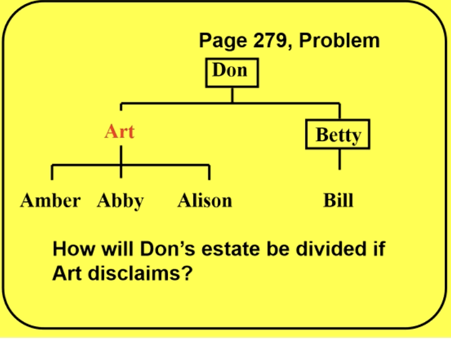
                        

### Acts of Beneficiaries Notes…

- Another way shares can change is by acts of the beneficiaries themselves. Courts often deny beneficiaries their shares because of the beneficiaries misconduct. In addition, a beneficiary may turn down an inheritance or attempt to give away one not yet received.

A. Disclaimers

- “I don’t want it”.
    - They are no longer wanting the title to the property.
- Beneficiaries use disclaimers to change the distribution of an estate or trust by refusing to accept its benefies. They are the principal tool for “post mortem” after death, estate planning. Probably the most common reason for disclaiming property is to save taxes, although the device often can be used to avoid creditors or simply allow others, more needy, to take the property. Before executing disclaimers, potential recipients should be fully aware of the consequences.

In re Estate of Holden

Background: South Carolina 2000

Facts: William Holden died without a will. Two sons filed disclaimers so that the property would goto Julia, his wife. They were wrong, because it would go to Julia AND her grandkids. 

Issue:

Holding/Reasoning:

---

- As Holden illustrates, two sets of rules govern disclaimer questions: State statutes and decisions control how a disclaimer affects ownership. The IRC controls fed tax consequences.
- Survivors may want to disclaim their gifts to keep the property out of the hands of creditors or to keep government benefits. Courts often recognize disclaimers for these purposes, but the law is not uniform.

**UPC 2-1105** Power to Disclaim, General Requirements; When Irrevocable (the umbrella provision)

(a) A person may disclaim, in whole or in part, any interest in or power over property, including a power of appointment. A person may disclaim the interest or power even if its creator imposed a spendthrift provision or similiar restriction on transfer or a restriction or limitation on the right to disclaim.

Anyone can refuse to accept property or a power given to them (like being named in a will), even if the person who gave it tried to prevent them from refusing it. Disclaimers are optional, may disclaim in full or in part.

(b) Except to the extent a fiduciary’s right to disclaim is expressly restricted or limited by another statute of this State or by the instrument creating the fiduciary relationship, a fiduciary may disclaim, in whole or in part, any interest in or power over property, including power of appointment, whether acting in a personal or representative capacity. A fiduciary may disclaim the interest or power even if its creator imposed a spendthrift provision or similiar restriction on transfer or a restriction or limitation on the right to disclaim, or an instrument other than the instrument that created the fiduciary relationship imposed a restriction or limitation on the right to disclaim.

A fiduciary (like a trustee or executor) can also refuse to accept property or powers on behalf of the person or estate they're managing—even if the person who created the trust or will tried to prevent them from doing so.

**(c)** To be effective, a disclaimer must be in a writing or other record, declare the disclaimer, describe the interest or power disclaimed, be signed by the person making the disclaimer, and be delivered or filed in the manner provided in Section 2-1112. In this subsection:

(1) "record" means information that is inscribed on a tangible medium or that is stored in an electronic or other medium and is retrievable in perceivable form;

(2) "signed" means, with present intent to authenticate or adopt a record, to:

(A) execute or adopt a tangible symbol; or

(B) attach to or logically associate with the record an electronic sound, symbol, or process.

must be written, described, signed, delivered (filed)

In simple terms: To refuse an inheritance, you must write it down (or create an electronic record), clearly state what you're refusing, sign it, and properly file or deliver it according to the law.

(d) A partial disclaimer may be expressed as a fraction, percentage, monetary amount, term of years, limitation of a power, or any other interest or estate in the property.

If someone buys property from a killer (or their relative) without knowing about the killing, or receives payment from them, they don't have to give it back. But the killer (or their relative) who received the property or payment may have to personally pay back its value.

(e) A disclaimer becomes irrevocable when it is delivered or filed pursuant to Section 2-1112 or when it becomes effective as provided in Sections 2-1106 through 2-1111, whichever occurs later.

The delivery makes it irrevocable. Prior to delivery, they can change or revoke it.

(f) A disclaimer made under this Part is not a transfer, assignment, or release.

**Section 2-1106. Disclaimer of Interest in Property:**

(a) In this section:

(1) "Future interest" means an interest that takes effect in possession or enjoyment, if at all, later than the time of its creation.

(2) "Time of distribution" means the time when a disclaimed interest would have taken effect in possession or enjoyment.

(b) Except for a disclaimer governed by Section 2-1107 [Jointly Held Property] or 2-1108 [Disclaimer by Trustee], the following rules apply to a disclaimer of an interest in property:

(1) The disclaimer takes effect as of the time the instrument creating the interest becomes irrevocable, or, if the interest arose under the law of intestate succession, as of the time of the intestate's death.

A disclaimer takes effect at the moment the will or trust became final (when the person died or the document couldn't be changed anymore), not when you actually file the disclaimer. This means legally, it's treated as if you never owned the property in the first place.

for irrevocable trusts, the moment of irrevocability is complicated?

(2) The disclaimed interest passes according to any provision in the instrument creating the interest providing for the disposition of the interest, should it be disclaimed, or of disclaimed interests in general.

The disclaimed interest does not pass according to some language in the disclaimer; it passes according to language in the instrument (the will, maybe). the bene cant make language choosing where it goes.

(3) If the instrument does not contain a provision described in paragraph (2), the following rules apply:

If the will doesn’t have language that shows how the disclaimed interest should pass…the following rules apply…

(A) If the disclaimant is not an individual, the disclaimed interest passes as if the disclaimant did not exist.

If someone isn't a person (like a company, organization, trust, charity) and they refuse an inheritance, it's treated as if that entity never existed. This means the property goes to whoever would have received it if the disclaiming entity had never been named in the first place.

(B) If the disclaimant is an individual, except as otherwise provided in subparagraphs (C) and (D), the disclaimed interest passes as if the disclaimant had died immediately before the time of distribution.

If someone refuses their inheritance and the will doesn't say what happens to it, the refused property is treated as if that person predeceased the decedent. The property then goes to whoever would have gotten it if that person had actually died at that time.

**(C)** If by law or under the instrument, the descendants of the disclaimant would share in the disclaimed interest by any method of representation had the disclaimant died before the time of distribution, the disclaimed interest passes only to the descendants of the disclaimant who survive the time of distribution.

If the disclaimed interest would pass to the descendants of the disclaimee, we do not go and redo the representation, simply, the disclaimed interest passes down, preventing someone from disclaiming in order to redo representation and get their kids more shares.

Every intestate scenario where kids are disclaiming, will scenario where kids disclaiming.

**(D)** If the disclaimed interest would pass to the disclaimant's estate had the disclaimant died before the time of distribution, the disclaimed interest instead passes by representation to the descendants of the disclaimant who survive the time of distribution. If no descendant of the disclaimant survives the time of distribution, the disclaimed interest passes to those persons, including the state but excluding the disclaimant, and in such shares as would succeed to the transferor's intestate estate under the intestate succession law of the transferor's domicile had the transferor died at the time of distribution. However, if the transferor's surviving spouse is living but is remarried at the time of distribution, the transferor is deemed to have died unmarried at the time of distribution.

If that refused inheritance would normally have gone to the person's estate, then instead the property goes to their children or descendants who are alive at the time. If the person has no living descendants, the property is distributed as if the original gift-giver had died at that moment without a will, going to whoever would inherit under intestacy rules—but importantly, it cannot go to the person who refused it in the first place. ???

**(4)** Upon the disclaimer of a preceding interest, a future interest held by a person than the disclaimant takes effect as if the disclaimant had died or ceased to exist immediately before the time of distribution, but a future interest held by the disclaimant is not accelerated in possession or enjoyment.

**Question**: Should a legal guardian be able to disclaim an interest of a minor child? Mixed holdings.

Problem: Don died instestate, leaving his son Art and Arts three children, and Bill, the child of Dons predeceased daughter Betty. If Art disclaims, how will Dons estate be divided under the UPC if the disclaimer statute says to treat the disclaimant as having predeceased the decedent?

Answer: Under **103**, the first people entitled to receive are descendants by representation. Art lives, and AAA,B live. 106 by representation rules tells us to go to first generation of group of decendents alive, that generation is children Art. 1 share for Art. 1 share for Betty bc although she predeceased, she has a living descendent. 2 shares total. We give 1 share to the living descendent, and the other share, where Betty is dead, passes down to her descendent(s). Art gets 1 share, Bill gets 1 share. **Art 1/2. Bill 1/2.** 

Now…if Art disclaims, how will it pass?

Rather than splitting at the child generation, we split at the grandchildren generation. AAA,B alive. They would each get 1/4 share.

BUT if 1106(3)(C) “If under the instrument, the descendants of the disclaimant would share in the disclaimed interest by any method of representation had the disclaimant died before the time of distribution, the disclaimed interest passes only to the descendants of the disclaimant who survive the time of distribution.”

Art disclaimed his 1/2, his kids will inherit his 1/2.

The UPC will not allow them to disclaim in order to redo the representation to give the kids more, the existing interest that the disclaimant already was owed is passed down…

**Assignment of Expectancies**

- An expectancy is hoped for inheritance.
- Sometimes people want to transfer their expectancies to others. Perhaps they want to make a gift, maybe they want to cash in early.
    - From the recipients perspective, the risk is the the expectancy will never amount to anything. The donor could always make or revise a will or the expectant could die too soon. This had led courts to restrict severely the situations in which any transfer would be effective.
        - Revocable instruments have a likelihood of being nothing, big risk
        - Irrevocable instruments have more weight
            - According to Orthodox doctrine, outright transfers of expectancies are invalid. **Res Prop S 313**, the whole point of the instrument is to follow intent of the testator, selling it while alive goes against, it encourages people to kill them to get the money back.
                - Exceptions: Equitable exceptions, if we say you cant transfer it, but a buyer will offer money, the kid gets advance and the transaction is void, as long as it is for adequate consideration, presumptive consideration, treat it as a release, beneficiary gives up their right to receive in exchange for the consideration, would be buyer is now entitled to it, similiar to a disclaimer with a forward→
        - A parallel doctrine recognizes transfers of a childs expectancy back to the parent, again if supported by fair consideration. These transfers are called “releases” and are treated like advancements. The parents payment for the release is really just an early transfer of an expected share.

### **Misconduct**

- A beneficiaries misconduct can change the beneficiaries expected share.
    - Ex. Arnie kills her father. Can Arnie then inherit from him?
- Courts and legislatures would often deny Arnie from collecting his share. Depending on the facts, that response may not seem fair. Mental illness? Drunk driving? abuse?
    - Courts based on the principle established in Riggs that a murderer should not profit from his or her wrongdoing, may impose a constructive trust against the property Arnie would otherwise get from his dad. A constructive trust is a remedy courts use to prevent unjust enrichment.

**Excellent point—you're absolutely right.**

The manslaughter conviction here is ambiguous because state law defines it as either:

- **(1) Intent to kill in the heat of passion or during provocation** (which would meet the UPC's "intentional" killing requirement), or
- **(2) A reckless act that results in death** (which would NOT meet the "intentional" killing requirement under UPC 2-803)

**The Problem:**

The jury verdict of "manslaughter" doesn't specify which definition applies. If Bobby was convicted under the recklessness theory (definition 2), he did not "intentionally" kill Dave, and therefore would not be barred under the slayer statute.

**Revised Answer: It depends.**

- **If the conviction was based on intentional killing** (heat of passion/provocation), then Bobby is barred under UPC 2-803(b) and (g), and the statement is **False**.
- **If the conviction was based on recklessness**, then Bobby did not "intentionally" kill Dave, the slayer statute does not apply, and the statement is **True**—the executor must distribute to Bobby.

**What would likely happen:**

The executor would need to examine the record of conviction, jury instructions, or verdict form to determine the basis of the manslaughter conviction. If the record is unclear, an interested party could petition the court under 2-803(g) to determine whether Bobby "feloniously and intentionally" killed Dave under the preponderance of evidence standard.

Without knowing which theory the jury relied on, we cannot definitively say whether Bobby forfeits his inheritance.

**UPC 2-803**. **Effect of Homicide** on Intestate Succession, Wills, Trusts, Joint Assets, Life Insurance, and Beneficiary Designations. (Slayer Statute)

(a) [Definitions.] In this section:

(1) “Disposition or appointment of property” includes a transfer of an item of property or any other benefit to a beneficiary designated in a governing instrument.

(2) “Governing instrument” means a governing instrument executed by the decedent.

(3) “Revocable,” with respect to a disposition, appointment, provision, or nomination, means one under which the decedent, at the time of or immediately before death, was alone empowered, by law or under the governing instrument, to cancel the designation in favor of the killer, whether or not the decedent then had capacity to exercise the power.

**(b)** [Forfeiture of Statutory Benefits.] An individual who feloniously and intentionally kills the decedent forfeits all benefits under this Article with respect to the decedent’s estate, including an intestate share, an elective share, a spouse’s or child’s share, a homestead allowance, exempt property, and a family allowance. If the decedent died intestate, the decedent’s intestate estate passes as if the killer disclaimed his [or her] intestate share.

If he dies by intestacy, and a potential taker killed them feloniously and intentionally, they forfeit all takings.

**(c)** [Revocation of Benefits Under Governing Instruments.] The felonious and intentional killing of the decedent:

Wills

(1) revokes any revocable (i) disposition or appointment of property made by the decedent to the killer in a governing instrument, (ii) provision in a governing instrument conferring a general or nongeneral power of appointment on the killer, and (iii) nomination of the killer in a governing instrument, nominating or appointing the killer to serve in any fiduciary or representative capacity, including a personal representative, executor, trustee, or agent; and

If someone kills the testator, they revoke property, powers, and any fiduciary capacities like being trustee.

(2) severs the interests of the decedent and killer in property held by them at the time of the killing as joint tenants with the right of survivorship [or as community property with the right of survivorship], transforming the interests of the decedent and killer into tenancies in common.

This…

**(d)** [Effect of Severance.] A severance under subsection (c)(2) does not affect any third-party interest in property acquired for value and in good faith reliance on an apparent title by survivorship in the killer unless a writing declaring the severance has been noted, registered, filed, or recorded in records appropriate to the kind and location of the property which are relied upon, in the ordinary course of transactions involving such property, as evidence of ownership.

If a third party bought property or received something of value in good faith, relying on the fact that the killer appeared to be the rightful owner through survivorship, they get to keep it unless there was already a public record filed showing the property interests had been separated. Basically, innocent buyers are protected unless there was a warning on file that would have told them the killer wasn't actually entitled to the whole property.

**(e)** [Effect of Revocation.] Provisions of a governing instrument are given effect as if the killer disclaimed all provisions revoked by this section or, in the case of a revoked nomination in a fiduciary or representative capacity, as if the killer predeceased the decedent.

If you slay, and are revoked from taking, we pretend the killer disclaimed, go to disclaimer statute.

**(f)** [Wrongful Acquisition of Property.] A wrongful acquisition of property or interest by a killer not covered by this section must be treated in accordance with the principle that a killer cannot profit from his [or her] wrong.

**(g)** [Felonious and Intentional Killing; How Determined.] After all right to appeal has been exhausted, a judgment of conviction establishing criminal accountability for the felonious and intentional killing of the decedent conclusively establishes the convicted individual as the decedent’s killer for purposes of this section. In the absence of a conviction, the court, upon the petition of an interested person, must determine whether, under the preponderance of evidence standard, the individual would be found criminally accountable for the felonious and intentional killing of the decedent. If the court determines that, under that standard, the individual would be found criminally accountable for the felonious and intentional killing of the decedent, the determination conclusively establishes that individual as the decedent’s killer for purposes of this section.

If there is a conviction and it stands on appeal, they are out. Pleading guilty does not mean a guilty conviction, we must have the civil proceeding below Swansons Estate

In absence of conviction, the court must determine, under a civil standard preponderance of evidence, they are to be held accountable. This will start after the criminal and all criminal appeals is over.

**(h)** [Protection of Payors and Other Third Parties.]

**(1)** A payor or other third party is not liable for having made a payment or transferred an item of property or any other benefit to a beneficiary designated in a governing instrument affected by an intentional and felonious killing …

**(i)** [Protection of Bona Fide Purchasers; Personal Liability of Recipient.]

**(1)** A person who purchases property for value and without notice, or who receives a payment or other item of property in partial or full satisfaction of a legally enforceable obligation, is neither obligated under this section to return the payment, item of property, or benefit nor is liable under this section for the amount of the payment or the value of the item of property or benefit. …

In the Matter of the Swansons’ Estates

Background: Montana 2008

Facts: Jeanette Swanson shot and killed her two children. Doctors agreed that she had been suffering from mental illness, she believed she could kill them and send them to heaven to protect them from incoming danger. District Court found Jeanette forfeited her rights of inheritance to the children’s estates. 

Issue: Does the state slayer statute prevent Jeanette from collecting from the children’s estates?

Holding/Reasoning: Remand.

The MT state stautes codifies the long standing common law principle that a killer should not profit from his own wrongdoing…

A guilty verdict establishes these elements (feloniously and intentionally killing), but a guilty plea does not. Thus, a guilty verdict would be conclusive, a guilty plea is not.

On remand, Gene has the burden of proving that Jeanette acted “intentionally” and “feloniously” for the purposes of the slayer statute.

Side Note: On remand, the lower court found Gene did not prove she has the requisite intent, because her mental disease or defect. Ultimately, the parties agreed to a global settlement that included a divorce.

---

- Other states have taken similiar approaches despite the somewhat different phrasing of their statutes. See Dougherty (slayer barred despite being found guilty by reason of insanity because facts showed slayer intentionally and unjustifiably killed his mother)
    - But see Armstrong (slayer who was insane at time of killing did not willfully cause death under the Mississippi statute)
        - New York does not have a slayer statute, but would not bar a slayer from taking if the slayer was insane at the time of the act. See Estate of Bobula
- What if two people own property as joint tenants with right of survivorship and one kills the other?
    - UPC—Equal Division
        - Denies wrongdoer a gain while it recognizes that the wrongdoer already owned an interest in the property since the slayer could have converted the joint tenancy into a tenancy in common at any time. The wrongdoer loses the right of survivorship.
            - But See Welch v Waggoner (slayer who was joint tenant deemed to predecease slain joint tenant so slayer receives nothing.)
- Courts often reach the same result with respect to tenancy by the entireties property.
    - According to comments to UPC 2-803m this is the proper result, since the slayer could have obtained a no fault divorce and wound up with one half of the property.

Exercise: Should any of the following be barred from inheriting from the decedent?

UPC—Feloniously and intentionally?

(a) Someone who facilitates suicide by providing a gun? Yes

(b) A supposed caregiver who largely ignored a needy indiviudal? No

(c) Someone whose parental rights had been terminated? ???

(d) Someone who kept the secret of another relatives planned crime and who would inherit if the criminal were barred? (No)

### Acts of Property Holder

- Actions property holders can take before death can affect how their property will be divided after death.

A. Advancements

- Advancements are gifts that the donor intends to be charged against the recipients share of the donors intestate estate.
    - Two problems arise
        - How do we tell whether the donor intended a gift to be an advancement?
        - How does an advancement affect the shares of other heirs?
    - Evidence is often circumstantial. To help solve the proof problem, common law presumed a parents gift of a substantial sum to a child to be an advancement.
        - Many states have reversed the presumption and recognized gifts as advancements only if the donee acknowledges them as such or if the donor indicates in a contemporaneous writing that the gift is meant as an advancement. **UPC 109.**
            - This approach “virtually removes the doctrine of advancements from the law of intestate succession”
    - Courts conduct “a hotchpotch” calculation, adding the value of each advancement to the total amount available for distribution from the estate. Then it divides the total among the heirs according to the intestate statutes. Court credits each donee with the gifts already received, and distributes the rest of the property. The court is merely adding the advancements value for the purpose of calculating shares.
    - The UPC values an advancement “as of the time the heir came into possession or enjoyment of the property or as of the time of the decedent’s death, whichever first occurs **UPC 109(b)**.

**Problem**. Ada died a widow, leaving daughters L F and N. During Adas life, she gave L 20k advancement and N 30k advancement. Ada left 100k estate. How should the estate be divided under UPC?

B. Satisfaction

- What the advancements doctrine is to intestate succession, the satisfaction doctrine is to wills.
    - Ex. Suppose Hugh wrote a will givine M half his estate and later gave M $5,000 intended to come out of her ultimate share. If a court recognized the $5k as being “in partial satisfaction” of the gift under the will, other beneficiaries could force a hotchpot calculation to credit Melanie with the money she already received.
- As with advancements, disputes arise about the intention behind lifetime gifts and court have relied upon presumptions. Traditionally, courts have presumed that gifts of money from parents to children after a wills execution are in satisfaction of any legacies under the will. Courts have disagreed about whether testamentary gifts of real estate or specific personal property could ever be satisfied by a lifetime gift or different property. The modern view would allow lifetime gifts to replace testamentary gifts of different character, where that is the intention.

Yivo Institute for Jewish Research v. Zaleski

Background:

Facts: Dr. Karski wrote a letter to the YIVO Institute for Jewish Research (YIVO) (plaintiff), agreeing to create an endowment of $100,000 for an annual $5,000 award for Polish Jewish authors. The letter stated that the endowment would consist of a gift in Karski’s will, or in cash or securities during his lifetime. In Karski’s will he left to YIVO his shares in the Northern States Power Company (Northern Power), which were worth approximately $100,000. In the years before he died, though, Karski made a series of gifts of stocks in other companies to YIVO. The total value of the stocks was $99,997.69. Soon after the final stock gift, Karski gifted YIVO $2.31 to bring the total value of gifts to $100,000. Karski did not amend his will. At Karski’s death, the Northern Power shares remained in the estate and were worth over $100,000. Paul Zaleski (defendant), Karski’s personal representative, denied YIVO’s request for the Northern Power stock, stating that the bequest had been adeemed by Karski’s inter vivos gifts to YIVO.

Issue: If the bequest is made for a particular purpose, does his inter vivos gift for the same purpose and same kind create a presumption that the gift adeemed the legacy by satisfaction?

Holding/Reasoning: Yes

To establish this presumption, the gift cannot be substantially different in kind than the legacy.

The testator’s intent at the time of the inter vivos gift is the key to this inquiry.

However, a testator’s intent to adeem a legacy need not be proven by a writing executed at the same time as the inter vivos gift. In this case, the lower courts correctly held that Karski’s inter vivos gifts to YIVO adeemed YIVO’s legacy by satisfaction. The purpose of the legacy in Karski’s will was to fulfill Karski’s endowment promise to YIVO. The inter vivos gifts were for the same purpose and of the same kind. Karski’s endowment letter to YIVO stated the endowment would consist of $100,000 as either a gift in Karski’s will, or in cash or securities during his lifetime. Karski’s inter vivos stock gifts to YIVO totaled just under $100,000. As this amount was just short of the amount that Karski committed to YIVO, Karski gave YIVO an additional gift of $2.31 to reach the total of $100,000. There is no plausible explanation for the $2.31 gift other than that Karski intended the gift for the purpose of fulfilling his $100,000 endowment obligation. 

---

### Changes in Property

- General Gift—gift of value, of cash
- Specific Gift—a specific asset
- Demonstrative Gift—gift of value from a specific source, but maybe other sources
- Residuary Gift—-gift of “everything else”

- What if property, left to someone in a will, is no longer in the estate? **Ademption**.
    - If gift is general, we use general estate assets to buy property for the beneficiary, they are still entitled to the value, it cannot be adeemed.
    - If gift is specific, beneficiary loses it under the “identity theory”, (Wasserman), it is adeemed, but the **UPC 2-606** looks for intent and changes this.
    - **UPC 2-606** Non-Ademption of Specific Devises
        - If it is a specific gift, the specific devisee has a right to that specifically devised property and **606(a)(1)** any balance of the purchase price, **(2)** any amount of a condemnation award, **(3)** insurance awards (like from a burned down house), **(4)** property owned by foreclosure…
        - **606(a)(5)** real or tangible property owned by the testator at death acquired as a replacement for specifically devised real or tangible property.
            - This is the big one. Under common law identity theory, if that parcel was not part of the estate, rip your specific gift. Under UPC, if that parcel is gone, but testator acquired another parcel to replace it, the court may consider if they acquired that new parcel “as a replacement”, the devisee gets it.
- What if there is not enough money to go around, considering debts? **Abatement**.
    - First, residuary gifts fail first.
    - Then, general gifts fail.
    - Finally, Demonstrative and Specific gifts fail as a class.
        - Consider Exoneration—
            - Some jurisdictions follow exoneration doctrine, which means we must clear the debt on a specific gift to give it, a specific devise transfers free from any outstanding mortgage, which has to be paid by the residuary heir.
            - **UPC 607** has no right of exoneration.
        

---

### **Changes in Property**

- Much can happen to property between the time when a document is drafted and the time it becomes effective.
    - Ex. Suppose Mary’s Will gives 50 shares of Nvidia stock to Walter. Before her death, Nvidia stock splits, with additional shares issued for each share owned.
    - Ex. Robinhood buys Nvidia.
    - Ex. Mary sells her Nvidia stock and allocates the money to Robinhood stock.

**Classification of Gifts**

- Sometimes courts read similar language in different ways as they strain ti push a gift into a particular category to produce the result they believe makes the most sense in the case before them.
- Four classes: Specific, General, Demonstrative, Residuary.
    - The goal is to identify the testator’s intent—recognize that transferors have different ideas about various gifts.
    - Specific specific and general specific
- Specific Gifts:
    - gifts that specifically identify the item
    - gift of A THING, gift of a specific asset, specific gift
    - Beneficial for the beneficiary if there is some accrued, but unpaid, income. The beneficiary usually gets the income earned on specific bequests during estate administration while residuary benefits will be entitled to all other income during estate administration.
    - Hurtful for the beneficiary if the question involves a gift of property which is not an estate asset at the testator’s death. Here, specific gifts usually fail
    - The word “my” is indicative of a specific gift
        - “My oak desk in my room”
        - “My 100 shares of General Motors Preferred Stock”
        - “My house and lot on Hereford Lane”
- General Gifts:
    - gifts that are often legacies, but they need not be.
    - gifts of value, of cash…
    - Helpful for the beneficiary if the question involves a gift of property which is not an estate asset at the testator’s death. They do not fail like specific gifts usually.
    - Beneficiaries of general and demonstrative gifts may only be entitled to interest on bequests not timely distributed.
        - “$3,000 to Carter”, this is a gift of value, general gift,
        - “100 shares of HOOD”, this is a gift of value, valued at whatever 100 shares of HOOD are worth…
            - The value at the time of death, generally…
- Demonstrative Gift
    - Testator intends to come from a specific source, but which can also come out of general estate assets
    - Beneficiaries of general and demonstrative gifts may only be entitled to interest on bequests not timely distributed.
    - Rare
        - “$6,000 to come from my robinhood account, but if the account is too small, from my other funds”
- Residuary Gift:
    - Catch-all
    - The beneficiary of specific gifts usually gets the income earned on specific bequests during estate administration while residuary benefits will be entitled to all other income during estate administration.
        - “Everything else I own to Carter”

Exercise: Classify each of the following dispositions:

(a) I leave Jess 100 shares of HOOD common stock

This communicates I am giving you the VALUE of 100 shares… this is a general gift

(b) I leave Jess my 100 shares of HOOD common stock

This communicates I am giving you these 100 shares, this is a specific gift

(c) I leave Jess all my shares of HOOD common stock

(d) I leave Jess one-half of my net estate

Answer: First, before distributing resdue, we subtract specific gifts which are all the pre-residuary gifts, we subtract debts taxes expenses, as a residuary heir, you can only know what represents your share of the estate at the very end of the administration of the estate. After everything is sorted out, you get your share 1/3.

(e) I leave Jess an annuity of $300 per month, to be paid out of my Chase bank account

(f) I leave Jess one half of my tangible personal property

Answer: 

Every residuary heir wants every pre residuary gift to be a gift of the specific asset rather than genreal, bc of if the value reduces the residuary estate if that gift no longer exists

dad has a will and gives steve 100 shares of datacorp, all residue to chris, but sells the shares before he dies…

chris will say this sucks, and argue that it was a specific gift, but he sold it so it is dead

steve will argue it was a general gift…he would be righjt

100 shares to C, but at death he only has 50 shares at death

there is no ademption of a value specific gift

a presidiaryar general gift based on value cannot be adeemed if the property does not exist at death, whereas a gift of speific property is adeemed is the property does not exist

**Dividends and Stock Splits**

- Testators often gain wealth between the time of the wills execution and the date of death. This happy event poses construction problems, however, when the growth (sometimes called Accretion) stems from securities specifically devised in the will.
    - The basic question is: does the specific gift include the gain?
- Stock splits or stock dividends
- A testator would hold both the shares owned at the time of the will execution and the additional shares gained from the split or dividend. The question then becomes whether these new shares follow the original shares or belong to the residuary estate as would cash dividends. Stock splits merely reallocate capital among a greater number of shares, most modern courts give the new shares to the beneficiary of the old. See Bostwick v Hurstel.
    - Some courts take this approach only if the gift is specific. See Boerstler v Andrews
    
    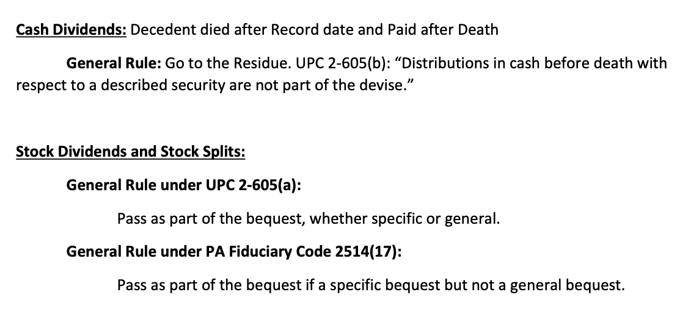
    
- Stock dividends, however, resemble both cash dividends and stock splits. Because a stock dividend normally converts accrued corporate earnings into stated capital, it substitutes for a cash dividend.
    - On the other hand, from the investors perspective, the “dividend” serves only to spread the market value of the corporation among a greater number of shares, so the post dividend stock carries a lower market value.
        - The stock dividend thus looks like a restructuring of the investors market investnemtn, much like a stock split.
            - Courts therefore disagree about whether stock dividends go with the specific gift of the underlying stock.
                - Under the UPC, a devise of securities will include additional securities acquired “as a result of the testator’s ownership” (UPC 605(2).
                    - Thus both the stock dividends and the stock splits would go with the original shares, regardless of the gift’s classification as general or specific.

**Ademption**

- The Doctrine of ademption seeks to answer questions about what to do if a document gives away property which is not available when the document becomes effective.
- If the gift is general, the fiduciary uses general estate assets to buy property for the beneficiary. If the gift is specific, the beneficiary loses out under the “identity” theory which says that a specific gift fails if the subject matter is not an estate asset at death.
    - specific asset gifts come before specific value gifts which come before residuary gifts,
        - a value gift can never take from a specific asset gift
- In many situations, it defeats testators’ probable intentions, so courts have developed carious devices for avoiding the strict doctrine.
    - The UPC goes further and abolishes the identity theory in favor of one which seeks out the testator’s intention. UPC 606.

Wasserman v Cohen

Facts: In 1982, Frieda Drapkin executed a trust that directed the trustee, David Cohen (defendant), to distribute “12-14 Newton Street” to Elaine Wasserman (plaintiff) upon her death. In 1988, Drapkin sold the property. Wasserman filed a petition asking the probate court to not apply the doctrine of ademption, but rather consider Drapkin’s intent.

Holding/Reasoning: For a specific gift, if it no longer is in the decedents ownership, it is dead.

if a gift is not owned or not in existence at the time of the testator’s death, the gift is terminated. The focus is thus not on the testator’s intent. Rather, the law holds that if the testator intended a different outcome, he or she would have changed the will or trust when the gift was sold or extinguished.

Drapkin did not own the subject property at the time of her death. Accordingly, Drapkin’s devise of the property to the plaintiff was adeemed.

This doctrine allows for stability and consistent drafting of trusts and estates.

Trusts are to be construed in the same manner as wills.

---

- A different sort of ademption can occur if a donor anticipates an at death goft by transferring equivalent property to a beneficiary during the donor’s life. Called ‘ademption by satisfaction’ or simply ‘satisfaction’ this doctrine is very similiar to the advancements theory of intestate succession. 501(a) and (b)
- In response to the identity rule’s harshness, courts and legislatures have developed several avoidance devices. As the Wasserman opinion notes, if the testator becomes incompetent, courts often trace assets when someone acting on behalf of the incompetent has transferred property subject to a specific devise.
    - Where a guardian has sold specifically devised property to pay the ward’s expenses, but some of the proceeds of the sale are left over, courts have allowed tracing to the extent of the remaining funds.
    - A state may also take a modified intention approach beyond transfers made by guardians.
    - If the gift is clearly ‘specific’ the ‘change in form’ exception may come into play.
        - For example, if a will devised HOOD stock, before a buyout by SCHWAB, the devisee would take the new SCHWAB stock. See in Re Estate of Watkins.
            - Courts sometimes take the change in form exception for granted.
    - Also, courts can construe a will as speaking at the time of the testator’s death. Thus, a gift of ‘my car’ will almost certainly apply toi the car owned at death.
        - The technique of tracing assets of following proceeds through different forms, emphasized the beneficiarys importance to the donor. The theory is that the donor wanted the benficiary to get something, sometimes, however, perhaps the focus should be more on the gift itself—like a keepsake tied to particular memories. If so, perhaps ademption should apply.
        - The UPC reverses the identity theory and creates a rule based on intention.

**UPC 2-606 Non-Ademption of Specific Devises, Unpaid proceeds of sale, Condemnation or Insurance, Sale by Coservator or Agent**

Dismisses the common law, no longer the Identity Theory

**(a)** A specific devisee has a right to the specifically devised property in the testators estate at death and;

**(1)** any balance of the purchase price, together with any security agreement, owing from a purchaser to the testator at death by reason of sale of the property;

Asset is $100k, but testator has only paid half the money, we can’t leave the specific devisee with an imperfect title, so we give the devisee the other 50k to perfect the title.

**(2)** any amount of a condemnation award for the taking of the property unpaid at death;

If gov takes the property by force, but provides value in return, the devisee gets that award.

**(3)** any proceeds unpaid at death on fire or casualty insurance on or other recovery for injury to the property;

House burns down, decedent dies in the fire, left the house to the kids. The fire insurance award insurance recovery goes to the specific devisee.

**(4)** property owned by the testator at death and acquired as a result of foreclosure, or obtained in lieu of foreclosure, of the security interest for a specifically devised obligation;

If in a foreclosure proceeding you receive another asset, equity in the house, the specific beneficiary gets that equity value.

**(5)** real or tangible personal property owned by the testator at death which the testator acquired as a replacement for specifically devised real or tangible personal property; and

**THE BIG CHANGE - Replacement / Intent Theory**

I have a will provision that leaves to you “my house in PA to C”, under common law that is a specific gift, under UPC if I own it at death, you get the home, if I do not own the home and I moved somewhere else, if it is a specific gift of property and you used my, you do not get it as the asset changed, the UPC does not play that game, the UPC looks to the testators intent, how you were using the property, was the propertyin FL the replacement to the house in PA? If so, C gets it under 606(5). The UPC reads that will provision like  “I am giving you my principal residence” 

**(6)** unless the facts and circumstances indicate that ademption of the devise was intended by the testator or ademption of the devise is consistent with the testator’s manifested plan of distribution, the value of the specifically devised property to the extent the specifically devised property is not in the testator’s estate at death and its value or its replacement is not covered by paragraphs (1) through (5).

**(b)** If specifically devised property is sold or mortgaged by a conservator or by an agent acting within the authority of a durable power of attorney for an incapacitated principal, or if a condemnation award, insurance proceeds, or recovery for injury to the property are paid to a conservator or to an agent acting within the authority of a durable power of attorney for an incapacitated principal, the specific devisee has the right to a general pecuniary devise equal to the net sale price, the amount of the unpaid loan, the condemnation award, the insurance proceeds, or the recovery.

**(c)** The right of a specific devisee under subsection (b) is reduced by any right the devisee has under subsection (a).

**(d)** For the purposes of the references in subsection (b) to a conservator, subsection (b) does not apply if after the sale, mortgage, condemnation, casualty, or recovery, it was adjudicated that the testator’s incapacity ceased and the testator survived the adjudication by one year.

**(e)** For the purposes of the references in subsection (b) to an agent acting within the authority of a durable power of attorney for an incapacitated principal,

**(i)** “incapacitated principal” means a principal who is an incapacitated person,

**(ii)** no adjudication of incapacity before death is necessary, and

**(iii)** the acts of an agent within the authority of a durable power of attorney are presumed to be for an incapacitated principal.

---

- Wasserman sticks to the identity rule. The UPC looks to intention. In this context, which is better?

Problems: 299.1 and 299.2

299.1: Suppose Bill’s will says “to my son Dick, my 30-06 Springfield rifle, handmade stock, 2.5 scope, in memory of our good times together in the Blue Mountains. If the rifle is insured and stolen the week before Bills death, what would Dick receive under UPC 606?

Answer: Yes **606(b)** says “he specific devisee has the right to a general pecuniary devise equal to the net sale price.” Therefore Dick is entitled to the insurance proceeds.

299.2: Terrell’s will gave her 4-wheel jeep Wrangler to Martha. Terrell then sold the jeep and bought a sportscar. Under UPC 606, would Martha take the sportscar??

Answer: If she was using the sportscar as a replacement to the Jeep, then under **606(a)(5)** yes. Not a value question, an intent question. If this was simply another purchase, not relating to the jeep, then maybe not! Argue.

### Abatement and Exoneration

**Abatement**

- Abatement addresses what to do when there is not enough money to go around
    - Gifts to will beneficiaries “abate”, or fail in the face of inadequate funds, in the following order:
        1. Residuary fails first,
        2. General (value beneficiaries) fails next, then
        3. Demonstrative and Specific, gifts of a specific asset, fail as a single class. (The only way they lose, then, is if the estate is in insolvency)
            - Ex. Ralph leaves in his will “tools to Victoria, $8000 to Michael, $4000 to Marie, and the rest to Bob.” Assume the tools are worth $6,000, and the estate assets in total are $24,000. Debts total $15,000. Who gets what?
                - Bob’s residuary is $12,000 and the debts are $15,000, so Bob get nothing.
                - Michael and Marie received general gifts. The 8k and 4k get proportionately reduced, therefore Michael gets 6k and Marie gets 3k.
                - Victoria takes the tools, valued at $6,000.

**Exoneration**

- Exoneration addresses the impact of liens on specifically-devised property
    - A specific devise transfers free from any outstanding mortgage, which has to be paid by the residuary estate.
        - If your jurisdiction followed the exoneration doctrine, the gift is reduced by the amount necessary to pay off the mortgage and car loan.
        - UPC 607 no right of exoneration.

Problems 300/301

300.1 Bill wants to make several pecuniary and specific bequests to friends and family and leave the rest to his wife, Bobby. Draft that.

301.2 

### Lapse

Steps:

1. Did a beneficiary predecease?
2. Is the predeceased beneficiary in a class protected by the statute?
    1. Up to grandparents down? Are they within that orbit?
3. Did the beneficiary die before the doc was created?
    1. —

- Intestate statutes require that you must survive the testator to receive. If they don’t the gift extinguishes. This is ‘lapse’
    - This is a Will only problem. Not will substitutes. Intestacy gives to takers “by representation”
- Antilapse Statutes Rule: **If beneficiary dies, and is protected by statute, create a substitute gift in the devisee’s heirs**
    - **Exception 1**—if devise provides clear intent that the antilapse statute should not apply (usually in the form of “no antilapse!” language) (of survivorship language is insufficient contrary intent (Kehler))
    - **Exception 2**—if devise provides for an alternate gift, we follow the alternate gift.
        - If the alternate gift taker is dead, we then create a substitute gift like as if there wasn’t an alternate taker.
- **UPC 603**—Will only Antilapse
    - **(b)** **If a devisee fails to survive**, and is in the orbit of grandparents down…
        - **(b)(1)** except as provided in para 4, **substitute gift to devisee’s heirs** IF there are surviving descendants AND not a class gift
            - **(b)(2)** if a class gift, a substitute gift is created in the surviving descendants of any deceased devisee. Each surviving devisee takes the share by representation Per Stirpes
            - **(b)(3) Exception 2** from above, if there is evidence of contrary intent, we turn off antilapse. Same thing from Keller where mere words of survivorship are not enough.
                - **(b)(4)** If there is an alternative gift, they win over the substitute gift, overruling b1 only if they are entitled to take.
                    - So, if the **b4** taker is dead, the alternative gift lapses…this is answered by C.
                    - **(c)** if under b there are multiple substitute gifts…
                        - **(c)(1)** the devised property passes under the primary substitute gift BUT
                        - **(c)(2)** if there is a younger generation devise, the devised property passes to the younger generation, and not under the primary substitute gift.

### **Lapse**

Exam—People fail to consider lapse exists at some point. If someone predeceases the will, consider lapse and antilapse statute.

Historically, no lapse for residue

Exception 1: If devise provides 

—The mental anguish of a child predeceasing their parent. 

—Antilapse is a statutory remedy to solve tha Q that the testator never answered, bc at the time of the Wills creation, they never even considered their grandchildren, because they had none, we must alter the will to take into the account the circumstances they did not plan for, their children having children, and their child predeceasing. 

—No remedy in the common law. 

—This is not an intestate problem, it is a problem of wills, because the laywers failed to consider the children dying, this is the same thing as passing by representation!

- Suppose Carter leaves Parker a car, but Parker predeceases, the gift would “lapse”
    - The car would then pass under the residuary clause, or if the will lacked one, by intestacy
- Legislatures thought that in some cases such a result would be contrary to a common testator’s intention, they passed “antilapse” statutes
    - Rather than letting gifts fail, these statutes give the property to a specified alternative taker. The statues vary in detail, in terms of whose gifts they save, and what alternative takers they designate. questions also argue about the extent to which antilapse statutes, originally applied only to wills, cover will substitutes.

**Traditional Antilapse Statutes**

Rule: if B dies who is protected by an antilapse statute, then substitute gift in deceased B’s heirs

Exception1: If devise provides for an alternate gift if B dies, then follow alternate gift and not substitute gift

Exception 2: If devise provides clear intent that antilapse should not apply, no substitute gift.

- Identify the relationship between the testator and the predeceased beneficiary—is the predeceased beneficiary in a class protected by the statute?
    - Spouses usually do not qualify as “relatives” because applying the statute could shift property to the spouses family.
- Did the beneficiary die before the doc was created?
    - At common law, a gift to someone dead when the will was executed did not lapse, rather, it was “void”. Most statutes expressly cover both lapsed and void gifts, but some do not.
- Did the beneficiary leave survivors who qualify under the statutes to take the gift?
    - Antilapse statutes only work in the sense that they identify alternative takes. If appropriate survivors exist, they will take the gift. By far the most common substitute takers are issue of the beneficiary.
- How does the document’s language affect the statute?
    - Bc they are remedial statutes, designed to effectuate presumed intention, antilapse statues will yield to contrary expressions of intent. The problem is deciding what expressions will remove the document from the statutes grasp. Because extrinsic evidence traditionally is not admissible, we are left with the documents words.

Estate of Kehler, PA 1980

Facts: Kehler’s will left his residual estate to each of his four siblings in equal shares, and their survivors. Emerson explicitly accounted for possible gift lapses. Ralph Kehler predeceased, but her daughter Ethel survived. Ethel Chupp claimed Ralphs portion of the estate based on the antilapse statute.

Holding/Reasoning: A testator may overcome an antilapse statute if the testator’s intent to do so in the will is reasonably certain. Antilapse statutes provide that if a beneficiary predeceases the testator, a gift to the beneficiary in the testators will passes to the beneficiary's survivor.

However, if a testator intends a different distribution in the event of a beneficiary predeceasing him or her, the testator can draft for that distribution in the will.

The language in the will’s residuary clause is ambiguous with respect to the main issue in this case, which is whether the residuary estate should be split among only those siblings who survive Emerson, or whether it should be split into four portions, with each portion devised to a sibling or that sibling’s survivor(s). Any intent to overcome the state’s antilapse statute on Emerson’s part was not reasonably certain. Further, Emerson explicitly accounted for possible lapses in other sections of the will. That he did not do so in the residuary clause is indicative of an intent for the gift to pass in accordance with the antilapse statute. As a result, the antilapse statute applies, and the gift to Ralph does not lapse but is devised to Ralph’s survivor, Chupp.

Dissent: Emerson intended to leave his residuary estate to his siblings. The language in the will demonstrates this intent and thus overcomes the antilapse statute.

---

- Kehler interpreted a residuary clause. Under traditional rules, a lapsed gift to a residuary beneficiary goes to intestate takers, unless saved by an antilapse statute. The theory is that there can be no “residue of a residue”, there is nothing to catch the failed gift.
    - Both UPC 604(b) and Res of Prop 5.5 comment o reject this rule, and would let the other residuary beneficiaries take.
- A court might avoid the “no residue of a residue” rule if the residuary clause also created a class gift, like one to “children” or “brothers and sisters”. If the antilapse statute does not apply to class gifts, the surviving class members take larger shares. Many antilapse statutes expressly apply to class gifts, wen the statute is not clear, most, but not all, courts apply their statutes to class gifts.
- Because antilapse statutes yield to a showing of contrary intent, courts regularly struggle with whether language in a particular document is sufficient to avoid a statute.
    - One might expect “to Mary, if the survives me” to be enough, the gift looks contingent, no survival, no gift.
    - The vast majority of cases hold that an express survivorship requirement shows an intention that the antilapse statutes not apply, but that rule is under attack.
        - The latest Restatement “The trier of fact should be especially reluctant to find that survival language manifests a contrary intent to the antilapse statues applying in cases in which the deceased devisee is one of the testators children, or other direct descendant, and the effect of refusing to apply the antilapse statuts would be to disinherit one or more grandchildren or great grandchildren”
            - The comment to UPC 603 warns: “Lawyers who believe that the attachment of words of survivorship to a devise is a foolproof method of defeating an antilapse statutes are mistaken.”
- Another problem appears if both the primary and secondary beneficiaries predecease the testator, with one or more of them leaving issue.
    - Courts disagree about who should take. For this reason, drafters often provide a series of alternarive beneficiaries. Although it is possible to get carried away with too many options, providing alternative takers in different generations offers some protection against a gap appearing. Naming a charity as the last alternative beneficiary usually preserves the gift.
        - In more than half the states, antilapse statutes—previously limited to wills—now apply to lifetime trusts.
- Because antilapse statutes have no applicability unless the beneficiary failed to survive, questions arise about whether the benficiary survived. Well drafted documents define “survives” to mean survival by a defined time period.

Problems, 306.1, 2, 3, 4

**306.1** “to my sisters, Mary, if she survives me, and Jane” 

Q: If Mary predeceases Terry, leaving a daughter, Meghan, does Meghan take a share?

Answer: 1. Beneficiary predeceased testator, yes, there is a lapse. 2. We have a substitute gift to the deceased beneficiarys heirs if they are covered by antilapse statute. 3. Would we find them by going up and coming down from the grandparents good, so… 4 either of the exceptions? 1 is alternative gift? No 2 is intent that antilpase should not apply? No. But you could argue that they were giving to 1 or both

Q: If Jane predeceases Terry, leaving a daughter, Janice, does Janice take a share?

Answer 2: 1. bene predeceases 2. we have a substitute gift to the deceases bene heirs if they are covered by antilapse statute, 3. they are in the family 4. no exceptions applicable Therefore Yes Janice takes.

306.3 D and G were sole and equal residuary bene under mothers will. Because G was disabled and needed a place to live, D disclaimed his share. Should G or D minor chioldren get Ds interest if the local disclaimer statute says “disclaimed property passes as if the disclaimant had predeceased the testator”?

He is creating thee condition acting like he predeceased when he disclaims, so does it go to his kids, or to Gary?

To be covered they have to be able to be found by goin gup to grandparents and coming down, “friend Sheila”, and Sheila dies, their heirs are not covered by an antilapse

The UPC Approach to Lapse AntiLapse

**2-600 sections only apply to wills…

Question: Tanya has a stamp collection, to my son Ben, if he survives me, and if he does not, to my daughter Nancy. Ben predeceases, leaving Bill and Barb.

Who gets the estate 

Substitute gift in the deceases bene heirs, sub gift in bens gifts if they are protected by antilapse statue, would it protect children of a testator? yes. they would be in the tree so there is a substitute gift, exception 1 if it provides for alternate gift follow alt gift and not sub, exception 1 maybe argue that Nancy ??? there is exception 2 there is clear intent it should not apply? No Answer here, who wins,Nancy, because she is the alternate devise.

Who gets the state under UPC?

Answer: 

**UPC 603 Antilapse, Deceased Devisee; Class Gifts**

(a) Definitions. In this section:

(1) “Alternative Devise” means a devise that is expressly created by the will and under the terms of the will can take effect instead of another devise on the happening of one or more events, including survival of the testator or failure to survive the testator, whether an event is expressed in condition-precedent, condition-subsequent, or any other form. A residuary clause constitutes an alternative devise with respect to a nonresiduary devise only if the will specifically provides that, upon lapse or failure, the nonresiduary devise, or non residuary devises in general, pass under the residuary clause.

(2) “Class Member” includes an individual who fails to survive the testator but who would have taken under a devise in the form of a class gift had he or she survived the testator.

(3) "Devise" includes an alternative devise, a devise in the form of a class gift, and an exercise of a power of appointment.

(4) "Devisee" includes (i) a class member if the devise is in the form of a class gift, (ii) an individual or class member who was deceased at the time the testator executed his [or her] will as well as an individual or class member who was then living but who failed to survive the testator, and (iii) an appointee under a power of appointment exercised by the testator's will.

(5) "Stepchild" means a child of the surviving, deceased, or former spouse of the testator or of the donor of a power of appointment, and not of the testator or donor.

(6) "Surviving devisee" or "surviving descendant" means a devisee or a descendant who neither predeceased the testator nor is deemed to have predeceased the testator under Section 2-702.

(7) "Testator" includes the donee of a power of appointment if the power is exercised in the testator's will.

**(b)** [Substitute Gift.] If a devisee fails to survive the testator and is a grandparent, a descendant of a grandparent, or a stepchild of either the testator or the donor of a power of appointment exercised by the testator's will, the following apply:

If a beneficiary dies before the testator and is a close family member (grandparent, descendant of grandparent, or stepchild), their share automatically goes to their surviving descendants instead of lapsing, unless the will provides an alternative gift that actually takes effect.

(1) Except as provided in paragraph (4), if the devise is not in the form of a class gift and the deceased devisee leaves surviving descendants, a substitute gift is created in the devisee's surviving descendants. They take by representation the property to which the devisee would have been entitled had the devisee survived the testator.

Deceased devisee leaves descendants, therefore a substitute gift is created in the devisee’s surviving descendants, they take by representation. BUT paragraph (4) if alternative taker, that trumps substitute gift.

“to my surviving children” is a class gift, go to b(2)…

(2) Except as provided in paragraph (4), if the devise is in the form of a class gift, other than a devise to "issue," "descendants," "heirs of the body," "heirs," "next of kin," "relatives," or "family," or a class described by language of similar import, a substitute gift is created in the surviving descendants of any deceased devisee. The property to which the devisees would have been entitled had all of them survived the testator passes to the surviving devisees and the surviving descendants of the deceased devisees. Each surviving devisee takes the share to which he [or she] would have been entitled had the deceased devisees survived the testator. Each deceased devisee's surviving descendants who are substituted for the deceased devisee take by representation **(Per Stirpes)** the share to which the deceased devisee would have been entitled had the deceased devisee survived the testator. For the purposes of this paragraph, "deceased devisee" means a class member who failed to survive the testator and left one or more surviving descendants.

“to my children” is a class covered here, there is a substitute gift in their descendants. Then go to 4

There is a lapse if it goes to one of the left out classes…

If you are taking here, you use Per Stirpes, not the UPC taking. For Per Stirpes, one side is equally divided to the descendants, and the other side is equally divided to the descendants.

(3) For the purposes of Section 2-601 [stating that UPC rules of construction control in the absence of a contrary intention], words of survivorship, such as in a devise to an individual "if he survives me," or in a devise to "my surviving children," are, or are not, in the absence of additional evidence, a sufficient indication of an intent contrary to the application of this section.

Apply the following rules of construction unless there is contrary intent in the document. Use of the words “if he survives me” it is not enough to turn off the antilapse statute (mirroring Keller)

Saying “the antilapse statute shall not apply” is contrary intent…

(4) If the will creates an alternative devise with respect to a devise for which a substitute gift is created by paragraph (1) or (2), the substitute gift is superseded by the alternative devise only if an expressly designated devisee of the alternative devise is entitled to take under the will.

If there is an alternate devise and she is entitled to take (living), the substitute gift is superseded by an alternative devise.

(5) Unless the language creating a power of appointment expressly excludes the substitution of the descendants of an appointee for the appointee, a surviving descendant of a deceased appointee of a power of appointment can be substituted for the appointee under this section, whether or not the descendant is an object of the power.

(c) [More Than One Substitute Gift; Which One Takes.] If, under subsection (b), substitute gifts are created and not superseded with respect to more than one devise and the devises are alternative devises, one to the other, the determination of which of the substitute gifts takes effect is resolved as follows:

If no alternative gifts supercede the substitute gifts, and there are multiple substitutes…

(1) Except as provided in paragraph (2), the devised property passes under the primary substitute gift.

Two substitutes pass under the primary substitute gift, except…

(2) If there is a younger‑generation devise, the devised property passes under the younger‑generation substitute gift and not under the primary substitute gift.

If there is a younger generation, they get the gift, rather than the primary substitute…if they are the the same generation, primary substitute gets it…

(3) In this subsection:

(i) "Primary devise" means the devise that would have taken effect had all the deceased devisees of the alternative devises who left surviving descendants survived the testator.

(ii) "Primary substitute gift" means the substitute gift created with respect to the primary devise.

(iii) "Younger‑generation devise" means a devise that (A) is to a descendant of a devisee of the primary devise, (B) is an alternative devise with respect to the primary devise, (C) is a devise for which a substitute gift is created, and (D) would have taken effect had all the deceased devisees who left surviving descendants survived the testator except the deceased devisee or devisees of the primary devise.

(iv) "Younger‑generation substitute gift" means the substitute gift created with respect to the younger‑generation devise.

---

Notes…

—This is short answer section.

- How does the law cope with changes that affect property distributions at death?
- Whether and in what circumstances courts or legislatures should intervene to change a previously prepared plan

> Testamentary obsolescence…If a hiatus between the wills execution and the time it matures, intervening occurrences—changes in the testators life—may render it less well adapted to the subsequent circumstances.
> 

> “A will may be so easily revoked by the testator in his lifetime that the courts have been slow in permitting changes in circumstances to do by implication what the testator may so readily do for himself”
> 

Intervention with Friction

- Once we acknowledge that inability to update a will could provide grounds for legal intervention, we have to consider the range of circumstances where such a handicap could arise
    - Ex. Testator and a beneficiary get in a car accident, even if the beneficiary survives, we can predict that the testator would prefer to substitute a different taker. Now, on deaths door, the beneficiary will have no real occasion to enjoy the bequest, and it will pass to others.
    - Ex. A beneficiary who kills the testator.

Intervention in Absence of Friction

- When the testator remains at liberty to revise their will, the case for legal activism to update the text becomes uneasy…
- Impossibility:
    1. Where property testators bequeathed no longer remains within their possessions and hence is no longer theirs to give away
    2. where named beneficiaries are no longer alive and hence are unavailable to accept bequests.
        1. By striving to effectuate probable intent in these situations, lawmakers can destratify the inheritance process and reduce transaction costs.
- Formalistic—give effect to the literal terms of the will
- AntiFormalistic—weigh the effects that changed circumstances have on a testators intent and to implement that reading even in want of a codicil
    - As a matter of law, almost all jurisdictions reject antiformalistic move
    - These rules effect what is deceptively known as implied revocation (revocation by operation of law).
        - Testator performs no action that is intended, implicitely or explicitely, to revoke the estate plan, lawmakers simply reckon that these changes of circumstance will likely precipatate a shift of testamentary intent…
        - Implied revocation has an underside. Even if we can establish that likelihood that testators would respond to a particular change of circumstances with a specific revision, we cannot surmise that amending a will on its authors behalf effectuates intent with the same likelihood.
            - Not whether someone would probably want to revise a will, but whether someone who has not done so would probably want to do so
- Example: A testator who gets divorced after writing a will in favor of his spouse.
    - It can be argued that the will should be enforced as written, the testators will should be enforced unless and until he revokes it
    - The law has rejected this though, most jurisdictions gave reached the result that is codified un the UPC. the divorce extinguishes the ex wives interest.
    - If the testator wants the ex wife to take, he must write a new will.
    - The premise is that becayse most testators do not want to benefit ex spouses, such a will no longer reflets the intentions of the testator. Justice will more often be served if divorce is treated as a species of partial revocation and litigation on the question is foreclosed.
- What about Will Substitutes?
    - Opposite
        - “Illinois followed the majority rule that a decree of dicorce in no way affects the rights of the divorced wife as a beneficiary in a husbands life insurance policy…Surely if the insured had wished to substitute another person…he would have at least attemoted to effect this change…”
            - The law of Wills and the law of will substitutes are at odds here…

UTC 112 Rules of Construction

The rules of construction that apply in this State to the interpretation if property by will also apply as appropriate to the interpretation of the terms of a trust and the disposition of the trust property.

---

# Protection of the Spouse

- You may transfer away your elective share interests
- Also, consider the rule that gifts are debts if they are called back under the elective estate. Must not spend within 2 years of receiving a gift because if the gift giver dies and spouse elects to collect their share from your **205(3)(c)** gift.

**UPC Elective Share Exam Steps.**

1. **Calculate the augmented estate and Elective Share**
    1. **203(a)** include all assets of both spouses, regardless of title. Add together the following…
        1. **204** Decedents net probate estate (will be stated)
        2. **205**, **208** Value of non-probate transfers the decedent made to people other than the surviving spouse, except to the extent the recipients gave value or the surviving spouse joined in the transfer
            1. **205(c)** Each gift made, must subtract $12,000 from each. (remember 2 year period before spending)
            2. **205(1)(b)** Any joint tenancies, common ownership, with death going to other tenant… (if it says common ownership, assume joint tenancy with survivorship)
        3. **206** Value of nonprobate property going from the decedent to the surviving spouse.
            1. **206(1)** property joint tenancies with decedent
            2. **206(2)** accounts joint tenancies with decedent
        4. **207** Value of the spouses property (including what would have been included among the surviving spouses non probate transfers to others if the spouse had been the decedent. 
            1. The answer, for the above, is the augmented estate.
2. **203(B)** Determine the marital property portion by multiplying the appropriate percentage based on the length of the marriage.
3. **202(2)** Multiply the marital portion by 50% to determine the elective share.
    1. If that amount is less than $75,000, add "supplemental elective share amount" to bring the total up to $75,000 202(b)
    2. Thus, you have the elective share. Save this number.
4. **209** **Satisfy Elective Share Amount**
    1. **Step one**, use property the spouse already has:
        1. **209(1)** net probate estate left to them, plus
        2. **206** non probate property left to them, gifts to them, will substitutes benefitting the survivor, plus
        3. **209(a)(2)** the **207** amount, the marital property portion of the property the survivor already owned…multiplied by the marital property %
5. If the above property is not enough to satisfy the elective share, who must give up?
    1. **209(c)** **Step Three**, take from…
        1. **209(a)(1)** The Probate estate amounts left to people other than the surviving spouse and persons who received life insurance within two years of the decedents death. They contribute to the spouse pro rata, and
        2. **205(1)**, **205(2)**, **205(3)(B)** Then, other persons who received from the decedent within two years of death:
            1. **205(1)** joint estate survivorship stuff going to others bc of death…
            2. **205(2)** is IGNORE
            3. **205(3)(b)** is insurance 
                1. Please note **205(3)(c)** gifts are NOT INCLUDED HERE. Investment checking account, regular gifts, NOT HERE!
    2. Those people who must give back, they give back pro rata. 
    3. Take the **209(c)** number, find the percentage portion each person each contributed to the amount.
        1. **209(c)** divided by each taker number. (person gift amount divided by total gift amount)
        2. multiply that taker percentage times the unsatisfied balance.
            1. That is how much each taker must give back.
    4. **Step Four**, if **209(c)** is not enough, we must take under **209(d)**. We now take from **209(3)(c)** gifts.
        1. Each person's gift, minus the **205(c)** $12,000 tax.
        2. Take gift amount, divided by total taken under **209(d)** (person gift amount divided by total gift amount)
        3. Percentage from that, multiplied by unsatisfied balance amount. (person percentage multiplied by unsatisfied balance)

**Protection of the Family**

- Courts have long honored the principle of freedom of testation, the notion that testators can leave their property however and to whomever they wish.
- This is not intestacy protection, this is protection outside intestacy, for wills.
- Is there a legal obligation to leave something to your spouse? Yes.
    - **The elective share.**

Historically—Dower - Largely Ignore.

- In creating protections for surviving spouses, the common law distinguished between widowers and widows. A widower received a life estate in all of the lands his wife owned during the marriage, if issue who could inherit the land were born of the marriage.
    - The widower's right, granted by the curtesy of England, came to be called curtesy
    - A widow received a life estate in one third of the lands her husband owned during the marriage; issue were not required, but the estate to which the right attached had to be one that issue could inherit if they were born The widows right was called Dower
    - Most states has abolished both doctrines, Because of equal protections concerns, mot states that have retained dower and curtesy have collapsed them into a single right, available to both men and women.
        - Practically, the right of modern spouses to elect against a will has replaced dower and curtesy.

### **Disinherited Spouses - Largely Ignore.**

- Community Property states have created a form of property ownership that recognizes the mutuality of marital relationships. Community property includes:
    - (1) property acquired through the efforts of either spouse during the marriage and while domiciled in a community property jurisdiction; and
    - (2) income or proceeds from the sale of community property
        - Rather than treating spouses earnings as the separate property of each, this doctrine lumps together both spouses' earnings as the separate property of each and calls them community property.
        - In contrast, property each spouse brings into the marriage is called "separate property"
            - Each spouse owns one half of the community property and all of his or her separate property. In general, each spouyse can manage the community property, but transfers of certain property of gifts to third parties may require the consent of both spouses.
                - At death, both spouses usually have the power to dispose of their own separate property and half of the community property. Sometimes one spouses will tries to dispose of both spouses shares…but noe the survivor facts a choice…
                    - The Widows Election—between claiming either the trust benefits or the survivor share of the community property

In re Kobylski, Wis Ct App 1993

Note: They used the term 'marital property' rather than 'community property' but it is the same.

Facts: Genevieve and Geza were married. Genevieve owned a home, and title to the home, where they lived. They improved the home using joint funds, and Geza put in manual labor to the home. Genevieve's estate left everything to her children from a previous marriage. After Genevieve died, Geza sought reclassification of the home to community property, and presented evidence of the marital joint funds spent to improve the home.

Holding/Reasoning: May this non-community property be reclassified as community property? YES.

The community property may be reclassified into community property if the two are mixed to the point where the non-community component cannot be traced…the reclassification claim is based on "mixing"

After applying this standard, if community funds are used to improve a spouse's separate property, but the separate property can be traced, thus precluding reclassification, the marital estate can claim reimbursement in the amount of the property's enhanced value attributable to the improvements.

"All property of married persons either is, or is presumed to be, marital property unless it is proven to be otherwise…at death, the deceased spouse may freely dispose of only the one-half interest the decedent owns in each item of marital property. The decedent may also dispose of the whole of each item of his non-marital property"

Here, the home began as Genevieve's separate property, but Geza established property mixing by providing evidence of his work on the home and the improvements made to the home with marital funds. This same evidence, however, can be used to trace and segregate the non-marital component of the home. As the non-marital component can be traced, reclassification of the home to marital property is not proper.

Geza has a reimbursement claim for half of that enhanced value attributable to the improvements, but no reclassification of the property.

### The Right to Elect

- Except in community property states, **surviving spouses have the right to claim a share of their predeceased spouse's estate.** The size of the share varies among different jurisdictions, as does the size of the estate to which the right attached.
- First, the traditional approach, then the UPC.

Traditional—Basics

- Where dower has not been abolished, spouses are often given the choice to claim dower or an elective share.
- Regardless of a will's provisions, **under traditional elective share statutes, a surviving spouse can claim a share of the decedent's probate estate**.
- While shares of 1/3 or 1/2 are common, states take a variety of approaches. Statutory.
- Problem: How to handle elections when they would be in the "best interests" of the surviving spouse.
    - Some courts say best interest includes all of the facts and circumstances surrounding a particular case, while ofther focus on more narrowly on the monetary value of the election.
- The UPC places elective property in trust for an incompetent survivor. **UPC 2-212(b)**.
    - At the survivors death, anything left passes under the predeceased spouse's will or to the predeceased spouse's intestate heirs. **2-212(c)(3)**
- Exercising an elective share disrupts an estate plan, the property to satisfy the share must come from somewhere, thus some states place the burden on the residuary takers of the decedents will.
    - Others share the burden among all of the beneficiaries. If the electing spouse were giving up a life estate, a court might sequester the life estate and use the income to reimburse beneficiaries particularly disadvantaged by the election.

Problems. 324.1

324.2

324.3

324.4

324.5

324.6

324.7

**Exceptions**

- Because traditional elective share statutes apply only to the probate estate, people who want to defeat their spouses claims often shift their wealth into forms that will not pass through probate and, therefore, will not be subject to election.
- Some courts have found problems with someone "emptying" the probate estate to defeat a surviving spouses claim. Various theories protect a disinherited spouse by extending the right of election to non-probate assets. It may be helpful to group most of the cases among two general lines.
    - One approach focuses on intent—sometimes fraudulent intent—tends to consider a variety of factors, giving different weight to each in particular instances. Courts sometimes consider motive, timing, amount of support otherwise available to the spouse, or the relationship of the spouses.
    - One approach is an objective test based on the power the decedent—as a practical matter—had over the property.

Bonegaards v Millen

Page 340—-

### **The UPC**

- If the decedent spouse held property in his or her own name, so that the property becomes an asset of the probate estate, the survivor has a claim. If the property is held in trust or some other will substitute, survivors normally cannot reach it. Form prevails over substancee. This title based approach is arbitrary.
    - Also, whether the marriage lasted a day or half a century, the elective share is the same.
    - These traditional approaches suck, the UPC is an effort to reform this.

**UPC 2-202 Elective Share**

**(a)** Elective Share Amount. The surviving spouse of a decedent who dies domiciled in this State has a right of election, under the limitations and conditions stated in this Part, to take an elective-share amount equal to 50 percent of the value of the marital-property portion of the augmented estate.

**(b)** Supplemental Elective Share Amount. If the sum of the amounts described in 2-207 2-209(a)(1) and that part of the elective share amount payable from the decedents probate estate and nonprobate transfers to others under 209(b) is less than $75,000, the surviving spouse is entitled to a supplemental elective share amount equal to $75,000, minus the sum of the amounts described in those sections. The supplemental elective share amount is payable from the decedents probate estate and from recipients of the decedent's nonprobate transfers to others in the order of priority set forth in Section 2-209(b) and (c).

**(c)** Effect of Election on Statutory Benefits. If the right of election is exercised by or on behalf of the surviving spouse, the surviving spouse's homestead allowance, exempt property, and family allowance, if any, are not charged against but are in addition to the elective share and supplemental elective share amounts.

**2-203.** Composition of the Augmented Estate

**(a)** Subject to **Section 2-208**, the value of the augmented estate, to the extent provided in Sections **2-204, 2-205, 2-206, and 2-207**, consists of the sum of the values of all property, whether real or personal, movable or immovable, tangible or intangible, wherever situated, that constitute:

**(1)** the decedent's net probate estate; **204**

**(2)** the decedent's nonprobate transfers to others NOT the surviving spouse; **205**

**(3)** the decedent's nonprobate transfers to the surviving spouse; and **206**

**(4)** the surviving spouse's property and nonprobate transfers to others. **207**

**(b) The value of the marital‑property portion** of the augmented estate consists of the sum of the values of the four components of the augmented estate as determined under subsection (a) multiplied by the following percentage, based on the length of time the decedent and the surviving spouse were married to each other:

**If the decedent and the spouse were married to each other:  The percentage is:**

Less than 1 year 3%

1 year but less than 2 years	6%

2 years but less than 3 years	12%

3 years but less than 4 years	18%

4 years but less than 5 years	24%

5 years but less than 6 years	30%

6 years but less than 7 years	36%

7 years but less than 8 years	42%

8 years but less than 9 years	48%

9 years but less than 10 years	54%

10 years but less than 11 years	60%

11 years but less than 12 years	68%

12 years but less than 13 years	76%

13 years but less than 14 years	84%

14 years but less than 15 years	92%

15 years or more	100%

**Section 2-204**. Decedent's Net Probate Estate

**[Alternative Subsection (b) for States Preferring a Deferred Marital Property System]**

**(b)** The value of the marital‑property portion of the augmented estate equals the value of that portion of the augmented estate that would be marital property at the decedent's death under [the Model Marital Property Act] [copy in definition from Model Marital Property Act, including the presumption that all property is marital property] [copy in other definition chosen by the enacting state].

**Section 2-204**. Decedent's Net Probate Estate

The value of the augmented estate includes the value of the decedent's probate estate, reduced by funeral and administration expenses, homestead allowance, family allowance, exempt property, and enforceable claims.

**Section 2-205.** Decedent's Nonprobate Transfers to Others

The value of the augmented estate includes the value of the decedent's nonprobate transfers to others, not included under Section 2-204, of any of the following types, in the amount provided respectively for each type of transfer:

**(1)** Property owned or owned in substance by the decedent immediately before death that passed outside probate at the decedent's death. Property included under this category consists of: Traditional ownership of property between decedent and someone other than the spouse.

**(B)** The decedent's fractional interest in property held by the decedent in joint tenancy with the right of survivorship. The amount included is the value of the decedent's fractional interest, to the extent the fractional interest passed by right of survivorship at the decedent's death to a surviving joint tenant other than the decedent's surviving spouse.

The fractional interest, so if joint tenancy, 50%.

**(C)** The decedent's ownership interest in property or accounts held in POD, TOD, or co‑ownership registration with the right of survivorship. The amount included is the value of the decedent's ownership interest, to the extent the decedent's ownership interest passed at the decedent's death to or for the benefit of any person other than the decedent's estate or surviving spouse.

**(3)** Property that passed during marriage and during the two‑year period next preceding the decedent's death as a result of a transfer by the decedent if the transfer was of any of the following types:

Two year window prior to death of gifts he made.

**(A)** Any property that passed as a result of the termination of a right or interest in, or power over, property that would have been included in the augmented estate under paragraph (1)(A), (B), or (C), or under paragraph (2), if the right, interest, or power had not terminated until the decedent's death. The amount included is the value of the property that would have been included under those paragraphs if the property were valued at the time the right, interest, or power terminated, and is included only to the extent the property passed upon termination to or for the benefit of any person other than the decedent or the decedent's estate, spouse, or surviving spouse. As used in this subparagraph, "termination," with respect to a right or interest in property, occurs when the right or interest terminated by the terms of the governing instrument or the decedent transferred or relinquished the right or interest, and, with respect to a power over property, occurs when the power terminated by exercise, release, lapse, default, or otherwise, but, with respect to a power described in paragraph (1)(A), "termination" occurs when the power terminated by exercise or release, but not otherwise.

**(B) Any transfer of or relating to an insurance policy** on the life of the decedent if the proceeds would have been included in the augmented estate under paragraph (1)(D) had the transfer not occurred. The amount included is the value of the insurance proceeds to the extent the proceeds were payable at the decedent's death to or for the benefit of any person other than the decedent's estate or surviving spouse.

**(C)** Any transfer of property, to the extent not otherwise included in the augmented estate, made to or for the benefit of a person other than the decedent's surviving spouse. The amount included is the value of the transferred property to the extent the aggregate transfers to any one donee in either of the two years exceeded [$12,000] [the amount excludable from taxable gifts under 26 U.S.C. Section 2503(b) (or its successor)] on the date next preceding the date of the decedent's death.

Any gift made to the benefit of any person other than the surviving spouse.

Take each gift, subtract $12,000 from each.

**Section 2-206**. Decedent's Nonprobate Transfers to the Surviving Spouse

Excluding property passing to the surviving spouse under the federal Social Security system, the value of the augmented estate includes the value of the decedent's nonprobate transfers to the decedent's surviving spouse, which consist of all property that passed outside probate at the decedent's death from the decedent to the surviving spouse by reason of the decedent's death, including:

**(1)** the decedent's fractional interest in property held as a joint tenant with the right of survivorship, to the extent that the decedent's fractional interest passed to the surviving spouse as surviving joint tenant;

**(2)** the decedent's ownership interest in property or accounts held in co‑ownership registration with the right of survivorship, to the extent the decedent's ownership interest passed to the surviving spouse as surviving co‑owner; and

**(3)** all other property that would have been included in the augmented estate under Section 2-205(1) or (2) had it passed to or for the benefit of a person other than the decedent's surviving spouse, surviving spouse, surviving spouse, to the extent the decedent's ownership interest passed to the surviving spouse by reason of the decedent's death.

**Section 2-207.** Surviving Spouse's Property and Non‑Probate Transfers to Others

**(a)** [Included Property.] Except to the extent included in the augmented estate under **Section 2-204** or **2-206**, the value of the augmented estate includes the value of:

**(1)** property that was owned by the decedent's surviving spouse at the decedent's death, including:

**(i)** the surviving spouse's fractional interest in property held in joint tenancy with the right of survivorship,

**(ii)** the surviving spouse's ownership interest in property or accounts held in co‑ownership registration with the right of survivorship, and

**(iii)** property that passed to the surviving spouse by reason of the decedent's death, but not including the spouse's right to homestead allowance, family allowance, exempt property, or payments under the federal Social Security system; and

**(2)** property that would have been included in the surviving spouse's nonprobate transfers to others, other than the spouse's fractional and ownership interests included under subsection (a)(1)(i) or (ii), had the spouse been the decedent.

**(b)** [Time of Valuation.] Property included under this section is valued at the decedent's death, taking into account that the decedent predeceased the spouse into account, but, for purposes of subsection (a)(1)(i) and (ii), the values of the spouse's fractional and ownership interests are determined immediately before the decedent's death if the decedent was then a joint tenant or a co‑owner of the property or accounts. For purposes of subsection (a)(2), proceeds of insurance that would have been included in the spouse's nonprobate transfers to others under Section 2-205(1)(iv) are not valued as if he or she were deceased.

**(c)** [Reduction for Enforceable Claims.] The value of property included under this section is reduced by enforceable claims against the surviving spouse.

**Section 2-208**. Exclusions, Valuation, and Overlapping Application

**(a)** [Exclusions.] The value of any property is excluded from the decedent's nonprobate transfers to others, the decedent's nonprobate transfers to the surviving spouse, and the surviving spouse's property and nonprobate transfers to others:

**(1)** to the extent the decedent received adequate and full consideration in money or money's worth for a transfer of the property; or

**(2)** if the property was transferred with the written joinder of, or if the transfer was consented to in writing before or after the transfer by, the surviving spouse.

**Section 2-209** Sources from Which Elective Share Payable.

**(a)** Elective Share Only. In a proceeding for an elective share, the following are applied first to satisfy the elective share amount and to reduce eliminate any contributions due from the decedents probate estate and recipients of the decedent's nonprobate transfers to others

**(1)** amounts included in the augmented estate under **Section 2-204** which pass or have passed to the surviving spouse by testate or intestate succession and amounts included in the augmented estate under Section 2-206; and

Add two things together, the 204 net probate estate, the portion that is going to the surviving spouse; combined with…

**(2)** the marital‑property portion of amounts included in the augmented estate under **Section 2-207.**

the assets that the surviving spouse owns on her own.

**(b)** [Marital Property Portion.] The marital‑property portion under subsection (a)(2) is computed by multiplying the value of the amounts included in the augmented estate under Section 2-207 by the percentage of the augmented estate set forth in the schedule in Section 2-203(b) appropriate to the length of time the spouse and the decedent were married to each other.

**(c)** [Unsatisfied Balance of Elective‑Share Amount; Supplemental Elective‑Share Amount.] **If, after the application of subsection (a), the elective‑share amount is not fully satisfied,** or the surviving spouse is entitled to a supplemental elective‑share amount, amounts included in the decedent's net probate estate, other than assets passing to the surviving spouse by testate or intestate succession, and in the decedent's nonprobate transfers to others under Section 2-205(1), (2), and (3)(B) are applied first to satisfy the unsatisfied balance of the elective‑share amount or the supplemental elective‑share amount. The decedent's net probate estate and that portion of the decedent's nonprobate transfers to others are so applied that liability for the unsatisfied balance of the elective‑share amount or for the supplemental elective‑share amount is apportioned among the recipients of the decedent's net probate estate and of that portion of the decedent's nonprobate transfers to others in proportion to the value of their interests therein.

If after (a) there is an unsatisfied balance, first satisfy with the people who will lose first, 205(1)(2) and (3)(B).

**(d)** [Unsatisfied Balance of Elective‑Share and Supplemental Elective‑Share Amount.] If, after the application of subsections (a) and (c), the elective‑share amount or supplemental elective‑share amount is not fully satisfied, the remaining portion of the decedent's nonprobate transfers to others is so applied that liability for the unsatisfied balance of the elective‑share or supplemental elective‑share amount **is apportioned among the recipients of the remaining portion of the decedent's nonprobate transfers to others in proportion to the value of their interests therein.**

If after (c) there is still an unsatisfied elective share…

**Section 2-210.** Personal Liability of Recipients

(a) Only original recipients of the decedent's nonprobate transfers to others, and the donees of the recipients of the decedent's nonprobate transfers to others, to the extent the donees have the property or its proceeds, are liable to make a proportional contribution toward satisfaction of the surviving spouse's elective‑share or supplemental elective‑share amount. A person liable to make contribution may choose to give up the proportional part of the decedent’s nonprobate transfers to him or her or to pay the value of the amount for which he or she is liable.